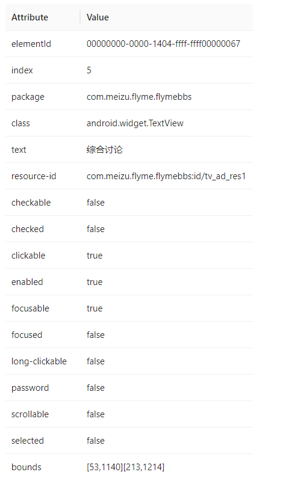

## appium API 封装

本节我们将介绍 appium 的API封装，当然，主要是 Appium-Python-Client 库的封装。

appium 的API继承 selenium 的API，例如 selenium 提供 id、class、xpath 定位在appium 同样适用，在此基础上appium 也扩展了accessibility_id、ios_uiautomation 等针对App移动端设计的定位方式。再例如 selenium 提供了 click、send_keys 操作在 appium 同样适用，此外，appium 扩展了 top、lang_press、swipe 等触摸、长按、滑动操作。

appium 有些API相对比较简单，例如 install_app、terminate_app 等app操作，因为用法比较简单，所以，没有封装的必要。有些API用法比较复杂，比如：

```py
from selenium.webdriver.common.actions import interaction
from selenium.webdriver.common.actions.action_builder import ActionBuilder

actions = ActionChains(driver)
# override as 'touch' pointer action
actions.w3c_actions = ActionBuilder(driver, mouse=PointerInput(interaction.POINTER_TOUCH, "touch"))
actions.w3c_actions.pointer_action.move_to_location(start_x, start_y)
actions.w3c_actions.pointer_action.pointer_down()
actions.w3c_actions.pointer_action.pause(2)
actions.w3c_actions.pointer_action.move_to_location(end_x, end_y)
actions.w3c_actions.pointer_action.release()
actions.perform()
```
来自 Appium-Python-Client 项目的滑动的例子，touch触摸一个坐标-> 按下 -> 暂停 -> 到另一个坐标位 -> 释放 -> 执行，整个过程就比较繁琐了，类似这样的操作，我们会进一步封装。

### Switch 类

对于App应用分Native原生应用、Web应用、flutter应用、Hybrid混合应用、对于大型App 一般都会是混合应用，例如 原生应用嵌入webview页面，随着 flutter的流行，也会嵌入 flutter页面。内嵌 webview/flutter好处自然是降低开发成本，一套代码多端运行，原生页面和 webview/flutter 的定位方式完全不同。这就涉及到context上下文切换，即在不同的页面要切换到不同的模式，才能使用相应的定位方式。

Switch中提供基本上下文切换操作。

* 目录结构

```shell
├───appium_lab
│   ├───__init__.py
│   ├───switch.py
│   └───xxx.py
└───appium_lab_assert.py
```

> lab 有“实验室” 的意思，这里希望把 appium 封装的操作都放到一个实验室里。

__功能代码__

实现switch类，实现不同模式的context切换。

```py
# appium_lab/switch.py
from loguru import logger


class Switch:
    """
    基于appium 切换上下文
    """

    def __init__(self, driver):
        self.driver = driver

    def context(self):
        """
        返回当前context.
        """
        current_context = self.driver.current_context
        all_context = self.driver.contexts
        logger.info(f"current context: {current_context}.")
        logger.info(f"all context: {all_context}.")
        return current_context

    def switch_to_app(self):
        """
        切换到原生app.
        """
        current_context = self.driver.current_context
        if current_context != "NATIVE_APP":
            logger.info("Switch to native app.")
            self.driver.switch_to.context('NATIVE_APP')

    def switch_to_web(self, context_name: str = None):
        """
        切换到webview.
        """
        logger.info("Switch to webview.")
        if context_name is not None:
            self.driver.switch_to.context(context_name)
        else:
            all_context = self.driver.contexts
            for context in all_context:
                if "WEBVIEW" in context:
                    self.driver.switch_to.context(context)
                    break
            else:
                raise NameError("No WebView found.")

    def switch_to_flutter(self):
        """
        切换到flutter.
        """
        current_context = self.driver.current_context
        if current_context != "FLUTTER":
            logger.info("Switch to flutter.")
            self.driver.switch_to.context('FLUTTER')
```

__代码说明__

创建 Switch 类，_\_init__() 初始化方法接收driver驱动，current_context 语句用于获取当前上下文名，native 和 flutter 可以根据名字切换，webview 需要通过 contexts 语句获取所有上下文，然后进一步判断 上下文名是否包含“WEBVIEW” 关键字。


__使用例子__

使用切换上下文相关方法。

```py
# appium_lab_test.py
from time import sleep
from appium.webdriver import Remote
from appium_lab.switch import Switch
from appium.webdriver.common.appiumby import AppiumBy

desired_caps = {
    ...
}

driver = Remote(command_executor="http://127.0.0.1:4723",
                desired_capabilities=desired_caps)
sleep(2)


context = Switch(driver)
# 打印并返回当前上下文
context.context()
# 切换到 webview
context.switch_to_web()
# 切换到 native
context.switch_to_app()
# 切换到 flutter
context.switch_to_flutter()

```

__代码说明:__

你需要准备一款混合应用的App，并设置 desired_capabilities 参数。

__运行测试:__

```shell
> python appium_lab_test.py

2023-02-26 20:03:09.220 | INFO     | appium_lab.switch:context:19 - current context: NATIVE_APP.
2023-02-26 20:03:09.220 | INFO     | appium_lab.switch:context:20 - all context: ['NATIVE_APP', 'WEBVIEW_com.huawei.browser'].
2023-02-26 20:03:09.220 | INFO     | appium_lab.switch:switch_to_web:36 - Switch to webview.
...
2023-02-26 20:03:09.220 | INFO     | appium_lab.switch:switch_to_web:36 - Switch to native app.
...
2023-02-26 20:03:09.220 | INFO     | appium_lab.switch:switch_to_web:36 - Switch to flutter.
```

### Action 类


* 目录结构

```shell
├───appium_lab
│   ├───__init__.py
│   ├───switch.py
│   └───action.py
└───appium_lab_assert.py
```

__功能代码__

Action类中提供基本滑动/触摸操作。

```py
# appium_lab/action.py
from time import sleep
from loguru import logger
from appium_lab.switch import Switch
from selenium.webdriver.common.action_chains import ActionChains
from selenium.webdriver.common.actions.action_builder import ActionBuilder
from selenium.webdriver.common.actions.pointer_input import PointerInput
from selenium.webdriver.common.actions import interaction


class Action(Switch):
    """
    封装基本动作: 滑动、触摸等
    """

    def __init__(self, driver):
        Switch.__init__(self, driver)
        self.switch_to_app()
        self._size = self.driver.get_window_size()
        self.width = self._size.get("width")     # {'width': 1080, 'height': 2028}
        self.height = self._size.get("height")   # {'width': 1080, 'height': 2028}

    def size(self):
        """
        返回屏幕尺寸
        """
        logger.info(f"screen resolution: {self._size}")
        return self._size

    def tap(self, x: int, y: int):
        """
        触摸坐标位
        :param x: x 坐标
        :param y: y 坐标
        :return:
        """
        self.switch_to_app()
        logger.info(f"top x={x},y={y}.")
        actions = ActionChains(self.driver)
        actions.w3c_actions = ActionBuilder(self.driver, mouse=PointerInput(interaction.POINTER_TOUCH, "touch"))
        actions.w3c_actions.pointer_action.move_to_location(x, y)
        actions.w3c_actions.pointer_action.pointer_down()
        actions.w3c_actions.pointer_action.pause(0.1)
        actions.w3c_actions.pointer_action.release()
        actions.perform()
        sleep(2)

    def swipe_up(self, times: int = 1, upper: bool = False):
        """
        向上滑动
        :param times: 滑动次数，默认1
        :param upper: 由于屏幕键盘遮挡，可以选择滑动上半部分。
        :return:
        """
        self.switch_to_app()
        logger.info(f"swipe up {times} times")
        x_start = int(self.width / 2)
        x_end = int(self.width / 2)

        if upper is True:
            self.height = (self.height / 2)

        y_start = int((self.height / 3) * 2)
        y_end = int((self.height / 3) * 1)

        for _ in range(times):
            actions = ActionChains(self.driver)
            actions.w3c_actions = ActionBuilder(self.driver, mouse=PointerInput(interaction.POINTER_TOUCH, "touch"))
            actions.w3c_actions.pointer_action.move_to_location(x_start, y_start)
            actions.w3c_actions.pointer_action.pointer_down()
            actions.w3c_actions.pointer_action.move_to_location(x_end, y_end)
            actions.w3c_actions.pointer_action.release()
            actions.perform()
            sleep(1)

    def swipe_down(self, times: int = 1, upper: bool = False):
        """
        向下滑动
        :param times: 滑动次数，默认1
        :param upper: 由于屏幕键盘遮挡，可以选择滑动上半部分。
        :return:
        """
        self.switch_to_app()
        logger.info(f"swipe down {times} times")
        x_start = int(self.width / 2)
        x_end = int(self.width / 2)

        if upper is True:
            self.height = (self.height / 2)

        y_start = int((self.height / 3) * 1)
        y_end = int((self.height / 3) * 2)

        for _ in range(times):
            actions = ActionChains(self.driver)
            actions.w3c_actions = ActionBuilder(self.driver, mouse=PointerInput(interaction.POINTER_TOUCH, "touch"))
            actions.w3c_actions.pointer_action.move_to_location(x_start, y_start)
            actions.w3c_actions.pointer_action.pointer_down()
            actions.w3c_actions.pointer_action.move_to_location(x_end, y_end)
            actions.w3c_actions.pointer_action.release()
            actions.perform()
            sleep(1)

```

__代码说明:__

Action类继承 Switch 类，因为相关操作基于 Native 上下文，所以需要调用封装的 switch_to_app() 方法。其次，相关操作基于坐标，所以，通过get_window_size() 方法获取当前屏幕的x和y的坐标。

top() 方法接受x和y的坐标，然后进行触摸。

swipe\_up() 和 swipe_down() 方法根据屏幕的大小进行计算，x轴居中，向上滑动 y轴 从屏幕高度的2/3位置滑动到 1/3 处，向下滑动则相反。通过 times 控制滑动次数。在一些情况下屏幕键盘处于弹出状态，占用屏幕底部大约1/3空间，那么可以通过 upper 参数控制只滑档屏幕上半部分。

__使用例子:__

通过例子演示 Action类的使用

```py
from time import sleep
from appium.webdriver import Remote
from appium_lab.action import Action


desired_caps = {
    ...
}

driver = Remote(command_executor="http://127.0.0.1:4723",
                desired_capabilities=desired_caps)
sleep(2)

action = Action(driver)
# 屏幕尺寸
action.size()
# 向上滑动
action.swipe_up(times=3)
# 向下滑动
action.swipe_down(times=1)
# 触摸坐标位
action.tap(x=100, y=1333)
```

__运行测试:__

```shell
> python appium_lab_test.py

2023-02-26 21:05:28.718 | INFO     | appium_lab.action:size:27 - screen resolution: {'width': 1200, 'height': 2499}
2023-02-26 21:05:28.722 | INFO     | appium_lab.action:swipe_up:56 - swipe up 3 times
2023-02-26 21:05:33.482 | INFO     | appium_lab.action:swipe_down:84 - swipe down 1 times
2023-02-26 21:05:35.076 | INFO     | appium_lab.action:tap:38 - top x=100,y=1333.
```


### FindByText 类

Find中提供基于文本的查找，一个元素可以没有ID、name，但一定有显示的文本，这里提供了一组基于文本的查找。



如果上图某元素的属性，可以基于 resource-id 来定位元素。但是，我们在实际编写App自动化测试经常会遇到没有定义 resource-id 的情况，对于iOS 平台的App 甚至没有ID属性，但是 class一定是会有的，因为它表示控件的类型，text/content-desc 用于显示控件的名（iOS平台app一般是 name 用于显示控件名），一般也会有的。因此，基于 class + text 大概率是可以定位到元素的。

* 目录结构

```shell
├───appium_lab
│   ├───__init__.py
│   ├───switch.py
│   └───find.py
└───appium_lab_assert.py
```

__功能代码__

Find类用于封装基于文本的元素查找。


```py
# appium_lab/find.py
from time import sleep
from loguru import logger
from appium.webdriver.common.appiumby import AppiumBy
from appium_lab.switch import Switch


class FindByText(Switch):
    """
    基于文本查找元素
    """

    def __find(self, class_name: str, attribute: str, text: str):
        """
        查找元素
        :param class_name: class名字
        :param attribute: 属性
        :param text: 文本
        :return:
        """
        elems = self.driver.find_elements(AppiumBy.CLASS_NAME, class_name)
        for _ in range(3):
            if len(elems) > 0:
                break
            sleep(1)

        for elem in elems:
            if elem.get_attribute(attribute) is None:
                continue
            attribute_text = elem.get_attribute(attribute)
            if text in attribute_text:
                logger.info(f'find -> {attribute_text}')
                return elem
        return None

    def find_text_view(self, text: str):
        """
        Android: 基于TextView查找文本
        :param text: 文本名
        :return:
        """
        self.switch_to_app()
        for _ in range(3):
            elem = self.__find(class_name="android.widget.TextView", attribute="text", text=text)
            if elem is not None:
                break
            sleep(1)
        else:
            raise ValueError(f"Unable to find -> {text}")

        return elem

```

__代码说明:__

FindByText 类继承 Switch 类，需要保证操作是在 Native 模式，需要调用封装的 switch_to_app() 方法。

__find() 为类内部方法，基于 class 类型，查找当前页面的所有元素，然后基于文本属性（text/content-desc/name）查找显示的名称。循环判断文本属性显示的名称是否包含 text，如果是则返回元素。

find_text_view() 基于 android.widget.TextView 类封装的基于文本控件操作。

这里帮你总结了Android/iOS 一般带文本书的组件。

| 平台    | class                     | 文本属性          |
| ------- | ------------------------- | ----------------- |
| Android | android.view.View         | text/content-desc |
| Android | android.widget.EditText   | text              |
| Android | android.widget.Button     | text/content-desc |
| Android | android.widget.TextView   | text              |
| Android | android.widget.ImageView  | content-desc      |
| Android | android.widget.CheckBox   | text              |
| iOS     | XCUIElementTypeStaticText | name              |
| iOS     | XCUIElementTypeOther      | name              |
| iOS     | XCUIElementTypeTextField  | name              |
| iOS     | XCUIElementTypeImage      | name              |
| iOS     | XCUIElementTypeButton     | name              |

参考表格，可以封装对应 class 属性的定位方法：find_xxx_xxx()

__使用例子:__

通过例子演示 Find 类的使用。


```py
from time import sleep
from appium.webdriver import Remote
from appium_lab.switch import Switch
from appium_lab.action import Action
from appium_lab.find import FindByText
from appium.webdriver.common.appiumby import AppiumBy

desired_caps = {
    ...
}

driver = Remote(command_executor="http://127.0.0.1:4723",
                desired_capabilities=desired_caps)
sleep(2)


find = FindByText(driver)
find.find_text_view("综合讨论").click()

```

__运行测试:__

```shell
> python appium_lab_test.py
2023-02-26 22:16:46.263 | INFO     | appium_lab.find:__find:32 - find -> 综合讨论
```

### KeyEvent 类

appium提供的输入分两种，一种是从selenium 继承过来的send\_keys()方法，另一中是调用屏幕键盘，使用 press_keycode()方法输入字符编码。

press_keycode() 的输入是非常不方便的，比如，输入 “HELLO” 字符串，需要查询每个字符对应的编码。

Android KeyEvent文档: https://developer.android.com/reference/android/view/KeyEvent

H - 36
E - 33
L - 40
O - 43

然后，通过 press_keycode()一个一个输入。
```py
driver.keyevent(36)
driver.keyevent(33)
driver.keyevent(40)
driver.keyevent(40)
driver.keyevent(43)
```

* 目录结构

```shell
├───appium_lab
│   ├───__init__.py
│   └───keyevent.py
└───appium_lab_assert.py
```

__功能代码__

KeyEvent类用于封装基于文本的元素查找。


```py
# appium_lab/keyevent.py

keycodes = {
    '0': 7, '1': 8, '2': 9, '3': 10, '4': 11, '5': 12, '6': 13, '7': 14, '8': 15,
    '9': 16, 'A': 29, 'B': 30, 'C': 31, 'D': 32, 'E': 33, 'F': 34, 'G': 35, 'H': 36,
    'I': 37, 'J': 38, 'K': 39, 'L': 40, 'M': 41, 'N': 42, 'O': 43, 'P': 44, 'Q': 45,
    'R': 46, 'S': 47, 'T': 48, 'U': 49, 'V': 50, 'W': 51, 'X': 52, 'Y': 53, 'Z': 54,
    ' ': 62, '*': 17, '#': 18, ',': 55, '`': 68, '-': 69, '[': 71, ']': 72, '\\': 73,
    ';': 74, '/': 76, '@': 77, '=': 161, '.': 158, '+': 157,
    'NUM_LOCK': 143, 'CAPS_LOCK': 115, 'HOME': 4, 'BACK': 3,
}

class KeyEvent:
    """
    KeyEvent:
    https://developer.android.com/reference/android/view/KeyEvent
    """

    def __init__(self, driver):
        self.driver = driver

    def key_text(self, text: str = ""):
        """
        keyword input text.
        :param text: input text

        Usage:
            key_text("Hello")
        """
        if text == "":
            return

        logger.info(f'input "{text}"')
        for string in text:
            keycode = keycodes.get(string.upper(), 0)
            if keycode == 0:
                raise KeyError(f"The '{string}' character is not supported")
            if string.isupper():
                self.driver.press_keycode(keycode, 64, 59)
            else:
                self.driver.keyevent(keycode)

```

__代码说明:__

keycodes 字典用于保存 字符与编码之间的对应关系。


KeyEvent 类中实现 key\_text() 方法，upper()用于将字符串转为大写，通过 keycodes 字典查找每个字符对应的编码，如果字符为大小写，调用 press_keycode() 方法以大写方式输入，如果为小写，调用 keyevent() 以小写方式输入。


__使用例子:__

通过例子演示 KeyEvent 类的使用。

```py
from time import sleep
from appium.webdriver import Remote
from appium_lab.keyevent import KeyEvent
from appium.webdriver.common.appiumby import AppiumBy

desired_caps = {
    ...
}

driver = Remote(command_executor="http://127.0.0.1:4723",
                desired_capabilities=desired_caps)
sleep(2)

# 点击输入框，调起屏幕键盘
driver.find_element(AppiumBy.ID, "com.meizu.flyme.flymebbs:id/et_search").click()

# 使用key_text 输入字符串
key = KeyEvent(driver)
key.key_text("Flyme9")

```

__运行测试:__

```shell
> python appium_lab_test.py
2023-02-26 22:54:19.631 | INFO     | appium_lab.keyevent:key_text:35 - input "Flyme9"
```
