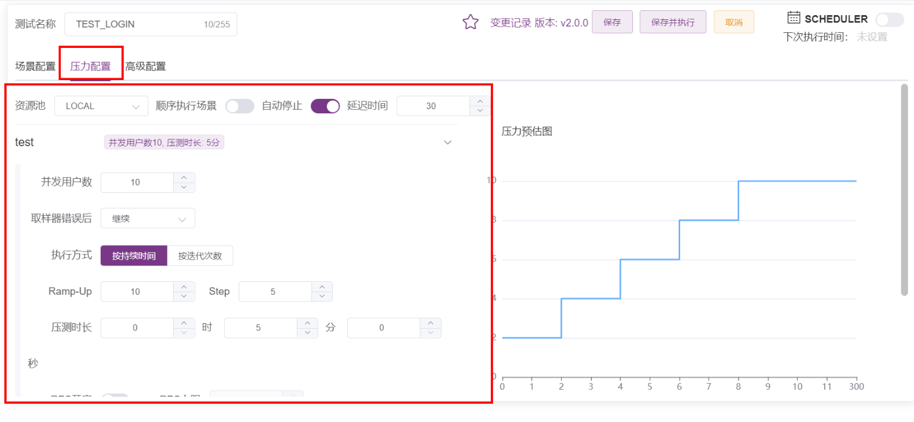
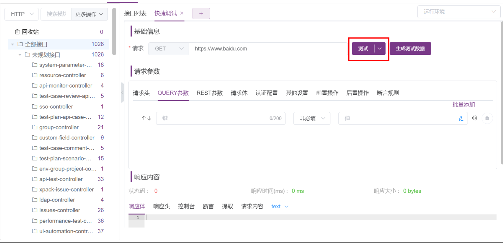
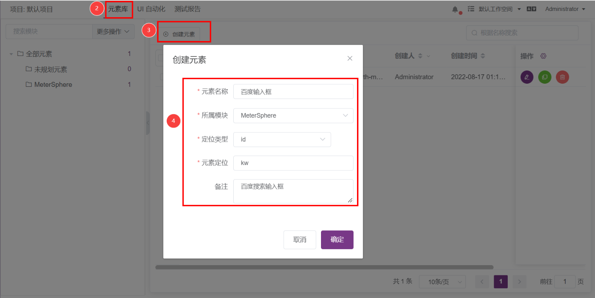
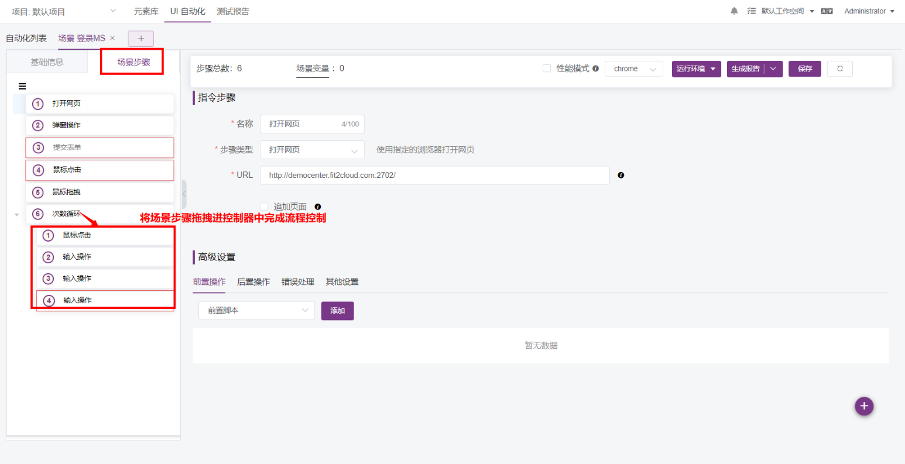
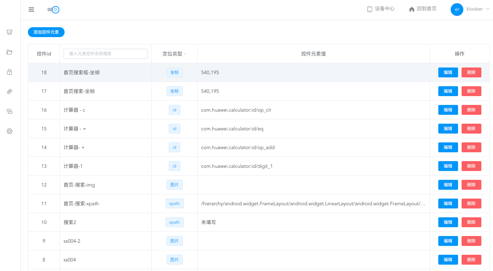
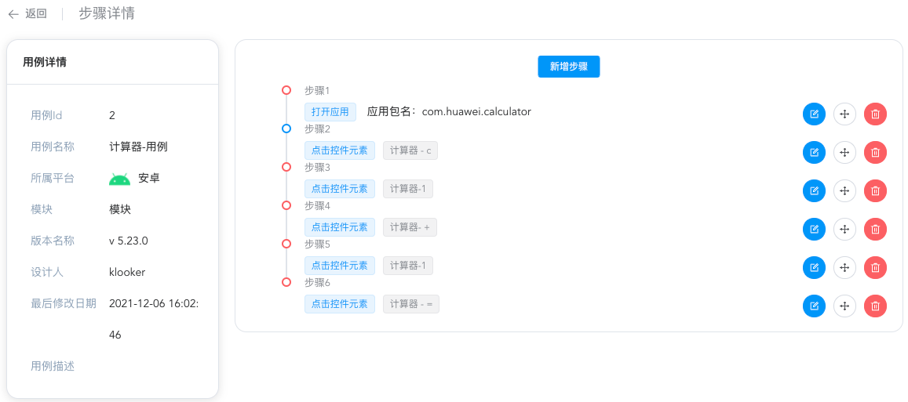

## 平台化支持

软件测试自动化正在朝着平台化发展。在一些方面性能测试、接口测试方面已经有比较好的落地方案，然而在 web/app 自动化方面没有成熟的方案。

* 性能测试：性能测试发展到今天，分 Web/MWeb前端性能测试、Web后端性能、App端性能等，目前性能平台主要实现 Web后端性能，集成JMeter、locust等性能测试工具，通过界面提供性能测试用例的创建，以及压测参数的配置等。

以集成JMeter 压测平台为例，可以通过 JMeter 编写测试用例，生成 .jmx 性能测试脚本文件。然后，通过平台配置并发相关的参数。


(截图自来开源平台 metersphere)


* 接口测试：

后端服务主要提供API服务，应用比较广泛的是使用 HTTP/RPC 协议的接口，接口的调用相对有固定的格式，以为HTTP接口为例，一个接口大概包含一下信息：

```
URL： (http://www.xxx.com/v1/login)

方法：（GET/POST/PUT/DELETE 等）

Auth：认证信息

Header： 请求头

参数类型：（params/form-data/json..）

参数值：（id=1，name=tom）

返回值：（包含错误码、提示信息、数据等）
```

相对固定的格式就可以很容易的实现平台化，通过平台提供接口信息的配置。


(截图自来开源平台 metersphere)


* Web自动化测试

Web自动化测试主要模拟用户操作Web UI，没有固定的步骤，例如，模拟用户注册 和 登录的操作步骤肯定是不一样的，如果将步骤进行拆解，那么就是每个元素的操作。例如，点击“登录”按钮。

基于这样的思想，我们可以先建立元素库。


(截图自来开源平台 metersphere)

然后，再将元素组装成用例(场景)步骤。


(截图自来开源平台 metersphere)

* App自动化测试

App自动化测试和Web自动化测试类似，模拟用户操作App UI。相对来说， App的环境要更复杂一下，需要 Android/iOS手机或模拟器，平台驱动、还要兼容不同的应用类型。

同样，首先建立控件元素库


(截图自来开源平台 sonic)

创建测试用例，并添加控件元素组装步骤。


(截图自来开源平台 sonic)


## 平台化的优缺点

自动化测试平台化降低了自动化测试的门槛，可以更加方便的完成简单的自动化测试用例。

平台化优势：

* 门槛更低：通过UI交互就可以完成用例的创建、编辑、执行，对于非编程人员更加友好。
* 任务管理：更方便的实现任务管理，例如：定时任务。
* 监控统计：更方便的实现数据管理，例如：人员和用例数量，历史执行数据等。


平台化的缺点：

* 场景测试更复杂：在应对复杂的测试场景，平台化配置更加繁琐，例如：接口测试中，接口之间的数据依赖。
* 丢失编程语言的灵活性：采用测试框架编写用例的时候，可以充分利用编程语言的特性。例如 封装、集成、if/for循环，数据驱动等，可以非常灵活的编写自动化用例。
* 功能扩展不方便：采用自动化框架编写用例可以非常方便的引入测试库来扩展功能，例如，引入 faker 生成随机书，引入 langid 识别文字语言等。采用平台就不是非常方便，还要考虑UI上面如何设计功能的实现。

