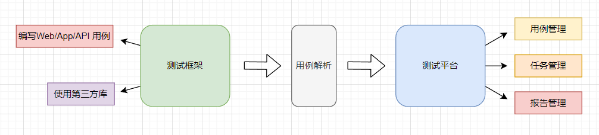
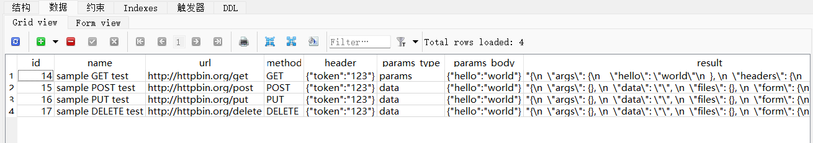

## 框架&平台整合方案

通过前面的介绍，总结下来就是，在用例编写阶段，采用编程语言编写用例是可以最大程度上兼顾到效率和灵活性的。在用例编写完成的任务执行、结果统计等采用平台化是有无可争议的优势。

那么，有没有一种方案，兼容框架与平台各自的优势呢？



这是一个很大胆的想法。我们知道通过测试框架编写的自动化测试是通过程序文件（.py）保存的一些类、方法。而平台上的用例是保存到数据库表中数据。两者有着本质上的区别。

* unitest+requests 接口测试用例

```py
import unittest
import requests


class TestRequest(unittest.TestCase):

    def setUp(self):
        self.base_url = "http://httpbin.org"

    def test_put_method(self):
        r = requests.put(self.base_url + '/put', data={'key': 'value'})
        self.assertEqual(r.status_code, 200)

    def test_post_method(self):
        r = requests.post(self.base_url + '/post', data={'key':'value'})
        self.assertEqual(r.status_code, 200)

    def test_get_method(self):
        payload = {'key1': 'value1', 'key2': 'value2'}
        r = requests.get(self.base_url + "/get", params=payload)
        self.assertEqual(r.status_code, 200)

    def test_delete_method(self):
        r = requests.delete(self.base_url + '/delete')
        self.assertEqual(r.status_code, 200)


if __name__ == '__main__':
    unittest.main()
```

* 测试平台数据库保存的接口测试用例



### unittest 解析用例

思考一个问题，通过unittest单元测试框架编写用例，存在“非用例”的测试方法，例如 setUp/tearDown、自己的封装的 login() 方法等，unitest可以精确的识别出测试用例的方法，那么它一定有方法去实现用例的识别工作。

* TestLoader 类

unittest的 TestLoader 类负责根据标准加载测试用例，并将他们包装在测试稿件中。

```py
...

class TestLoader(object):
    """
    This class is responsible for loading tests according to various criteria
    and returning them wrapped in a TestSuite
    """
    testMethodPrefix = 'test'
    sortTestMethodsUsing = staticmethod(util.three_way_cmp)
    testNamePatterns = None
    suiteClass = suite.TestSuite
    _top_level_dir = None

    def __init__(self):
        super(TestLoader, self).__init__()
        self.errors = []
        # Tracks packages which we have called into via load_tests, to
        # avoid infinite re-entrancy.
        self._loading_packages = set()

```

__代码说明__

其中，testMethodPrefix 定义测试用例的规则，测试用例方法名必须以`test`开头才会被识别为测试用例。

整个类的实现，此处不展开讨论。我们要做的是重写 TestLoader类中的getTestCaseNames() 方法。

### 实现用例的收集与执行

* 目录结构

```shell
├───running        # 实现测试运行器
│   ├───__init__.py
│   ├───loader_exend.py
│   └───runner.py
├───test_dir      # 测试用例目录
│   ├───sub_dir
│   │   ├───__init__.py
│   │   └───test_sub_case.py
│   ├───__init__.py
│   └───test_sample.py
└───run.py       # 收集&运行测试
```

* 自定义 MyTestLoader 类

通过 MyTestLoader 重写 TestLoader类中的getTestCaseNames() 方法。

```py
import functools
from fnmatch import fnmatchcase
from unittest.loader import TestLoader


class MyTestLoader(TestLoader):
    """
    This class is responsible for loading tests according to various criteria
    and returning them wrapped in a TestSuite
    """
    testNamePatterns = None
    collectCaseInfo = False  # 用例收集开关
    collectCaseList = []     # 搜集到的用例保存到列表

    def getTestCaseNames(self, testCaseClass):
        """Return a sorted sequence of method names found within testCaseClass
        """

        def shouldIncludeMethod(attrname):
            """
            should Include Method
            :param attrname:
            :return:
            """
            if not attrname.startswith(self.testMethodPrefix):
                return False
            testFunc = getattr(testCaseClass, attrname)
            if not callable(testFunc):
                return False

            fullName = f"""{testCaseClass.__module__}.{testCaseClass.__qualname__}.{attrname}"""

            if self.collectCaseInfo is True:
                case_info = {
                    "file": testCaseClass.__module__,
                    "class": {
                        "name": testCaseClass.__name__,
                        "doc": testCaseClass.__doc__
                    },
                    "method": {
                        "name": attrname,
                        "doc": testFunc.__doc__
                    }
                }
                self.collectCaseList.append(case_info)

            return self.testNamePatterns is None or \
                   any(fnmatchcase(fullName, pattern) for pattern in self.testNamePatterns)

        testFnNames = list(filter(shouldIncludeMethod, dir(testCaseClass)))
        if self.sortTestMethodsUsing:
            testFnNames.sort(key=functools.cmp_to_key(self.sortTestMethodsUsing))
        return testFnNames

```

__代码说明:__

collectCaseInfo 变量用于控制收集用例开关，collectCaseList 列表用于存放收集的用例信息。 当 collectCaseInfo 设置为True 时，开始收集用例：

testCaseClass.__module__ ：测试类的所属模块。

testCaseClass.__name__ ： 测试类的名字。

testCaseClass.__doc__ ： 测试类的描述。

attrname ： 测试方法名。

testFunc.__doc__ ： 测试方法的描述。


* 实现 TestMain 类

```py
import unittest
import json as sys_json
from running.loader_extend import MyTestLoader


class TestMain:
    """
    TestMain tests class.
    1. Collect use case information and return to the list
    2. Execute the use cases based on the use case list
    """
    TestSuits = []

    def __init__(self, path: str = None):
        """
        runner test case
        :param path:
        """
        self.path = path
        if path is None:
            raise FileNotFoundError("Specify a file path")

        self.TestSuits = MyTestLoader().discover(start_dir=self.path)

    @staticmethod
    def run(suits):
        """
        run test case
        """
        runner = unittest.TextTestRunner()
        runner.run(suits)

    @staticmethod
    def collect_cases(json: bool = False):
        """
        Return the collected case information.
         .collectCaseInfo = True
        :param json: Return JSON format
        """
        cases = MyTestLoader.collectCaseList

        if json is True:
            return sys_json.dumps(cases, indent=2, ensure_ascii=False)

        return cases

    def _load_testsuite(self):
        """
        load test suite and convert to mapping
        """
        mapping = {}

        for suits in self.TestSuits:
            for cases in suits:
                if isinstance(cases, unittest.suite.TestSuite) is False:
                    continue

                for case in cases:
                    file_name = case.__module__
                    class_name = case.__class__.__name__

                    key = f"{file_name}.{class_name}"
                    if mapping.get(key, None) is None:
                        mapping[key] = []

                    mapping[key].append(case)

        return mapping

    def run_cases(self, data: list):
        """
        run list case
        :param data: test case list
        """
        if isinstance(data, list) is False:
            raise TypeError("Use cases must be lists.")

        if len(data) == 0:
            raise ValueError("There are no use cases to execute")

        suit = unittest.TestSuite()

        case_mapping = self._load_testsuite()
        print(case_mapping)
        for d in data:
            d_file = d.get("file", None)
            d_class = d.get("class").get("name", None)
            d_method = d.get("method").get("name", None)
            if (d_file is None) or (d_class is None) or (d_method is None):
                raise NameError("""Use case format error""")

            cases = case_mapping.get(f"{d_file}.{d_class}", None)
            if cases is None:
                continue

            for case in cases:
                method_name = str(case).split(" ")[0]
                if method_name == d_method:
                    suit.addTest(case)

        self.run(suit)


main = TestMain
```

__代码说明:__

定义 TestMain 类，path 参数用于指定测试目录，调用 MyTestLoader 类下面的 discover() 方法用于收集 path 目录下面的用例，将收集到的用例保存到 TestSuits 变量中。

run() 方法通过调用unittest.TextTestRunner() 类运行测试套件中的用例。

collect_cases() 方法返回 MyTestLoader.collectCaseList 中收集的用例，如果 json为True 则将结果转为JSON格式。

_load_testsuite() 方法针对 TestSuits 中收集到的用例时行处理，找出用例的文件名+类名，作为字典key, 添加用例到value 列表中。格式如下：

```shell
{
  'sub_dir.test_sub_case.TestSubDirCase':  # 目录文件名
  [  # 用例对象列表
    <sub_dir.test_sub_case.TestSubDirCase testMethod=test_sub_case>
  ], 
 'test_sample.TestSample': 
  [
    <test_sample.TestSample testMethod=test_case_01>,
    <test_sample.TestSample testMethod=test_case_02>
  ]
 }
```

run_cases() 运行测试用例，data为收集到的测试用例数据，大体处理过程：调用 _load_testsuite() 返回的用例与 data 中的用例时行对比，如果文件名、类名、方法名一致，将用例对象追加到 suit 中。最后，调用run() 方法执行suit中的用例。

__使用例子__

准备例子，验证running模块中现实的功能是否可以。首先，在 test_dir 目录中准备一些用例。

* 根目录用例

```python
# test_dir/test_sample.py
import unittest


class TestSample(unittest.TestCase):
    """简单的测试类"""

    def test_case_01(self):
        """test case 01"""
        self.assertEqual(1+1, 2)

    def test_case_02(self):
        """test case 02"""
        self.assertEqual(2+2, 4)

```

* 子目录用例

```python
# test_dir/sub_dir/test_sub_case.py
import unittest


class TestSubDirCase(unittest.TestCase):
    """子目录测试类"""

    def test_sub_case(self):
        """test sub dir case"""
        self.assertEqual(4+4, 8)

```

* 收集用例

```python
# run.py
from running.runner import main
from running.loader_extend import MyTestLoader


if __name__ == '__main__':
    # 开启收集用例开关
    MyTestLoader.collectCaseInfo = True
    # 指定运行用例目录
    test_main = main(path="./test_dir")
    # 收集用用例
    case_info = test_main.collect_cases()
    print(case_info)
```

__代码说明__

开启收集用例开关，指定收集用例的目录，通用调用collect_cases() 方法收集测试用例。

* 运行run.py 文件

```shell
> python run.py

[
  {
    "file": "sub_dir.test_sub_case",
    "class": {
      "name": "TestSubDirCase",
      "doc": "子目录测试类"
    },
    "method": {
      "name": "test_sub_case",
      "doc": "test sub dir case"
    }
  },
  {
    "file": "test_sample",
    "class": {
      "name": "TestSample",
      "doc": "简单的测试类"
    },
    "method": {
      "name": "test_case_01",
      "doc": "test case 01"
    }
  },
  {
    "file": "test_sample",
    "class": {
      "name": "TestSample",
      "doc": "简单的测试类"
    },
    "method": {
      "name": "test_case_02",
      "doc": "test case 02"
    }
  }
]
```

通过执行结果可以看出，用例的 目录&文件名、类名和类注释、方法名和方法注释都已经收集到了。可以将用例数据保存到数据库表中，用于在Web页面中展示。

* 执行用例

```python
from running.runner import main


if __name__ == '__main__':
    # 收集到的用例列表
    cases = [
      {
        "file": "sub_dir.test_sub_case",
        "class": {
          "name": "TestSubDirCase",
          "doc": "子目录测试类"
        },
        "method": {
          "name": "test_sub_case",
          "doc": "test sub dir case"
        }
      }
    ]
    # 指定运行用例目录
    test_main = main(path="./test_dir")
    # 运行收集的用列
    test_main.run_cases(cases)
```

__代码说明__

参考收集到的用例格式，在 cases 中定义用例信息，指定收集用例的目录，通用调用 run_cases() 方法运行cases中的用例。

* 运行run.py 文件

```shell
> python run.py

.
----------------------------------------------------------------------
Ran 1 test in 0.000s

OK
```

通过结果可以看到，指定的用例被执行了。在Web项目中，可以将存表的用例信息取出，重新调用 main 类中的 run_cases() 方法执行用例。

