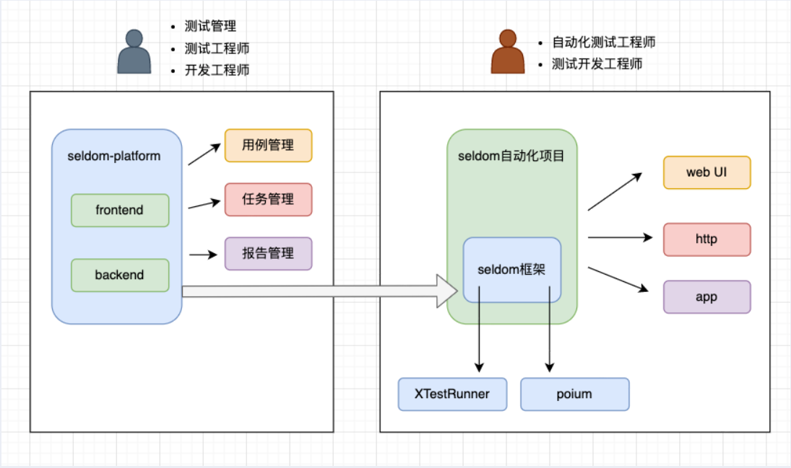
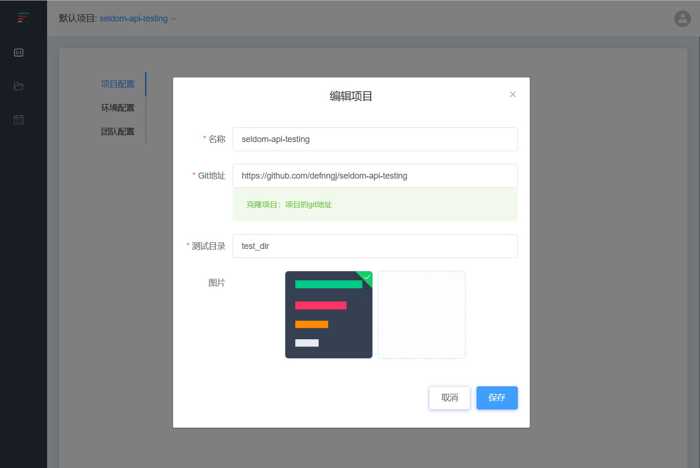
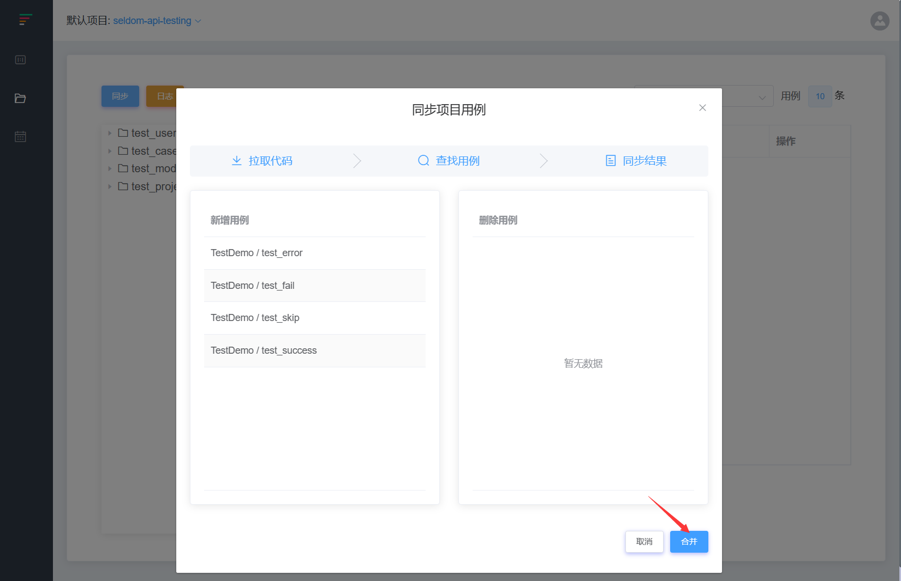
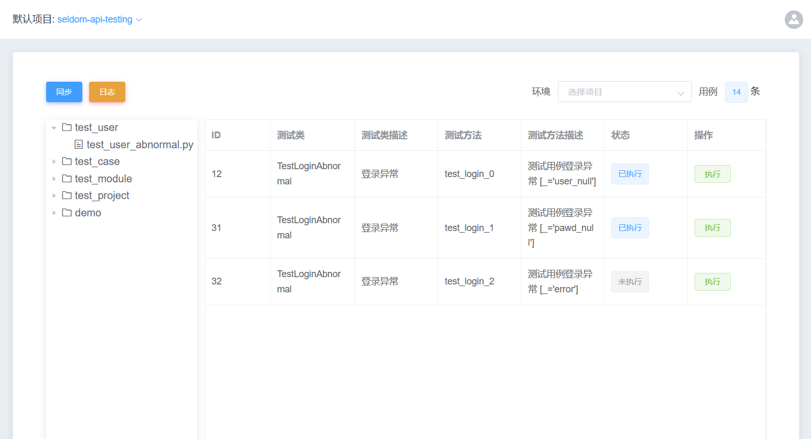
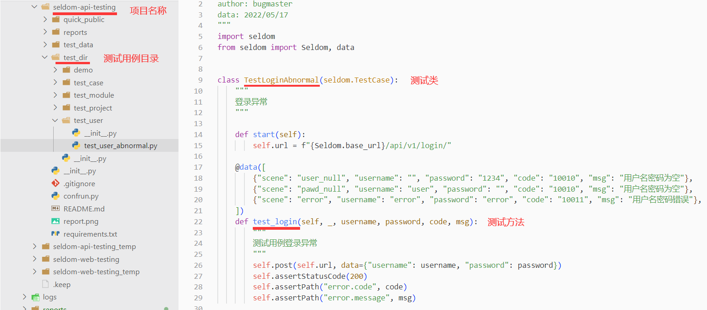
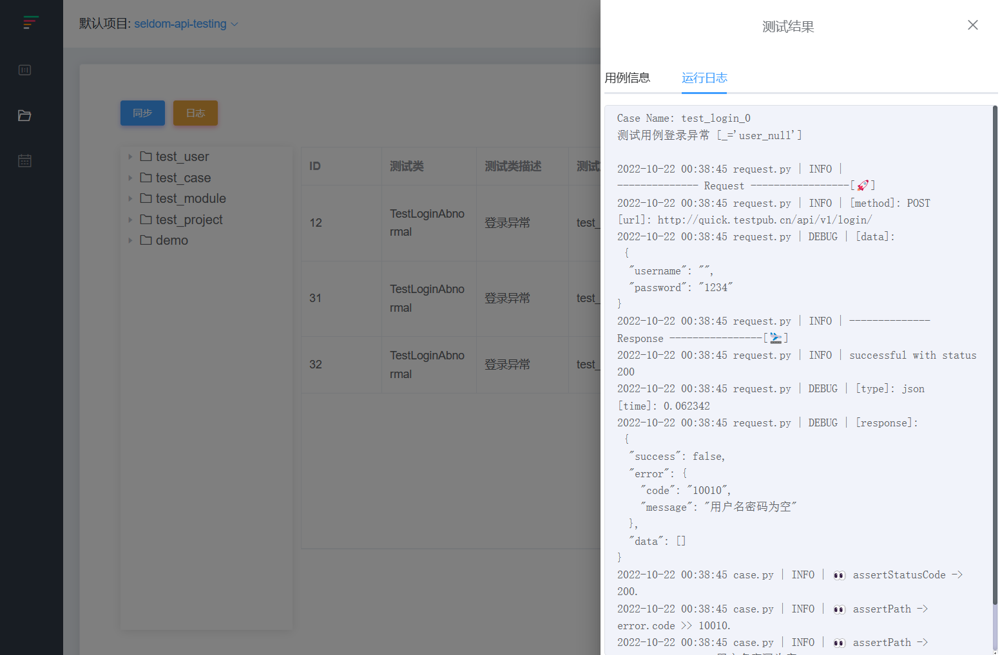

## seldom-platform 平台

前面介绍了如何基于unittest单元测试的扩展修改来提供平台化的能力，然后，就可通过Web开发技术将测试框架编写的用例通过平台进行展示和执行。由于本书的重点是介绍测试框架有的设计，Web开发技术的展开是一个比较庞大的话题。基于这个核心实现，我们相关的开源项目。

SeldomQA: https://github.com/SeldomQA



* seldom: 基于unittest的全功能自动化测试框架。支持 Web/App/API 等测试类型的。我们可通过seldom方便的编写相关自动化测试用例。

* XTestRunner: 基于unittest实现的现代风格的HTML/XML测试报告库，并提供了发送邮件、钉钉、企微、飞书等消息的功能。Seldom集成XTestRunner提供测试报告。

* poium: 一个针对page object模式现实的库，支持selenium/appium/playwright等，在Web/App自动化测试中，利用poium可以更方便的使用page object模式。

* seldom-platform: 基于seldom框架的平台化实现，可方便的接入使用seldom编写的自动化测试项目。


### seldom 框架使用

* 安装seldom

```shell
> pip install seldom
```

* 编写Web测试

seldom集成selenium库，对selenium的API进行了二次封装，使用更简单，全局浏览器启动/关闭，以及无处不在的智能等待，更加稳定的运行Web自动化测试。

```python
# test_sample_01.py
import seldom


class BaiduTest(seldom.TestCase):

    def test_case(self):
        """a simple test case """
        self.open("https://www.baidu.com")
        self.type(id_="kw", text="seldom")
        self.click(css="#su")
        self.assertTitle("seldom_百度搜索")

if __name__ == '__main__':
    seldom.main(browser="chrome")
```

* 编写HTTP接口测试

seldom集成requests库，同样做了二次封装，以及提供了assertStatusCode()、 assertJSON()、assertSchema()、assertPath() 等针对HTTP接口返回设计的断言。

```python
# test_sample_02.py
import seldom


class TestRequest(seldom.TestCase):

    def test_put_method(self):
        self.put('/put', data={'key': 'value'})
        self.assertStatusCode(200)

    def test_post_method(self):
        self.post('/post', data={'key':'value'})
        self.assertStatusCode(200)

    def test_get_method(self):
        payload = {'key1': 'value1', 'key2': 'value2'}
        self.get("/get", params=payload)
        self.assertStatusCode(200)

    def test_delete_method(self):
        self.delete('/delete')
        self.assertStatusCode(200)


if __name__ == '__main__':
    seldom.main(base_url="http://httpbin.org")
```

* 编写App测试

seldom集成appium库，同样做了二次封装；Seldom运行App测试需要appium环境，例如 通过 appium server 启动服务监听端口，以及准备运行测试的手机设备等。

```python
# test_sample_03.py
import seldom


class TestBBS(seldom.TestCase):

    def test_bbs_search(self):
        self.sleep(5)
        self.click(id_="com.meizu.flyme.flymebbs:id/nw")
        self.type(id_="com.meizu.flyme.flymebbs:id/nw", text="flyme")
        self.click(id_="com.meizu.flyme.flymebbs:id/o1")
        self.sleep(2)
        elems = self.get_elements(id_="com.meizu.flyme.flymebbs:id/a29")
        for elem in elems:
            self.assertIn("flyme", elem.text.lower())


if __name__ == '__main__':
    desired_caps = {
        'deviceName': 'JEF_AN20',
        'automationName': 'UiAutomator2',
        'platformName': 'Android',
        'platformVersion': '10.0',
        'appPackage': 'com.meizu.flyme.flymebbs',
        'appActivity': '.ui.LoadingActivity',
        'noReset': True,
    }
    seldom.main(app_info=desired_caps, app_server="http://127.0.0.1:4723")
```

* 运行测试

```shell
> python test_sample_01.py

              __    __
   ________  / /___/ /___  ____ ____
  / ___/ _ \/ / __  / __ \/ __ ` ___/
 (__  )  __/ / /_/ / /_/ / / / / / /
/____/\___/_/\__,_/\____/_/ /_/ /_/  v3.2.0
-----------------------------------------
                             @itest.info


XTestRunner Running tests...

----------------------------------------------------------------------
.1.22023-04-02 20:10:37 webdriver.py | INFO | 📖 https://www.baidu.com
2023-04-02 20:10:40 webdriver.py | INFO | ✅ Find 1 element: id=kw  -> input 'seldom'.
2023-04-02 20:10:41 webdriver.py | INFO | ✅ Find 1 element: css selector=#su  -> click.
2023-04-02 20:10:41 case.py | INFO | 👀 assertTitle -> seldom_百度搜索.
.3Generating HTML reports...
2023-04-02 20:10:42 runner.py | SUCCESS | generated html file: file:///D:\github\code\reports\2023_04_02_20_10_32_result.html
2023-04-02 20:10:42 runner.py | SUCCESS | generated log file: file:///D:\github\code\reports\seldom_log.log
```

* seldom 项目实例

https://github.com/SeldomQA/seldom-api-testing

https://github.com/SeldomQA/seldom-web-testing


## seldom-platform

seldom-platform项目分前端和后端，后端主要基于 django 、django-ninja 框架开发，前端主要基于 vue.js、 element-UI等技术实现。

seldom-platform平台使用：

1. 创建项目接入seldom 自动化项目



参数说明：
* 名称：项目名称。
* git地址：github、gitlab 等git仓库地址。
* 测试目录：指测试项目中的测试用例目录，例如 seldom-api-testing 项目中的 test_dir/目录，即为测试用例目录。

2. 同步用例&合并代码



这一步相当于执行 “git clone” 或 “git pull” 命令，相当于拉取克隆或拉取代码到平台，并且解析项目中的测试用例。然后，做合并操作。

> 注意，平台运行环境需要git账号，并且对项目有克隆权限。

3. 查看项目用例。



平台解析了seldom自动化项目中的 目录结构和测试用例信息。




4. 执行用例&查看结果



通过seldom-platform 平台除了可以展示用例信息，当然也可以执行用例，运行结果将会被记录到数据库表中，所以，可以直接通过平台查看测试结果。


