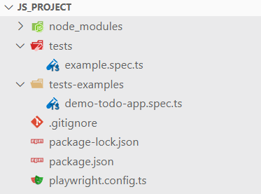
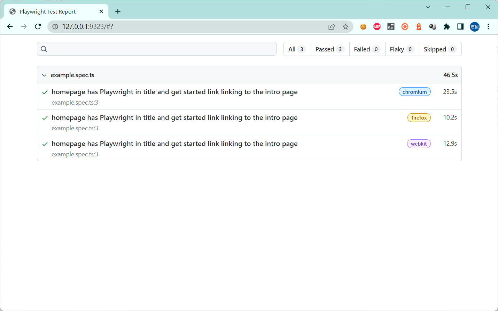

## playwright基于node.js安装


## playwright 支持多种语言：

node.js: https://github.com/microsoft/playwright  41.5K star
python: https://github.com/microsoft/playwright-python  6.8K star
.net: https://github.com/microsoft/playwright-dotnet  1.6k star
java: https://github.com/microsoft/playwright-java  533 star


## 安装

- [x] node.js

* 下载地址

https://nodejs.org/en/download/

* 查看版本

```
> node --version
v16.17.0

> npm --version
8.18.0
```

- [x] playwright

```
> npm init playwright@latest
Need to install the following packages:
  create-playwright@1.17.118
Ok to proceed? (y) y
Getting started with writing end-to-end tests with Playwright:
Initializing project in '.'
√ Do you want to use TypeScript or JavaScript? · TypeScript
√ Where to put your end-to-end tests? · tests
√ Add a GitHub Actions workflow? (y/N) · false

✔ Success! Created a Playwright Test project at D:\tech\playwright_pro\js_project


We suggest that you begin by typing:

    npx playwright test

And check out the following files:
  - .\tests\example.spec.ts - Example end-to-end test
  - .\tests-examples\demo-todo-app.spec.ts - Demo Todo App end-to-end tests
  - .\playwright.config.ts - Playwright Test configuration

Visit https://playwright.dev/docs/intro for more information. ✨

Happy hacking! 🎭
```

## 测试用例分析

* 目录结构：



`tests`文件夹包含一个基本的示例测试，可以帮助您开始测试。

`test-sample`文件夹更详细的示例，包含为测试todo应用程序而编写的测试。


* 简单的例子

```ts
// 导入playwright测试
import { test, expect } from '@playwright/test';

// 创建用例
test('Playwright首页标题和点击开始链接', async ({ page }) => {

  //访问URL
  await page.goto('https://playwright.dev/');

  // 检查标题包含字符串
  await expect(page).toHaveTitle(/Playwright/);

  // 创建定位器
  const getStarted = page.locator('text=Get Started');

  // 检查定位器属性是否包含
  await expect(getStarted).toHaveAttribute('href', '/docs/intro');

  // 针对定位器点击.
  await getStarted.click();

  // 检查跳转的页面包含字符串
  await expect(page).toHaveURL(/.*intro/);
});

```

## 运行测试

进入项目`js_project\`目录，通过下面的命令运行测试。

* 运行命令

```shell
> npx playwright test  # 运行指定目录测试
> npx playwright test --project=chromium #指定运行浏览器
> npx playwright test example #运行特定文件中的用例
> npx playwright test --debug  #debug模式运行测试
> npx playwright codegen # 启动录制脚本
```


* 运行测试

```shell
> npx playwright test

Running 3 tests using 3 workers

  3 passed (25s)

To open last HTML report run:

  npx playwright show-report
```

* 查看报告

```
> npx playwright show-report

Serving HTML report at http://127.0.0.1:9323. Press Ctrl+C to quit.
```

浏览器访问URL: http://127.0.0.1:9323



