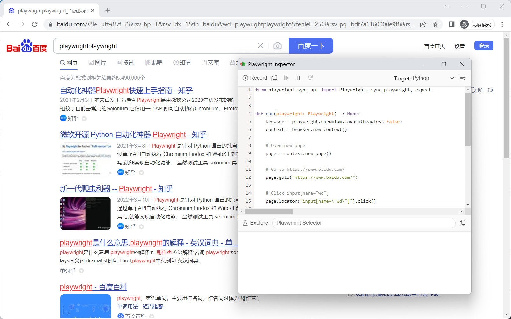
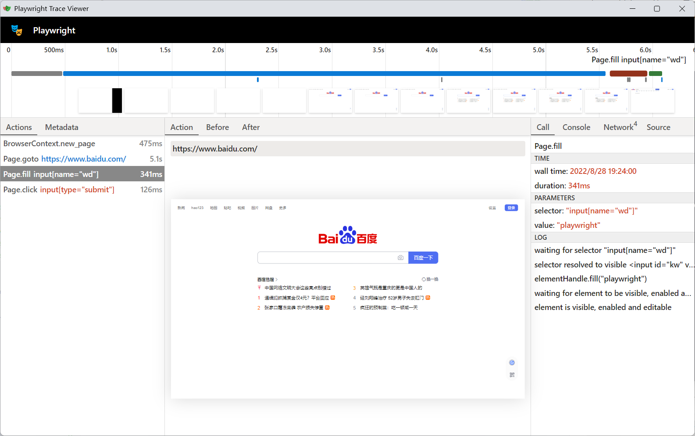

# playwright辅助工具

* Test Generator (测试生成器)
* Inspector (检查器)
* Trace Viewer(跟踪查看器)

## Test Generator（测试生成器）

剧作家痕迹查看器是一个GUI工具，可以让您探索测试中记录的剧作家痕迹，这意味着您可以在测试的每个操作中来回查看，并直观地看到每个操作期间发生了什么

https://playwright.dev/python/docs/codegen-intro

* 运行Codegen

```
> playwright codegen baidu.com
```

录制百度搜索用例。




__playwright Inspector功能__

- Record 录制按钮
- 复制脚本按钮
- 运行按钮
- 暂停
- 单步调试
- Target 选择语言。


* 录制的脚本

```shell
from playwright.sync_api import Playwright, sync_playwright, expect


def run(playwright: Playwright) -> None:
    browser = playwright.chromium.launch(headless=False)
    context = browser.new_context()

    # Open new page
    page = context.new_page()

    # Go to https://www.baidu.com/
    page.goto("https://www.baidu.com/")

    # Click input[name="wd"]
    page.locator("input[name=\"wd\"]").click()

    # Fill input[name="wd"]
    page.locator("input[name=\"wd\"]").fill("playwright")

    # Click text=百度一下
    page.locator("text=百度一下").click()
    page.wait_for_url("https://www.baidu.com/s?ie=utf-8&f=8&rsv_bp=1&rsv_idx=1&tn=baidu&wd=playwrightplaywright&fenlei=256&rsv_pq=bdf7a1160000e9f8&rsv_t=c6d4tiz2g%2BfBX5nNc%2B2ymCHfMo3%2FKOReFifdiamQJMUh4D8qhUjpCv%2BEcc0&rqlang=cn&rsv_enter=0&rsv_dl=tb&rsv_sug3=12&rsv_sug1=8&rsv_sug7=100&rsv_btype=i&prefixsug=playwrightplaywright&rsp=1&inputT=4846&rsv_sug4=7351&rsv_jmp=fail")

    # ---------------------
    context.close()
    browser.close()


with sync_playwright() as playwright:
    run(playwright)

```

## Inspector (检查器)

https://playwright.dev/python/docs/debug#playwright-inspector

playwright Inspector是一个GUI工具，可以帮助编写和调试playwright脚本。他是脚本故障排除的默认推荐工具。

* 设置环境变量(prowerShell)

```
$env:PWDEBUG=1
```

* 运行测试脚本（debug模式）

```
pytest -s xxx.py
```

* 还原环境变量(prowerShell)

```
$env:PWDEBUG="console"
```


## Trace Viewer(跟踪查看器)

playwright Trace Viewer 是一个GUI工具，可以帮助探索脚本运行后记录的playwright跟踪。在本地或浏览器中打开trace.playwright.dev。

```py
# test_trace.py
from playwright.sync_api import sync_playwright


with sync_playwright() as p:
    browser = p.chromium.launch(headless=False)
    context = browser.new_context()

    # Start tracing before creating / navigating a page.
    context.tracing.start(screenshots=True, snapshots=True, sources=True)

    page = context.new_page()
    page.goto("https://www.baidu.com/")
    page.fill('input[name="wd"]', "playwright")
    page.click('input[type="submit"]')

    # Stop tracing and export it into a zip archive.
    context.tracing.stop(path="trace.zip")
```

官方的例子不全，注意看`page` 的赋值：

*  `page = context.new_page()` 正确。
 
*  `page = browser.new_page()` 错误。


__执行脚本__

```
> python playwright_trace.py
```

* 本地打开

你会在脚本的所在目录得到一个 `trace.zip` 文件。本地打开：

```
> playwright show-trace trace.zip
```



* 网站打开

访问：https://trace.playwright.dev/


上面有个上传文件的按钮，将 `trace.zip` 文件上传。
