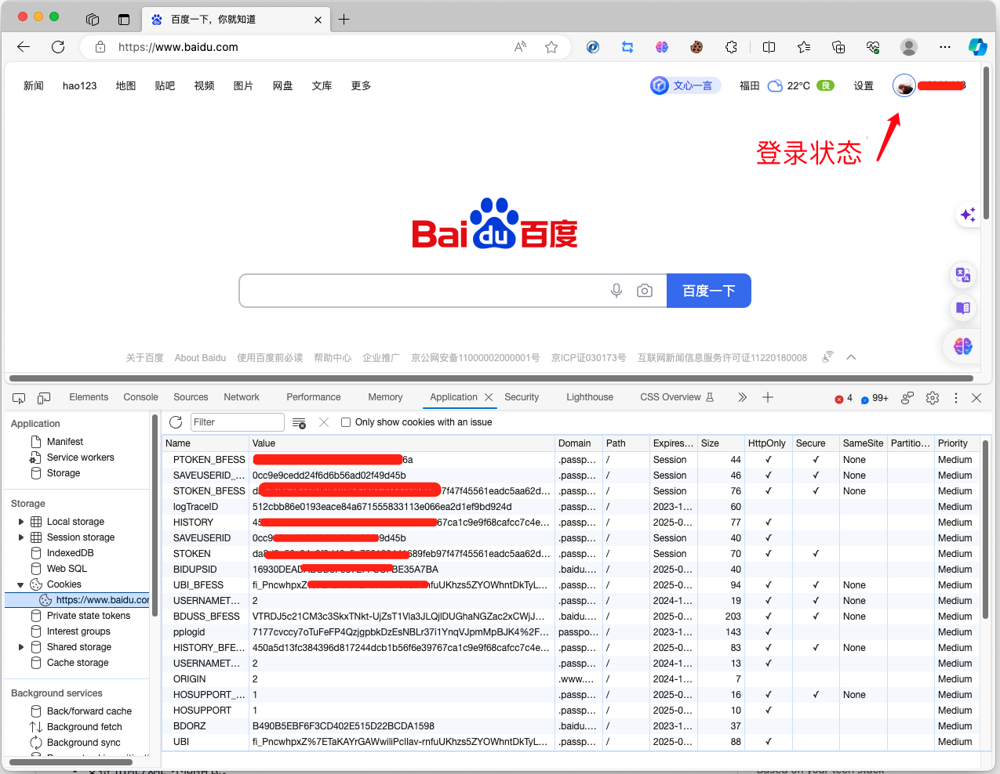
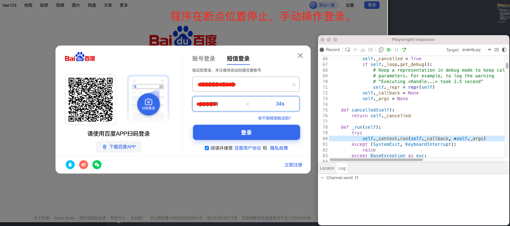
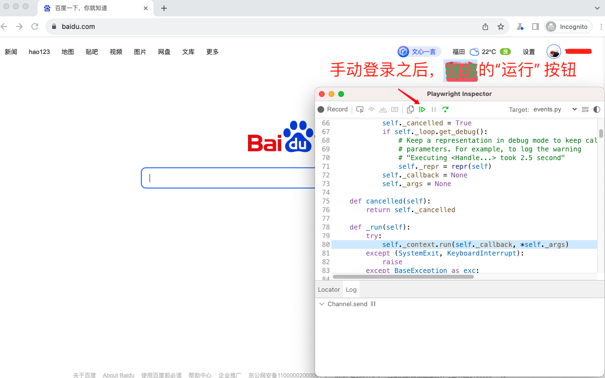

## playwright如何利用cookie免登录

我们在用 Playwright进行自动化测试或爬虫的时候，经常会碰到需要登录的情况，然而，各种形式的验证码往往给我们带来了不小的挑战。但是，我们知道，许多网站或系统一旦登录成功，几个小时，甚至是几天都不需要再次登录，可以直接访问网站功能。原理就是利用浏览器cookie保存了登录信息。



这里cookie保存的信息很多，我们也不太清楚哪些是影响是否登录的关键信息。在playwright中获取和使用cookie超简单。

### 操作步骤

1. 首先，编写一个脚本。

```py
# cookie_playwright.py
import os
import asyncio
from playwright.async_api import async_playwright

WEB_DIR = os.path.dirname(os.path.abspath(__file__))
COOKIE_PATH = os.path.join(WEB_DIR, "cookie.json")


async def main():
    async with async_playwright() as p:
        print("open browser")
        browser = await p.chromium.launch(headless=False)
        # 3.读取本地登录cookie
        # context = await browser.new_context(storage_state=COOKIE_PATH)
        page = await context.new_page()
        await page.goto('https://www.baidu.com')
        # 1.打断点
        await page.pause()
        # 2. 将登录之后的cookie保存到本地
        storage = await context.storage_state(path=COOKIE_PATH)
        print(storage)
        # await page.screenshot(path=f'example.png')
        await browser.close()
        print("close browser")


if __name__ == '__main__':
    asyncio.run(main())
```

运行上面的代码

```bash
python cookie_playwright.py
```

通过`pause()`方法，程序会在断点位置停止，此时，我们手动输入手机+验证码登录。



当手动完成登录，点击"运行"按钮，程序继续执行。



通过`storage_state()` 方法可以将登录cookie信息保存到本地 `cookie.json` 文件中。


2. 最后，再次修改脚本。

```py
import os
import asyncio
from playwright.async_api import async_playwright

WEB_DIR = os.path.dirname(os.path.abspath(__file__))
COOKIE_PATH = os.path.join(WEB_DIR, "cookie.json")


async def main():
    async with async_playwright() as p:
        print("open browser")
        browser = await p.chromium.launch(headless=False)
        # 3.读取本地登录cookie
        context = await browser.new_context(storage_state=COOKIE_PATH)
        page = await context.new_page()
        await page.goto('https://www.baidu.com')
        # # 1.打断点
        # await page.pause()
        # # 2. 将登录之后的cookie保存到本地
        # storage = await context.storage_state(path=COOKIE_PATH)
        # print(storage)
        # await page.screenshot(path=f'example.png')
        await browser.close()
        print("close browser")


if __name__ == '__main__':
    asyncio.run(main())
```

通过`new_context()` 创建上下文的时候，直接将本地保存的 `cookie.json` 文件中的cookie写入浏览器。

所以，直接访问 baidu 页面即是登录状态了。程序运行截图如下：


### 总结

通过这方式优缺点很明显。

* 优点

可以应对一切系统的登录，毕竟是人工登录的，所以，什么复杂的验证码，手机验证码都行。

* 缺点

cookie 是有效时间的，如果一直使用这个登录状态做操作，那么有效状态会比较长，如果长时间不用，可能一会儿就过期了。当然，这完全取决于系统对有效时间的设置。

总结下来，这是一个不错的临时避免登录的有效方案。

