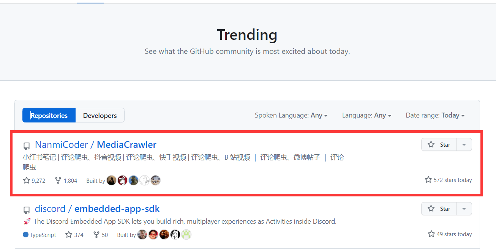

## 他刚刚删除了Github最火的项目！

刚刚过去的一周，我朋友刚刚经历了一次过山车，他开源的爬虫项目，在Github上冲上了趋势榜第1名，短短几天star数飙升至9K+，可就在此时，他却选择了删库。背后经历什么？

我对他做了个简单的专访，一下为QA内容。

### 1. 先来做个简单的自我介绍？

> 大家好，我是程序员阿江-Relakkes，Github开源仓库MediaCrawler作者，5年开发经验+2年测开经验，主力编程语言是Python，工作中用Golang，爬虫只是平时一个技术方向的爱好吧，或者算兴趣也行。

### 2. 什么背景下开源了 MediaCrawler 项目？

> 这个要追溯到23年5月份样子吧，这个时候准备换工作了，鉴于我之前在上一家单位筛选求职者简历时，如果一个人的简历上有Github开源项目链接，我会优先点进去看一下他的开源项目写的怎么样，然后从他的coding实现来做一个编码水平的初步评估，然后看看能否约面试。
> 有了上面的经历之后，就想着自己也要找工作了，是不是也给简历上准备一个项目，机缘巧合下这个自媒体平台爬虫MediaCrawler开源第一个版本就诞生了，随着第一个提交并push到Github上之后，陆陆续续的收到了一些Star，我记得在我参加面试的时候就应该有200个star左右（对我找工作的作用还是蛮大的）。

### 3. 介绍一下项目实现了什么功能？有什么特点？

> 实现的功能的话简单讲就是：基于playwright和异步编程实现了主流自媒体平台帖子+评论的数据采集
> 特点：开箱即用、上手门槛低、原生异步编程实现、支持并发爬取、数据支持多种方式存储

### 4. 为什么 MediaCrawler 会冲上GitHub 趋势榜第一名，你的心情是怎样的？以及之后你做了什么？

> 这个问题，说实话我也不知道具体的原因，我也很困惑，从我的视角看我自己的代码，我觉得它实现的很一般，值不了这么多的关注，不知道为什么突然就火了。
> 事后回顾了下整个火的流程。可能的原因大概是：在1300star星的时候被github小范围推荐了一波，然后正好这个仓库的定位和它所产生的结果（数据）刚好满足很多做相关数据分析的需求，以及有些人可能会用它来爬取数据然后喂个AI模型做一些其他处理，大家就开始点赞点起来，然后辐射开来，随着热度暴涨，我那个心情的真的非常开心啊，开心到我连发了两个视频去记录我这爆火的一刻。
> 火了之后，我的Gmail邮箱邮件也变得很多，很多人给我发邮件，也有人找我打广告，这时候我就从一些广告商中选了3家赞助我（毕竟有钱不赚 xxxx）。
> 因为从这个仓库开源到火爆之前其实这个仓库基本没有带给可观的他收入，基本可以忽略不计吧。

### 5. 为什么 MediaCrawler 刚刚大火，你就选择了删除项目？

> 爬虫是有一定风险的，从以往的爬虫宣判的案件来说，我这个项目既没有商业化，也没有给企业提供任何服务，理论上法律方面的问题应该不大，但是回家之后我咨询了我老婆（律师），从她的视角下给我科普了一些法律知识，再加上它火爆了之后，势必会大面积传播，这有可能会给一些平台方造成一定的压力（当然如果都是个人以学习为目的去跑这个项目，这点压力基本可以忽略了）。
> 再加上我的自媒体平台账号上，也有B友给我发了很多弹幕去说这个事情不宜过度的去宣传，有一定的风险，综合考量之下，我在3.20晚上凌晨大概在2.20左右的时候，执行`git rm -rf` .的操作，新建了一个main分支去覆盖原先的main分支，只保留了README文档，那一刻其实内心是很难受的，从第一次开源到爆火之后删库，经历了100多次Commit，累计贡献了1w多行代码，MediaCrawler它像自己一步一步抚养的孩子一样，孩子长大了，有出息了，然后孩子没了（大概是这种感觉吧）。。。。。

### 6. MediaCrawler 可能会面临法律风险，除了删除项目，有没有什么办法规避这些风险？

> 我在README文档中做了一些免责声明，规避风险的话，我认为不要对平台方造成损失，那怎么定义损失呢。
> 第一：就是不要并发的爬别人，比如搞什么分布式爬虫，人家不起诉你，起诉谁
> 第二：低调点、低调点、低调点。
> 第三：遵循Robot.txt协议

### 7. 如果不再开发 MediaCrawler，接下来你有什么计划？

> 接下来暂时还没什么计划，本来之前原计划是基于MeidaCrawer做一些可视化的自媒体爬虫平台（MediaCrawlerPro）然后开源出来，让更多人的简历上有一个拿得出手，值得去学习和研究的项目，基于Golang去实现。
> 本来技术方案这些都写完了，甚至项目、代码仓库我都建立好了，准备好好的再写一个开源项目，现在看来是没机会去实现了。

### 8. 最后，你有什么想对其他程序员说的？

> 我是一个双非本科的非科班毕业生，0基础转行的计算机，真的0基础，大学挂科累计有个7门左右，还记得刚学技术那会，真的特别特别努力（一点都不夸张，每天学到11点多，坚持了很久很久），后面入行计算机之后也没放下学习的脚步，积极的去探索新知识补充自己，丰富自己的技术视野。

最后，非常感谢阿江接受这次QA，可能作为一个非技术人员无法感受到Github上的star对于一个程序员的荣耀，但，作为阿江的同事，我们看这个star的飙升，不亚于自己买的股票突然翻了数倍。真的为此感到非常惋惜，不过，赞同阿江最终的决定。

文章的最后，再稍微科普一点开源知识！

1. 如果我们在职业期间，开源的项目也属于公司资产，不管是上班期间，亦或者非上班期间，当然了，大部分公司在这方面并没有特别严格的审查。因为我们工作中无处不在使用开源项目。Linux、nginx、redis、Python...等。如果我们要开源一些项目，最好能和Leader沟通一下，确认一下公司是否允许，如果允许，最好能签署一个开源协议，明确开源项目的归属权。

2. 在使用开源项目进行二次开发的时候，一定要了解开源项目的`LICENSE`，明确开源项目的使用范围，避免因为LICENSE的问题，造成不必要的麻烦。 我们公司曾经考虑过基于MeterSphere进行二次开发，因为项目使用的`GPL-3.0` 协议，所以最终没有采用。感兴趣的可以了解不同开源协议的细则。

3. 开源并不意味着绝对的自由、免费，更不是法外之地。搬运、传播有知识产权的技术，甚至是违规的技术，都是要承担法律责任的。
