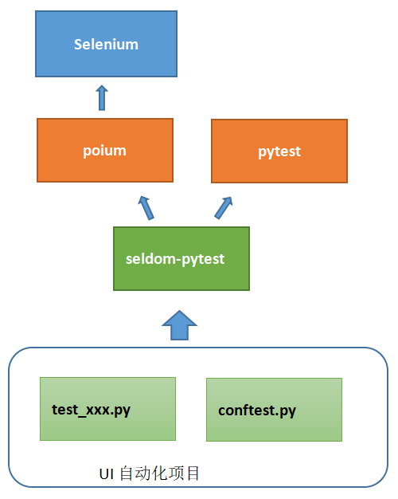

## 当pytest遇上poium会擦出什么火花

首先，创建一个`test_sample/test_demo.py` 文件，写入下面三行代码。

```py
def test_bing(page):
    page.get("https://www.bing.com")
    assert page.get_title == "必应"
```

不要问题 `page` 从哪里来，打开终端进入`test_sample/`目录，执行`pytest` 命令。

```shell
❯ pytest
================================================= test session starts =================================================
platform win32 -- Python 3.8.6, pytest-6.2.4, py-1.10.0, pluggy-0.13.1
benchmark: 3.2.3 (defaults: timer=time.perf_counter disable_gc=False min_rounds=5 min_time=0.000005 max_time=1.0 calibration_precision=10 warmup=False warmup_iterations=100000)
rootdir: D:\github\test-circle\seldom\test_sample
plugins: allure-pytest-2.8.40, base-url-1.4.2, benchmark-3.2.3, html-3.1.1, metadata-1.11.0, rerunfailures-9.1.1, seldom-0.0.3
collected 1 item

test_case.py
DevTools listening on ws://127.0.0.1:63137/devtools/browser/32d7e69d-69b5-4e0c-b0df-0e1d1d37af46
.                                                                                                   [100%]

================================================== 1 passed in 4.75s ==================================================
```

是不是觉得做UI自动化超级简单，并好奇是怎么做到的，别急，我画个图帮你理解。



__说明__

* poium: poium集成了selnium/appium并提供一套UI自动化测试的API。
* pytest: 强大的自动化测试框架，背后有一个丰富的生态，使用pytest就可以使用他背后的各种插件。
* seldom-pytest: 这是我开发的粘合剂，将poium和 pytest，以及pytest背后的插件粘合到一起。
* UI 自动化项目: 站在seldom-pytest的基础上编写你的UI自动化项目。


## seldom-pytest设计思想

如上图所示，在seldom-pytest中，核心只需要编写两类文件。

* conftest.py: 这是pytest的配置文件，功能非常强大，你可以在里面写各种钩子函数。如前面的例子，`page`就是一个钩子函数。

* test_xxx.py: 这是你的用例文件，你只需要引用各种钩子函数来完成用例即可。

## seldom-pytest 实战

其实，seldom-pytest 并没有做什么事情，几乎也没有提供API，更多是的提倡一个设计思想。我们来举个例子说明哈。

1. 创建一个`test_sample/conftest.py` 文件。

```py
import pytest
from poium import Page, Element


class BaiduPage(Page):
    search_input = Element(id_="kw", describe="搜索框")
    search_button = Element(id_="su", describe="搜索按钮")
    settings = Element(css="#s-usersetting-top", describe="设置")
    search_setting = Element(css="#s-user-setting-menu > div > a.setpref", describe="搜索设置")
    save_setting = Element(link_text="保存设置", describe="保存设置")


@pytest.fixture(scope="module", autouse=True)
def baidu_page(page):
    return BaiduPage(page)

```

* `BaiduPage` 类主要通过poium封装元素定位。

* `baidu_page` 将BaiduPage类封装为一个钩子函数。


2. 修改一个`test_sample/test_demo.py` 文件，代码如下：

```py

def test_baidu_search(baidu_page, base_url):
    """
    搜索
    """
    baidu_page.get(base_url)
    baidu_page.search_input.send_keys("pytest")
    baidu_page.search_button.click()
    baidu_page.sleep(2)
    assert baidu_page.get_title == "pytest_百度搜索"

```

`test_demo.py`文件不需要导入任何模块。可以直接调用钩子函数`baidu_page` 、`base_url` 实现自动化测试用例。


3. 如何运行用例，交给`pytest` 即可。

```shell
# 运行测试 (默认chrome)
> pytest

# 指定不同的浏览器 (chrome/gc, firefox/ff, safari)
> pytest --browser chrome
> pytest --browser firefox
> pytest --browser safari

# 指定base-url 
> pytest --base-url https://www.baidu.com

# 生成测试报告
> pytest --html ./report.html
```

当然，你也可以创建一个`run.py`文件来使用pytest。

```py
import pytest

pytest.main([
    "--browser=firefox",
    "--html=./report.html",
    "--base-url=https://www.baidu.com"
])
```

只需要运行该文件即可。

```shell
> python run.py
```

## 关于conftest文件

1. `conftest.py` 用来实现钩子函数的，我把`xxPage`类定义在里面有点奇怪，当然，你也可以单独封装一层，只在`conftest.py`实现`xx_page`钩子函数即可。

2. 一个项目中每个目录下都可以有一个`conftest.py`文件。每个`conftest.py`文件作用于当前目录以及子目录。我们可以充分利用这个特点。

```
test_sample/
├── test_aa/
│   ├── conftest.py
│   ├── test_aa.py
├── test_bb/
│   ├── conftest.py
│   └── test_bb.py
└── test_cc/
│   ├── conftest.py
│   └── test_cc.py
├── conftest.py
├── pytest.ini
└── run.py
```

> 如果定义的`xxPage`类会被所有测试用例用到，那么就放到根目录；如果只会被某个测试用例用到，那么就放到和他平级的目录。

seldom-pytest地址：

https://github.com/SeldomQA/seldom-pytest

项目中有例子，仅供参考，欢迎提出宝贵建议。


