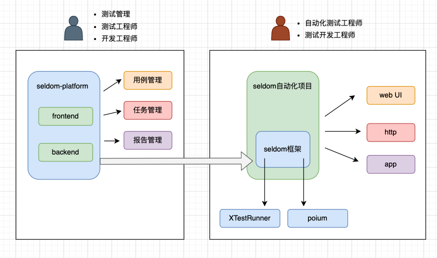
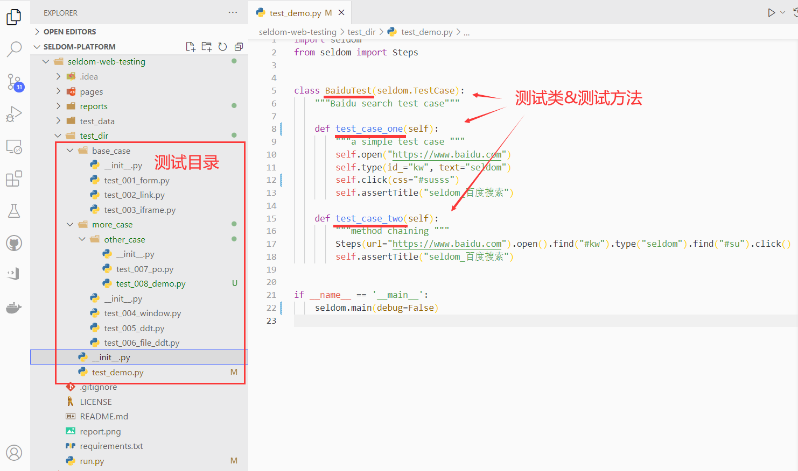
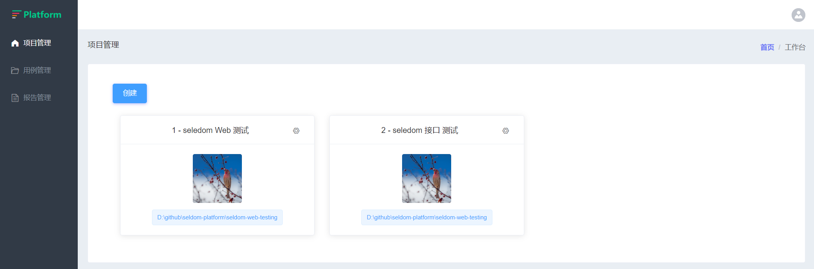
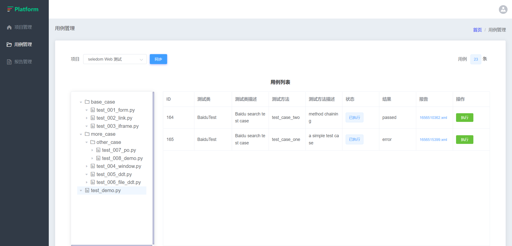
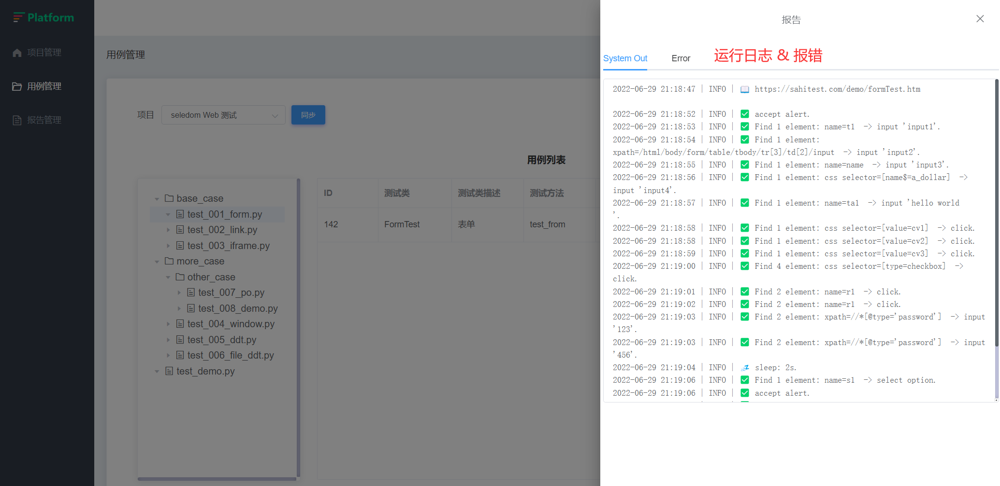

# 结束平台与框架之争 seldom-platform

早些时候，大家做自动化测试倾向于基于单元测试框架。例如：

* unittest/pytest + selenium/requests + HTMLTestRunner/allure + ...

* junit/testng +  selenium/httpclient + ...

近几年，更多的团队转向测试平台，尤其以接口测试平台，毕竟在`线版postman`容易实现，testerhome 上可以搜索出10个开源的接口测试平台，当然也有平台希望能支持api/web/app各种类型测试。例如

* LuckyFrame

* 流马

那么用平台还是用框架呢？这其实取决于你的屁股在哪儿。

* 测试新手：测试平台好，零基础不需要编程就能编写自动化测试，真香~！

* 测试平台开发：谁说我开发的平台不好用，我跟他急~！

* 自动化测试工程师：sorry啊~！你做的平台真的不好用。效率低，功能弱，bug多，就是难用（恕我直言，80%的测试平台没有产品，没有设计，没有持续迭代）。

* 想转测开的测试：不是我不愿意用你的平台，你跳槽可以吹牛自己会开发测试平台，我跳槽的时候吹什么？会用你的平台吗？你跳槽加薪了，我只配吃土吗？

## 平台 VS 框架各自优势

__框架的优势:__

* 灵活强大：当你具备编程能力，就能体会到编程的方式编写自动化的可控性很高。例如： if 判断、for 循环、封装、变量传递、字符串加密，语言层面非常简单的东西，搬到平台上要么不支持，要么很难用。

* 扩展方便：通过库的方式无限扩展框架的能力，例如：今天想连接MySQL数据库，安装个`pymysql`就可以；明天想实现AES加密，安装个`pycryptodome`就可以了。平台除了很难做到及时应对这种变化，还要考虑以什么的UI交互来提供这些能力。

* 测试人员自身成长：这一点其实也挺重要的，在编写自动化测试代码的过程中会对编程语言有更多的经验，不管是针对业务测试、还是升职、跳槽都是有益处，而平台往往会把你限制在UI的使用层面。

__平台的优势:__

* 降低了自动化门槛：这个无需多言。

* 可以搜集到更多数据：测试用例数量，天/周/月/年执行次数，天/周/年/成功率，各种数据的统计和分析。

* KPI: 没错~！平台容易做KPI，如果你是平台开发工程师，平台使你更容易衡量你的KPI，如果你是测试管理，上线的平台也更容易让你向上汇报。（前面说了，屁股决定脑袋，这条并无贬义）

## seldom-platform

那么，有没有一种可能，能兼顾框架与平台各自的优势，既可以让测试人员快乐的编写自动化测试代码，又能通过测试平台方便的展示测试用例、运行测试、统计分析、创建任务等。

https://github.com/SeldomQA/seldom-platform

* 项目架构

seldomQA打造的漫威宇宙。`seldom-platform`就是其中非常重要的一个超级英雄。

### seldom 自动化测试项目

作为自动化测试工程师，你可以使用seldom框架创建web/http/app(开发中...) 不同类型自动化测试。基于XTestRunner生成HTML/XML的测试报告，还是使用poium实现page objects设计模式。

如果，你会selenium/requests/appium等，你可能不用一天时间就可以使用seldom框架了，他提供了诸多好用的功能使你编写自动化测试事半功倍。

### seldom-platform

seldom-platform 作为一个平台可以非常方便的接入seldom自动化项目。

* 创建项目

* 同步seldom项目用例

这正是seldom-platform 与别的测试平台不同之处，他把seldom自动化测试的`目录&文件`，甚至`类`、`方法`解析到了平台上。

__已实现功能__

* 支持一键同步：你在seldom项目中创建一个测试方法，点击一下`同步`按钮，就能在平台上看到他了。

* 支持注释：类、方法的注释都可以获取到。

* 支持数据驱动：数据驱动编写的用例，依然可以解析。

* 单条用例执行：点击`执行` 按钮，可以执行单条用例。

__未实现功能__

未实现的很多，任务管理、测试分析、甚至登录都没做，不过，这都没有技术难点。

__执行单条用例__

执行单条用例可以查看日志或报错。

点击用例，可以通过弹出抽屉查看用例的执行日志、错误等信息。

## 最后

1. 别问了，不支持pytest，这是基于seldom框架提供的能力，他重写了unittest框架的运行测试加载器。

2. 目前开源平台中还没有看到有类似的方案，seldom官方技术群中`@古一`实现了类似的展示效果，后端解析方式不同。他参与项目需求的讨论，并提供了一些有价值的建议。

3. 下一期解密seldom-platform技术实现，再次邀请会前后端开发的同学，如果你对seldomQA项目感兴趣，并get到他的价值，欢迎参与进来共建。QQ群：948994709

4. 如果你有Github账号，欢迎给`seldom-platform`加星，点亮`star`，助力每一个梦想。

5. 再次感谢 @yongchin0821 一起参与项目的开发。

> 想说的话：我之前在文章提到seldom/unittest/XTestRunner的时候，评论区一片我继续用pytest，似乎unittest早就该丢掉历史的垃圾堆，放着pytest不用，去用unittest就是守旧，我大概在 2015年开始分享pytest的使用，他有非常丰富的插件，自身功能也很强大。我之前在多个项目中有使用到他，seldom之所以基于unittest是因为，他更容易二次开发，seldom也补足了unittest的一些主要短板，况且pytest的数据驱动设计的真的很恶心（我前面有文章详细说过了）。unittest作为python标准库，简单易用，易于扩展，并非一无是处。说这个并非挑起事端。不用在评论区刷pytest了，我仍然会在一些适合的场景使用pytest。

