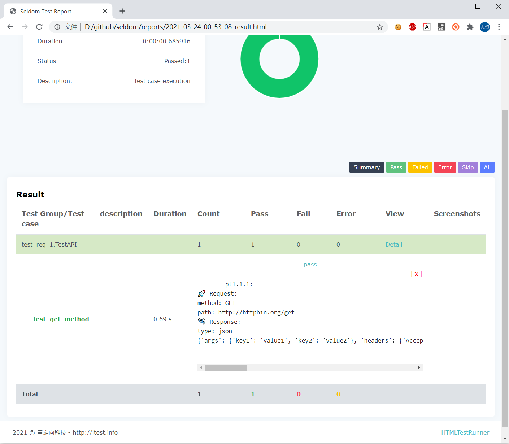

# Seldom2.0: 如何更简单的实现HTTP接口测试

背景：

Seldom 1.0版本2020年1月发布到现在，更新20多个小版本，目前在做Web UI方面已经是一套比较成熟的方案了。之前，我创建过一个git分支，希望能把appium集成进来，因为appium和selenium本来就有很强的关联性。但是，目前来看国内使用openatx的用户更多，然而，openatx(uiautomator2/facebook-wda) 这样的库，由于API风格问题，比较难集成。后来，就暂时放弃了。

关于接口自动化框架，`土豆`同学曾创建了reudom，其实就是用seldom 整合了Requests库，API设计的不好，并没有什么亮点，我本人也没有什么好的想法，就没有参与。其实，也不是完全没有，只是还足以让我动手。

直到，前段时间看到cypress居然也可以做接口测试，又让我有了想法为什么不把接口测试也集成到seldom里面。

* seldom本来就提供的有很好用的ddt，测试报告，这些可以直接给接口自动化使用。
* 在做UI自动化的时候，偶尔也需要调用接口去完成一些辅助工作。

如此看来，seldom支持HTTP接口测试两全齐美。

seldom 完全基于[requests](https://docs.python-requests.org/en/master/)实现，如果你熟悉requests API, seldom 默认兼容requests 的API，用法一致。

## 优势对比

先来看看unittest + requests 是如何来做接口自动化的：

```py
import unittest
import requests


class TestAPI(unittest.TestCase):

    def test_get_method(self):
        payload = {'key1': 'value1', 'key2': 'value2'}
        r = requests.get("http://httpbin.org/get", params=payload)
        self.assertEqual(r.status_code, 200)


if __name__ == '__main__':
    unittest.main()
```

这其实，已经非常简洁，甚至我觉得这几行代码敲下来，比postman\JMeter之类的工具更加简单，效率更高。

同样的用例，用seldom实现。

```py
import seldom


class TestAPI(seldom.TestCase):

    def test_get_method(self):
        payload = {'key1': 'value1', 'key2': 'value2'}
        self.get("http://httpbin.org/get", params=payload)
        self.assertStatusCode(200)


if __name__ == '__main__':
    seldom.main()
```

主要简化点在，接口的返回数据的处理。当然，seldom真正的优势在日志和报告。打开debug模式`seldom.run(debug=True)` 运行上面的用例。

```shell
> python .\test_req_1.py
2021-03-24 00:54:30 [INFO] A run the test in debug mode without generating HTML report!
2021-03-24 00:54:30 [INFO]
            _      _
           | |    | |
 ___   ___ | |  __| |  ___   _ __ ___
/ __| / _ \| | / _` | / _ \ | '_ ` _ \
\__ \|  __/| || (_| || (_) || | | | | |
|___/ \___||_| \__,_| \___/ |_| |_| |_|
-----------------------------------------
                             @itest.info

test_get_method (test_req_1.TestAPI) ...
🚀 Request:--------------------------
method: GET
path: http://httpbin.org/get
🛬️ Response:------------------------
type: json
{'args': {'key1': 'value1', 'key2': 'value2'}, 'headers': {'Accept': '*/*', 'Accept-Encoding': 'gzip, deflate', 'Host': 'httpbin.org', 'User-Agent': 'python-requests/2.25.0', 'X-Amzn-Trace-Id': 'Root=1-605a1d46-3cd15a151f0d46d20beda1d2'}, 'origin': '173.248.248.93', 'url': 'http://httpbin.org/get?key1=value1&key2=value2'}
ok

----------------------------------------------------------------------
Ran 1 test in 0.534s

OK
```

关闭debug模式，查看报告。



通过日志/报告都可以清楚的看到。

* 请求的方法
* 请求url
* 响应的类型
* 响应的数据

## 更强大的断言

断言接口返回的数据是我们在做接口自动化很重要的工作。

* assertJSON 断言

例如下面的接口：
```py
payload = {'name': 'tom', 'hobby': ['basketball', 'swim']}
r = requests.get("http://httpbin.org/get", params=payload)
print(r.json())
```

返回结果如下：

```json
{
  "args": {
    "hobby": [
      "basketball",
      "swim"
    ],
    "name": "tom"
  },
  "headers": {
    "Accept": "*/*",
    "Accept-Encoding": "gzip, deflate",
    "Host": "httpbin.org",
    "User-Agent": "python-requests/2.25.0",
    "X-Amzn-Trace-Id": "Root=1-605b562f-5746980d5fa5ce5513f20310"
  },
  "origin": "113.87.13.41",
  "url": "http://httpbin.org/get?name=tom&hobby=basketball&hobby=swim"
}
```

我的目标是断言`name` 和 `hobby` 部分的内容。

unittest + requests的写法。

```python
import unittest
import requests


class TestAPI(unittest.TestCase):

    def test_get_method(self):
        payload = {'name': 'tom', 'hobby': ['basketball', 'swim']}
        r = requests.get("http://httpbin.org/get", params=payload)
        ret = r.json()
        self.assertEqual(ret["args"]["hobby"], ['basketball', 'swim'])
        self.assertEqual(ret["args"]["name"], 'tom')
```

假设接口返回的 `basktball`、`swim` 顺序反了，断言就会失败，但其实这个列表可以是无序的。

再来看看seldom中的断言。

```py
import seldom


class TestAPI(seldom.TestCase):

    def test_get_method(self):
        payload = {'name': 'tom', 'hobby': ['basketball', 'swim']}
        self.get("http://httpbin.org/get", params=payload)
        assert_json = {'args': {'hobby': ['swim', 'basketball'], 'name': 'tom'}}
        self.assertJSON(assert_json)
```
将你要检查的字段写出来，层级关系是正确的即可，上面特意对调了 `basktball`、`swim` 的​位置。

```shell
test_get_method (test_req_1.TestAPI) ...
🚀 Request:--------------------------
method: GET
path: http://httpbin.org/get
🛬️ Response:------------------------
type: json
{'args': {'hobby': ['basketball', 'swim'], 'name': 'tom'}, 'headers': {'Accept': '*/*', 'Accept-Encoding': 'gzip, deflate', 'Host': 'httpbin.org', 'User-Agent': 'python-requests/2.25.0', 'X-Amzn-Trace-Id': 'Root=1-605b593e-0e7b44fa7587140f1cb81be2'}, 'origin': '113.87.13.41', 'url': 'http://httpbin.org/get?name=tom&hobby=basketball&hobby=swim'}
💡 Assert data has not key: headers
💡 Assert data has not key: origin
💡 Assert data has not key: url
ok
```

seldom还会提示你还有哪些字段没有断言。

* assertSchema 断言

有时我们并不关心数据本身是什么，而是更关心数据的类型、长度等，比如，检查`username`是否为字`string`类型。

seldom 集成了JSON-Schema，可以实现强大的JSON校验。

```python
import seldom


class TestAPI(seldom.TestCase):

    def test_format_assert(self):
        """
        Assert json-schema
        help doc: https://json-schema.org/
        """
        payload = {'usrname': "jack"}
        self.get("http://httpbin.org/get", params=payload)
        # 数据校验
        schema = {
            "type": "object",
            "properties": {
                "usrname": {
                    "type": "string"
                }
            },
        }
        self.assertSchema(schema)
```

* assertPath 断言

假设接口返回数据如下，如果我想断言 `bread`。

```json
{"args": {"foot": "bread"}}
```

unittest的断言是这样的：

```py
self.assertEqual(ret["args"]["foot"], 'bread')
```

seldom中可这样写：

```py
self.assertPath('args.foot', 'bread')
```

是否再次感受到了seldom提供的断言非常灵活，强大。


## 数据依赖

在场景测试中，我们需要利用上一个接口的数据，调用下一个接口。

```python
class TestRespData(seldom.TestCase):

    def test_data_dependency(self):
        """
        Test for interface data dependencies
        """
        headers = {"X-Account-Fullname": "bugmaster"}
        self.get("/get", headers=headers)
        self.assertStatusCode(200)

        username = self.response["headers"]["X-Account-Fullname"]
        self.post("/post", data={'username': username})
        self.assertStatusCode(200)
```

seldom提供了`self.response`用于记录上个接口返回的结果，直接拿来用即可。


## 数据驱动

seldom本来就提供的有强大的数据驱动，拿来做接口测试非常方便。

* data

```python
class TestDDT(seldom.HttpRequest):

    @data([
        ("key1", 'value1'),
        ("key2", 'value2'),
        ("key3", 'value3')
    ])
    def test_data(self, key, value):
        """
        Data-Driver Tests
        """
        payload = {key: value}
        self.post("/post", data=payload)
        self.assertStatusCode(200)
        self.assertEqual(self.response["form"][key], value)

```

* file_data

创建`data.json`数据文件
```
{
 "login":  [
    ["admin", "admin123"],
    ["guest", "guest123"]
 ]
}
```

通过`file_data`实现数据驱动。

```py
import os
import seldom
from seldom import file_data

DATA_PATH = os.path.join(os.path.dirname(os.path.abspath(__file__)), "data.json")


class TestDDT(seldom.TestCase):

    @file_data(DATA_PATH, key="login")
    def test_data(self, username, password):
        """
        Data-Driver Tests
        """
        payload = {username: password}
        self.post("http://httpbin.org/post", data=payload)
        self.assertStatusCode(200)
        self.assertEqual(self.response["form"][username], password)

```

## 项目地址

GitHub:
https://github.com/SeldomQA/seldom

