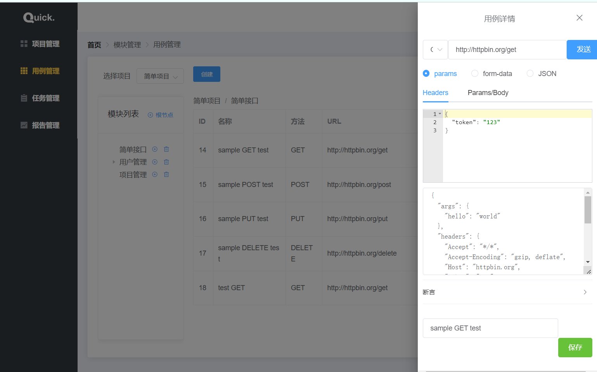
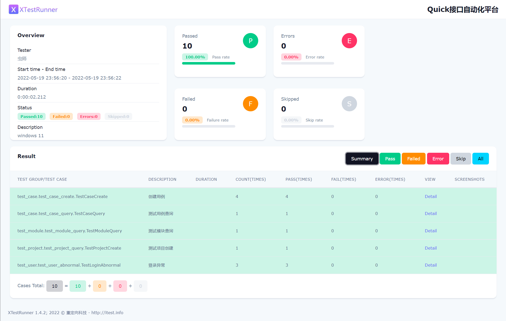
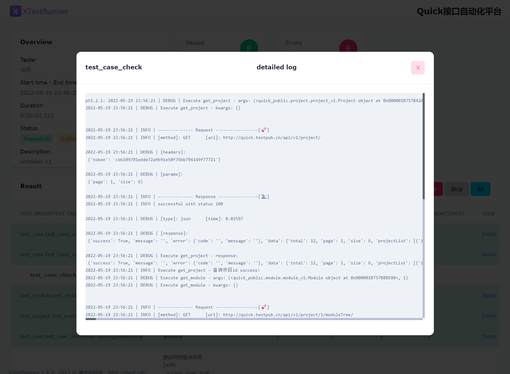

# 接口自动化项目最佳实践

Flask文档是简洁优美的典范，你可以一天时间学完上面的内容。对于初学者来说，在没有项目经验的情况下，很难快速的使用Flask搭建出一个Web系统。

我意识到seldom也可能存在这样的问题，这篇文章我打算深度的聊一聊Seldom在实际项目中如何做接口自动化。说`最佳实践`可能有些夸大了。但最近确实参与公司接口自动化项目的编写，包括参考其他同事的用法，还算有些经验拿出来分享。

## 准备工作

* 被测试系统

http://quick.testpub.cn/

> 这个我是搭建的一个免费的接口测试平台，主要用于学习。账号密码自动填充，请勿压测，服务很垃圾。



功能说来也很简单：

* 登录、注册
* 项目管理
* 模块、用例管理
* 测试任务管理
* 测试报告管理

整个项目20个接口左右，虽然不复杂，但至少也能代表一类系统了。

* 测试框架

seldom 2.9 版本，从 2.0 发布到现在重点接口自动化的能力扩展上。目前从功能上和稳定性上面都有很大提升。

## 项目结构

先来认识接口自动化项目目录划分：


```shell
mypro/
.
├── __init__.py
├── run.py   # 运行用例入口文件
├── quick_public  # 封装公共调用
│   ├── __init__.py
│   ├── module
│   │   ├── __init__.py
│   │   └── module_v1.py  # v1 通过版本号减少后续兼容问题
│   ├── project
│   │   ├── __init__.py
│   │   └── project_v1.py
│   └── user
│       ├── __init__.py
│       └── user_v1.py
├── reports   # 测试报告&日志目录
│   ├── 2022_05_18_12_05_04_result.html
│   └── seldom_log.log
├── test_data  # 测试数据目录
│   ├── __init__.py  # 存放通用的测试数据
│   └── json_data.json  # 具体用例的数据驱动文件
└── test_dir   # 测试用例目录
    ├── __init__.py
    ├── test_case   # 按照功能模块划分
    │   ├── __init__.py
    │   ├── test_case_create.py
    │   └── test_case_query.py
    ├── test_module
    │   ├── __init__.py
    │   └── test_module_query.py
    ├── test_project
    │   ├── __init__.py
    │   └── test_project_query.py
    └── test_user
        ├── __init__.py
        └── test_user_abnormal.py
```

* `run.py`:  入口运行文件
* `quick_public`: 用于存放公共模块。
* `reports`: 测试报告和日志目录。
* `test_data`: 测试数据。
* `test_dir`: 测试用例目录。

在跨团队的项目中会按按照团队进一步划分：

```
test_dir   # 测试用例目录
    ├── __init__.py
    ├── user   # 用户中心
    │   ├── __init__.py
    │   ├── case/   # 测试用例
    │   │    ├── __init__.py
    │   │    ├── test_xxx.py
    │   │    └── test_xxx.py
    │   ├── common/  # 公共模块
    │   │    ├── __init__.py
    │   │    ├── xx_common.py
    │   │    └── xx_common.py
    │   ├── test_data/  # 测试数据
    │   │    ├── __init__.py
    │   │    ├── xx_common.py
    │   │    └── xxx_comon.py

```

* `case`： 用于存放`用户中心`的用例。
* `common`: 公共模块，主要是把几个接口的调用再组合成一个业务。
* `test_data`: 用于`用户中心` 的测试数据。

## 功能分析

我们在做接口自动化一般分两种情况：

1. 单个接口验证。

例如，登录接口，这个接口一般是系统的入口，没有什么依赖。

2. 场景验证。

例如，项目查询接口，依赖登录接口，获取用户token。当然，有些场景是强相关的，必须按照顺序: A -> B --> C --> D .. 调用。

__实现方案__

1. 针对单个接口的验证，以异常验证为主要。
2. 如果一个接口被依赖，需要单独封装。
3. 在场景测试中，接口通过调用封装完成前置动作。


## 接口自动化项目实战

方案不复杂，接下来开始实战。

### 1. 登录异常测试


`test_dir/test_user/test_user_abnormal.py`


```py
"""
author: bugmaster
data: 2022/05/17
"""
import seldom
from seldom import Seldom, data


class TestLoginAbnormal(seldom.TestCase):
    """
    登录异常
    """

    def start(self):
        self.url = f"{Seldom.base_url}/api/v1/login/"

    @data([
        ("case_user_null", "", "1234", "10010", "用户名密码为空"),
        ("case_pawd_null", "user", "", "10010", "用户名密码为空"),
        ("case_error", "error", "error", "10011", "用户名密码错误"),
    ])
    def test_login(self, _, username, password, code, msg):
        """
        测试用例登录异常
        """
        self.post(self.url, data={"username": username, "password": password})
        self.assertStatusCode(200)
        self.assertPath("error.code", code)
        self.assertPath("error.message", msg)

```

这个接口非常简单，主要用到了：

* `@data()` 装饰器进行数据驱动。

* `assertPath()` 可以更加简单的获取接口返回的数据进行断言。

> 为什么不验证登录成功的用例，验不验证都可以，如果一个接口后面会成为别的用例的一部分，我们倾向于不验证了。

### 2. 项目查询接口测试

想要查询项目就需要先登录，那先去封装一个登录模块。


2.1 封装登录


`quick_public/user/user_v1.py`


```py
from seldom import Seldom
from seldom.request import HttpRequest, check_response


class UserLogin(HttpRequest):

    def __init__(self, user):
        self.username = user.get("username")
        self.password = user.get("password")

    @check_response("获取用户token", 200, ret="data.Token")
    def get_user_token(self):
        """
        获取用户token
        """
        url = f"{Seldom.base_url}/api/v1/login/"
        r = self.post(url, data={"username": self.username, "password": self.password})
        return r

```

* `UserLogin`类接收用户名、密码。

* `@check_response()` 装饰器前面有单独做过介绍，减少样例代码，`ret="data.Token"` 提取返回接口返回中的用户token。

2.2 准备用户登录数据

我们会约定俗成的把一些固定的通用数据丢到 `test_data/__init__.py` 文件中。

```py

class UserInfo:
    # 登录用户1
    user_1 = {"username": "admin", "password": "admin123456"}

```

2.2 项目查询

`test_dir/test_project/test_project_query.py`


```py
"""
author: bugmaster
data: 2022/05/17
"""
import seldom
from seldom import Seldom, data
from seldom.request import ResponseResult
from seldom.utils import genson
from quick_public.user.user_v1 import UserLogin
from test_data import UserInfo


class TestProjectCreate(seldom.TestCase):
    """
    测试项目创建
    """
    @classmethod
    def start_class(cls):
        login = UserLogin(UserInfo.user_1)
        cls.user_token = login.get_user_token()

    def start(self):
        self.url = f"{Seldom.base_url}/api/v1/project/"

        self.headers = {
           "token": self.user_token
        }

    def test_project_check(self):
        """
        项目数据检查
        """
        data_ = {"page": 1, "size": 6}
        self.get(self.url, params=data_, headers=self.headers)
        self.assertStatusCode(200)
        self.assertPath("success", True)

        # 获取接口的数据schema
        # schema = genson(self.response["data"]["projectList"])
        # print("schema:\n", schema)

        ResponseResult.response = self.response["data"]["projectList"]
        assert_data = {
            "$schema": "http://json-schema.org/schema#",
            "type": "array",
            "items": {
                "type": "object",
                "properties": {
                    "id": {
                        "type": "integer"
                    },
                    "name": {
                        "type": "string"
                    },
                    "describe": {
                        "type": "string"
                    },
                    "status": {
                        "type": "boolean"
                    },
                    "create_time": {
                        "type": "string"
                    }
                },
                "required": [
                    "create_time",
                    "describe",
                    "id",
                    "name",
                    "status"
                ]
            }
        }
        self.assertSchema(assert_data)
```

代码有点多，但不复杂。

* `start_class` 在每个测试类开始前执行，调用`UserLogin()` 实现用户登录。
* `start` 在每个用例开始前执行，用于准备用例需要的数据。
* `assertSchema()`: 验证数据就比较有意思了，对于项目返回的列表，我并不关心项目的`id`是不是`1`，`name`是不是叫`xx项目`；反而数据结构和字段类型非常重要。`assertSchema()`就是用来断言数据结构和类型的。我知道你写这样的数据结构有难度，于是，提供了`genson()` 方法帮你将数据生成这样的结构。


### 3. 用例查询接口测试

3.1 封装项目查询

`quick_public/project/project_v1.py`

```py
from seldom import Seldom
from seldom.request import HttpRequest, check_response


class Project(HttpRequest):

    def __init__(self, user_token):
        self.user_token = user_token

    @check_response("查询项目id", 200, ret="data.projectList[0].id", debug=True)
    def get_project(self):
        """
        获取一条项目数据
        """
        url = f"{Seldom.base_url}/api/v1/project/"

        headers = {
            "token": self.user_token
        }

        data_ = {"page": 1, "size": 6}
        r = self.get(url, params=data_, headers=headers)
        return r
````

* 查询项目一定需要用户登录token。

* `ret="data.projectList[0].id"` 用于返回项目列表的第个项目的`id`。

> 为什么公共模块要加 `_v1` 的后缀。当一个公共模块被多条用例调用时，被改动时影响越大，当他还在使用的情况下就不要轻易修改入参和返回值。但是，你又想做一些修改，为新的用例提供服务，那么就可以通过版本区分。是不是很好的方式？我是受同事的启发。


3.2 封装模块查询

`quick_public/module/module_v1.py`

```py

from seldom import Seldom
from seldom.request import HttpRequest, check_response


class Module(HttpRequest):

    def __init__(self, user_token):
        self.user_token = user_token

    @check_response("查询模块ID", 200, ret="data[0].id", debug=True)
    def get_module(self, project_id: int = None):
        """
        获取一条模块数据
        :param project_id: 项目id
        """
        if project_id is None:
            raise ValueError("项目id 不能为空")

        url = f"{Seldom.base_url}/api/v1/project/{project_id}/moduleTree/"

        headers = {
            "token": self.user_token
        }

        r = self.get(url, headers=headers)
        return r
```

* 模块接口需要用户token，同时还需要项目ID。

> 为什么不介绍模块查询？和项目查询差不多，去看代码。


3.3 用例查询接口

`test_dir/test_case/test_case_query.py`

```py
import seldom
from seldom import Seldom
from quick_public.user.user_v1 import UserLogin
from quick_public.project.project_v1 import Project
from quick_public.module.module_v1 import Module
from test_data import UserInfo


class TestCaseQuery(seldom.TestCase):
    """
    测试用例查询
    """

    @classmethod
    def start_class(cls):
        # 获取用户token
        login = UserLogin(UserInfo.user_1)
        cls.user_token = login.get_user_token()

    def start(self):
        self.headers = {
           "token": self.user_token
        }

    def test_case_check(self):
        """
        用例数据检查
        """
        # 获得项目ID
        project = Project(self.user_token)
        project_id = project.get_project()

        # 获得模块ID
        module = Module(self.user_token)
        module_id = module.get_module(project_id)

        # 模块查询接口
        data_ = {"page": 1, "size": 5}
        self.url = f"{Seldom.base_url}/api/v1/module/{module_id}/cases/"

        self.get(self.url, params=data_, headers=self.headers)
        self.assertStatusCode(200)
        self.assertPath("success", True)
```

* 首先，调用登录接口获取用户token；
* 然后，通过用户token查询项目id；
* 接下来，通过用户token和项目id；
* 最后，通过用户token和模块id查询用例。

> 你可能有疑问，为什么不写死一个模块ID，这样就不用调用项目和模块接口了。当然可以的，你要保证测试的ID不被删除或改动。
> 这个示例更多的是展示用例的依赖其他接口如何处理。实际项目当中有很多业务是强依赖的，不能从中间开始执行。必须一个接口一个接口严格按照顺序执行。


### 4. 用例创建接口测试

当用例的参数很多时，我们就要通过数据文件来实现参数化了。

4.1 创建参数化文件


`test_data/json_data.json`


```json
 "create_case": [
    {
      "scene": "case_all_params_null",
      "req": {
        "name": "",
        "module_id": 14,
        "method": "",
        "url": "",
        "header": "",
        "params_type": "",
        "params_body": "",
        "result": "",
        "assert_type": "",
        "assert_text": ""
      },
      "resp": {
        "code": "30010",
        "message": "This field may not be blank"
      }
    },
    {
      "scene": "case_name_null",
      "req": {
        "name": "",
        "method": "GET",
        "url": "http://httpbin.org/get",
        "header": "{\"token\":\"123\"}",
        "params_type": "params",
        "params_body": "{\"hello\":\"world\"}",
        "result": "\"\"",
        "assert_type": "include",
        "assert_text": "httpbin"
      },
      "resp": {
        "code": "30010",
        "message": "This field may not be blank"
      }
    },
  ]
}
```

当参数比较多时，我们可以将参数嵌套。
* `scence` 描述用例场景；
* `req` 定义接口入参；
* `resp` 定义断言接口返回值。

> seldom 还支持yaml/csv/excel等文件格式，不过，我发现大多测试偏爱json，我也一样。

4.2 调用参数化文件

`test_dir/test_case/test_case_create.py`


```py
"""
author: bugmaster
data: 2022/05/18
"""
import seldom
from seldom import Seldom, file_data
from quick_public.user.user_v1 import UserLogin
from quick_public.project.project_v1 import Project
from quick_public.module.module_v1 import Module
from test_data import UserInfo


class TestCaseCreate(seldom.TestCase):
    """
    创建用例
    """

    @classmethod
    def start_class(cls):
        # 获取用户token
        login = UserLogin(UserInfo.user_1)
        cls.user_token = login.get_user_token()
        # 获得项目ID
        project = Project(cls.user_token)
        project_id = project.get_project()
        # 获得模块ID
        module = Module(cls.user_token)
        cls.module_id = module.get_module(project_id)

    def start(self):
        self.url = f"{Seldom.base_url}/api/v1/case/create/"
        self.headers = {
           "token": self.user_token
        }

    @file_data("test_data/json_data.json", key="create_case")
    def test_create_case_abnormal(self, _, req, resp):
        """
        用例创建异常检查
        """
        data_ = {
            "name": req["name"],
            "module_id": self.module_id,
            "method": req["method"],
            "url": req["method"],
            "header": req["header"],
            "params_type": req["params_type"],
            "params_body": req["params_body"],
            "result": req["result"],
            "assert_type": req["assert_type"],
            "assert_text": req["assert_text"]
        }
        self.post(self.url, json=data_, headers=self.headers)
        self.assertStatusCode(200)
        self.assertPath("error.code", resp["code"])
        self.assertInPath("error.message", resp["message"])

```

* `@file_data`: 指定数据文件，一般情况下指定个文件名`json_data.json`即可，方法会自动查找文件的位置。`key` 是用来提取json文件的数据的，不指定将取至整个文件。

> 你会发现`json_data.json` 文件中有个`debug`，里面有一条数据，这是用来调试的。当参数化数据很多时，我们很难排查是哪一条数据造成的问题。于是，就可以通过`debug`单独定义一条数据来调试。

> 参数化在接口自动化中是非常重要的功能，参数化用的好事半功倍，我们一个参数化文件可以包含上百条用例。

### 运行测试

最后，我们来执行用例。


`run.py`

```py
import seldom


if __name__ == "__main__":
    # 执行测试用例目录
    seldom.main(
        path="./test_dir/",
        base_url="http://quick.testpub.cn",
        title="Quick接口自动化平台",
        tester="虫师",
        # debug=True,
        rerun=2,
        description="windows 11"
    )
```

* `run.py` 文件很简单，需要指定`base_url`，这是所有用例都会用到的。

请务必在终端下执行：


```shell
> python run.py
```

* 报告列表


* 报告详情



> XTestRunner 是一款颜值的测试报告。作为seldomQA的子项目你可以独立安装使用，最新版本 1.4.2。


## 总结


项目完整的项目代码：

https://github.com/defnngj/seldom-api-testing

这是一篇看完需要操作和实践文章，建议收藏，转发到朋友圈，开源不易，写作不易。

