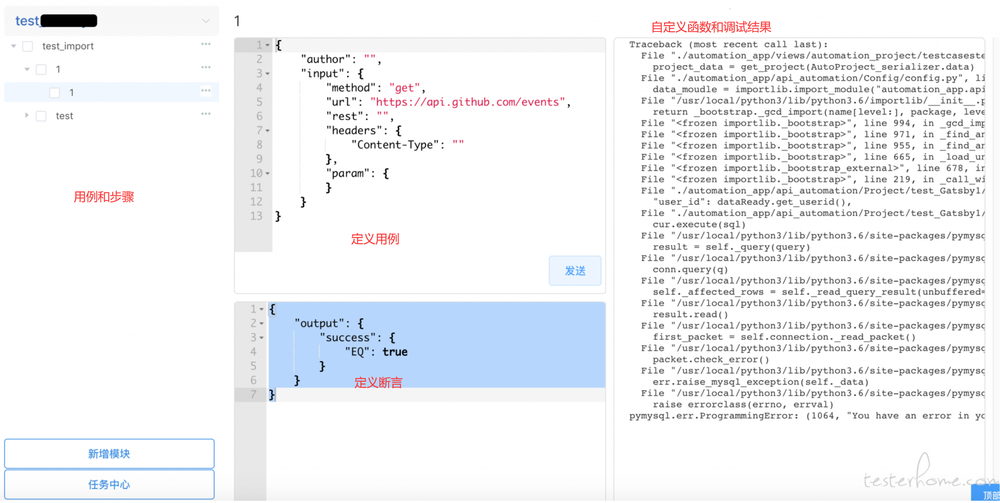

# 我们开始用seldom做接口自动化了

接口自动化的门槛并不高，而且可选择的工具太多太多了。

* 工具类：postman、apifox、JMeter

* 框架类：robot framework、HttpRunner

* 平台类：MeterSphere、以及各种自研的平台。

我们公司其实有自己的接口自动化测试平台，经历了三个版本，最终版本如下图。



这样的设计兼顾了易用性，以及支持自定义函数。谈不上在行业多么优秀，但功能层面绝对是满足需求的。

从实际使用情况来看，仍然存在一些问题。

1. 参数的传递不够方便，A 接口的出参给B接口调用，通过特殊的方式提取和调用，例如 `${token}`， 非编程的方式大家都只能这么玩儿。

2. 仍然需要编写代码自定义函数，比如，封装一个函数去拿接口的token。

3. 调试比较麻烦，自定义用例文件（json文件），自定义函数（代码文件），又通过平台执行，并不能像代码一样方便的做到灵活的单步调试。

4. 每个接口都有很多相似的前置的接口调用，使用起来并不高效率。

基于以上种种原因，接口自动化测试平台的使用率并不算很高，当我们测开提议再次对接口平台重构的时候。更多的测试同事表示不想被平台束缚了，想更加灵活的使用框架编写接口自动化测试，经过同事对不同接口测试框架的调研和实际用例编写，最终决定选用`seldom`框架。

> 你可能会觉得seldom是我的开源项目，当然会选我的框架了，实际情况是大家都太会做接口自动化了，可选的工具、平台那么多。如何更好的兼具灵活性和易用性才是考虑的重点。

__需要说明的是：平台有不可替代的一些优势，比如，用例运行次数，用例结果分析记录，用例的历史记录，这些功能我们仍然会通过平台实现，但是写用例的过程，测试人员就可以像开发一样使用git维护接口自动化项目了。__

## seldom 的设计理念

简单一句话就是回到最初写代码的样子。

自动化测试框架很多，只有在测试领域有一个比较奇怪的现象，如何用不写代码的方式解决自动化问题。为此，我们发明了用特定领域语言写用例，发明了用 `excel` 写用例，发明了用 `YAML/JSON` 写用例。这些方案看似简化了用例的编写，但是，会让解决复杂的问题变得更复杂。比如实现个分支判断/循环，传递参数，调用封装的步骤，编程语言中用 if/for 、变量、函数就实现了，但是用非编程语言的方式写用例处理起来就很麻烦。最终，并不能完全脱离编程，那么为什么不一开始就选择一个编程框架呢？

然而，seldom的定位是尽量用简单的设计去解决复杂问题，例如 Flask、requests、yagmail...等，这些框架/库都有一个共同的特点，用简单的方式去解决复杂的问题，在编程语言这个层面，并不会给你太多限制，你可以完全用它，也可以只用一部分，也可以平滑的实现它不支持的功能。

## seldom 示例

seldom 的功能很多，下面展示用它来做接口自动化的一些典型的使用方式。


### 1.简单的例子

```py
# test_req.py
import seldom

class TestAPI(seldom.TestCase):

    def test_get_method(self):
        payload = {'key1': 'value1', 'key2': 'value2'}
        self.get("http://httpbin.org/get", params=payload)
        self.assertStatusCode(200)

if __name__ == '__main__':
    seldom.main(debug=True)
```

* 执行日志

```
> python .\test_req.py

              __    __
   ________  / /___/ /___  ____ ____
  / ___/ _ \/ / __  / __ \/ __ ` ___/
 (__  )  __/ / /_/ / /_/ / / / / / /
/____/\___/_/\__,_/\____/_/ /_/ /_/  v2.4.2
-----------------------------------------
                             @itest.info

.\test_req.py
test_get_method (test_req.TestAPI) ...
------------------ Request ---------------------[🚀]
[method]: GET      [url]: http://httpbin.org/get

[params]:
 {'key1': 'value1', 'key2': 'value2'}

------------------ Response --------------------[🛬️]
[type]: json

[response]:
 {'args': {'key1': 'value1', 'key2': 'value2'}, 'headers': {'Accept': '*/*', 'Accept-Encoding': 'gzip, deflate', 'Host': 'httpbin.org', 'User-Agent': 'python-requests/2.25.0', 'X-Amzn-Trace-Id': 'Root=1-61e82760-0838e3336c8f2c7f5a34779a'}, 'origin': '173.248.248.93', 'url': 'http://httpbin.org/get?key1=value1&key2=value2'}

ok

----------------------------------------------------------------------
Ran 1 test in 0.632s

OK
```

### 2. 用例依赖

封装模块，用例调用模块，编程语言自然是轻松搞定。

* 封装公共模块

```py
# common.py
from seldom import HttpRequest


class Common(HttpRequest):

    def get_login_user(self):
        """
        调用接口获得用户名
        """
        self.get("http://httpbin.org/get", headers={"X-Fullname": "bugmaster"})
        user = self.response["headers"]["X-Fullname"]
        return user
```

* 调用公共模块

```py
import seldom
from common import Common


class TestRequest(seldom.TestCase):

    def start(self):
        self.common = Common()

    def test_case(self):
        # 调用 get_login_user() 获取
        user = self.common.get_login_user()
        self.post("http://httpbin.org/post", data={'username': user})
        self.assertStatusCode(200)


if __name__ == '__main__':
    seldom.main(debug=True)
```

## 3.参数化数据

seldom 中参数化非常灵活，这里仅介绍`@file_data()` 的N种玩法。

__3.1 二维列表__

当参数比较简单时可以试试下面的方式。

* 参数化数据

```json
{
 "add_guest":  [
   ["参数错误", "", "", 10021, "parameter error"],
   ["查询为空", "tom", "13711001100", 10022, "event id null"],
 ]
}
```

* 测试用例

```py
import seldom
from seldom import file_data


class AddGuestTest(seldom.TestCase):

    @file_data("add_guest.json", key="add_guest")
    def test_case(self, _, real_name, phone, status, msg):
        payload = {"realname": real_name, "phone": phone}
        self.post("/api/add_guest/", data=payload)
        self.assertStatusCode(200)
        self.assertPath("status", status)
        self.assertPath("message", msg)


if __name__ == "__main__":
    seldom.main(base_url="http://127.0.0.1:8000", debug=True)
```

__3.2 列表嵌套字典__

当参数很多时，不便于阅读，可以通过字典的方式定义。

* 参数化数据

```json
{
  "add_guest": [
    {
      "name": "参数错误",
      "real_name": "",
      "phone": "",
      "status": 10021,
      "msg": "parameter error"
    },
    {
      "name": "查询为空",
      "real_name": "tom",
      "phone": "13711001100",
      "status": 10022,
      "msg": "event id null"
    },
  ]
}
```

* 测试用例

```py
import seldom
from seldom import file_data


class AddGuestTest(seldom.TestCase):

    @file_data("add_guest.json", key="add_guest")
    def test_case(self, _, real_name, phone, status, msg):
        payload = {"realname": real_name, "phone": phone}
        self.post("/api/add_guest/", data=payload)
        self.assertStatusCode(200)
        self.assertPath("status", status)
        self.assertPath("message", msg)


if __name__ == "__main__":
    seldom.main(base_url="http://127.0.0.1:8000", debug=True)
```


__3.3 复杂的数据结构__

我们可以将接口的入参、出参进一步拆分。

* 参数化数据

```json
{
  "add_guest": [
    {
      "name": "参数错误",
      "req": {
        "real_name": "",
        "phone": ""
      },
      "resp": {
         "status": 10021,
          "msg": "parameter error"
      }
    },
    {
      "name": "查询为空",
      "req": {
        "real_name": "tom",
        "phone": "13711001100"
      },
      "resp": {
        "status": 10022,
        "msg": "event id null"
      }
    }
  ]
}
```

* 测试用例

```py
import seldom
from seldom import file_data


class AddGuestTest(seldom.TestCase):

    @file_data("add_guest.json", key="add_guest")
    def test_case(self, _, req, resp):
        payload = {"realname": req["real_name"], "phone": req["phone"]}
        self.post("/api/add_guest/", data=payload)
        self.assertStatusCode(200)
        self.assertPath("status", resp["status"])
        self.assertPath("message", resp["msg"])


if __name__ == "__main__":
    seldom.main(base_url="http://127.0.0.1:8000", debug=True)
```


__3.4 通过json编写用例__

虽然不推荐用文件写用例，你想写也是可以的。

* 测试用例文件

```json
{
  "cases": [
    {
      "name": "参数错误",
      "method": "post",
      "url": "/api/add_guest/",
      "req": {
        "eid": "",
        "real_name": "",
        "phone": ""
      },
      "resp": {
         "status": 10021,
          "msg": "parameter error"
      }
    },
    {
      "name": "查询为空",
      "method": "post",
      "url": "/api/add_guest/",
      "req": {
        "eid": 901,
        "real_name": "tom",
        "phone": "13711001100"
      },
      "resp": {
        "status": 10022,
        "msg": "event id null"
      }
    }
  ]
}
```

* 解析测试用例

```py

import seldom
from seldom import file_data


class SampleCaseTest(seldom.TestCase):

    @file_data("test_case.json", key="cases")
    def test_case(self, _, method, url, req, resp):
        if method == "post":
            payload = {"eid": req["eid"], "realname": req["real_name"], "phone": req["phone"]}
            self.post(url, data=payload)
            self.assertStatusCode(200)
            self.assertPath("status", resp["status"])
            self.assertPath("message", resp["msg"])
        elif method == "get":
            pass


if __name__ == "__main__":
    seldom.main(base_url="http://127.0.0.1:8000", debug=True)

```

最后的这种写法不是seldom推荐的，假如要测试的接口足够简单，设计一个测试方法来处理简单的接口也未尝不可。当然，往往实际项目中的用例并不足够简单。回到代码的方式编写才能足够个兼具灵活性和易用性。


## 最后

如果你正要编写接口自动化测试，不妨试试seldom，经过两年多的持续迭代，它已经变得越来越成熟，也正在被更多的测试人员使用。
