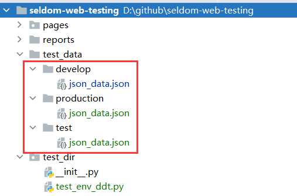

## seldom数据驱动之如何区分环境

数据驱动是自动化测试框架非常重要的能力，尤其是接口自动化测试，因为利用数据驱动可以很大程度提高用例编写速度，毕竟多增加一份数据即增加一条用例。所以，我们的接口自动化测试用例中80%用到了数据驱动。

最近，我们遇到一个问题，我们希望编写的接口自动化用例可以在不同的环境上执行，那么不同的环境只是使用的数据不一样，比如 活动ID，登录账号等。但是测试步骤是一样的。在不修改现有代码的情况下，能否支持不在不同的环境下读取不同的数据驱动文件。

Seldom在`2.10.3`版本中实现了这一个功能，希望设计思路对你有帮助。




首先，将一份测试数据拆成三份，分别放到不同目录下面，当然这个目录是按照`环境`进行命名的，你们可以自行根据自己的环境创建不同的目录。

三个目录下面的文件内容如下：

`develop/json_data.json`

```json

{
  "search":[
    {
      "scene": "develop环境-关键字",
      "keyword": "seldom框架"
    },
    {
      "scene": "develop环境-关键字",
      "keyword": "XTestRunner"
    }
  ]
}
```

`production/json_data.json`

```json
{
  "search":[
    {
      "scene": "production环境-关键字",
      "keyword": "seldom框架"
    },
    {
      "scene": "production环境-关键字",
      "keyword": "XTestRunner"
    }
  ]
}
```

`test/json_data.json`

```json
{
  "search":[
    {
      "scene": "test环境-关键字",
      "keyword": "seldom框架"
    },
    {
      "scene": "test环境-关键字",
      "keyword": "XTestRunner"
    }
  ]
}
```

备注：三个文件的数据格式保持一致即可，数据的内容和数据的多少可以自由变换。

接下来是使用数据文件的测试用例。

```python
import seldom
from seldom import file_data


class FileDataTest(seldom.TestCase):
    """
    文件数据驱动
    """

    def start(self):
        self.test_url = "https://www.bing.com"

    @file_data("json_data.json", key="search")
    def test_json_list(self, _, keyword):
        """
        used file_data test
        """
        self.open(self.test_url)
        self.type(id_="sb_form_q", text=keyword, clear=True, enter=True)
        self.sleep(2)
        self.assertInTitle(keyword)


if __name__ == '__main__':
    seldom.main(debug=True, browser="gc")
```

这里以Web UI 自动化用例为例，其实HTTP接口测试用法也一样。`@file_data()` 是非常强大的数据驱动装饰器，支持主流的`excel/csv/json/yaml`等数据文件。而且还有智能（复杂）的数据文件检索能力，也就说，不需要写数据文件绝对路径，他可以检索距离测试用例最近的数据驱动文件。所以，一般只需要指定数据驱动文件名即可。

这种自动的检索能力，刚好可以灵活的支持不同的环境。

* 默认匹配规则

当不指定环境的情况下，`@file_data()` 按照自己的默认的检索规则。查找`json_data.json` 数据驱动文件。

运行结果如下：

```shell
> python test_env_ddt.py
...
.\test_env_ddt.py
test_json_list_0 (test_env_ddt.FileDataTest)
used file_data test [_='develop环境-关键字'] ... 2022-08-12 00:38:07 log.py | INFO | 📖 https://www.bing.com
test_json_list_1 (test_env_ddt.FileDataTest)
used file_data test [_='develop环境-关键字'] ... 2022-08-12 00:38:16 log.py | INFO | 📖 https://www.bing.com
..
----------------------------------------------------------------------
Ran 2 tests in 13.717s
```

通过运行日志，可以看到程序检索到了`develop/`目录下面的`json_data.json`文件。


* 指定环境

seldom提供了`env`变量来指定环境，只需要在`main()`方法之前，指定环境，那么就会按照环境去查找用例。例如，修改测试用例如下：

```python
import seldom
from seldom import file_data
from seldom import Seldom


class FileDataTest(seldom.TestCase):
    ...

if __name__ == '__main__':
    Seldom.env = "test"  # 指定环境为test
    seldom.main(debug=True, browser="gc")
```

再次运行测试用例：

```shell
> python .\test_env_ddt.py

...
.\test_env_ddt.py
test_json_list_0 (test_env_ddt.FileDataTest)
used file_data test [_='test环境-关键字'] ... 2022-08-12 00:46:39 log.py | INFO | 📖 https://www.bing.com
test_json_list_1 (test_env_ddt.FileDataTest)
used file_data test [_='test环境-关键字'] ... 2022-08-12 00:46:48 log.py | INFO | 📖 https://www.bing.com
...
----------------------------------------------------------------------
Ran 2 tests in 14.057s
```

通过运行日志，可以看到程序检索到了`test/`目录下面的`json_data.json`文件。


用一张表格说明匹配规则:

表1:
|  Seldom.env=None   | Seldom.env="develop"  | Seldom.env="test"  |
|  ----  | ----  | ---|
| @file_data("json_data.json")  | @file_data("develop/json_data.json") | @file_data("test/json_data.json") |
| @file_data("test_data/json_data.json")  | @file_data("develop/test_data/json_data.json") |@file_data("develop/test_data/json_data.json") |

表2:

|  环境   | 检索数据文件  |
|  ----  | ----  |
|   Seldom.env=None  | @file_data("json_data.json")  |
|   Seldom.env=None  | @file_data("test_data/json_data.json")  |
|   Seldom.env="test"  | @file_data("test/json_data.json")  |
|   Seldom.env="test"  | @file_data("test/test_data/json_data.json")  |
|   Seldom.env="develop"  | @file_data("develop/json_data.json")  |
|   Seldom.env="develop"  | @file_data("develop/test_data/json_data.json")  |

> 表1 和 表2 说明的规则一样，你看哪个容易理解？

## 总结

1. 核心思路就是通过`Seldom.env` 配置的参数，在数据文件上面多加一级目录，从而检索到不同文件夹下相同名字的文件。

2. 这个方案的修改成本是很低的，不会对旧的自动化用例造成影响。同时你可以按照环境规则去创建新的数据驱动文件。 

3. 今年把大部分精力都投入到了开源seldomQA的相关项目，所以分享的相关技术比较多。这是设计上面的技巧，你可能应用到任意你熟悉的测试框架中。

