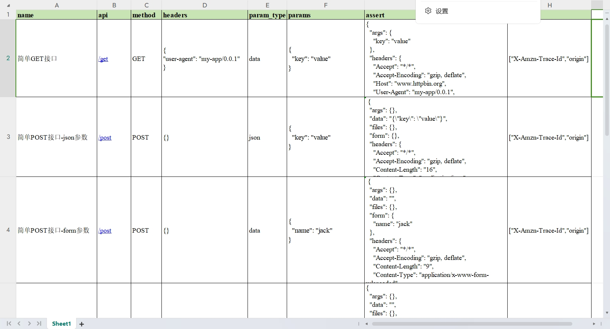
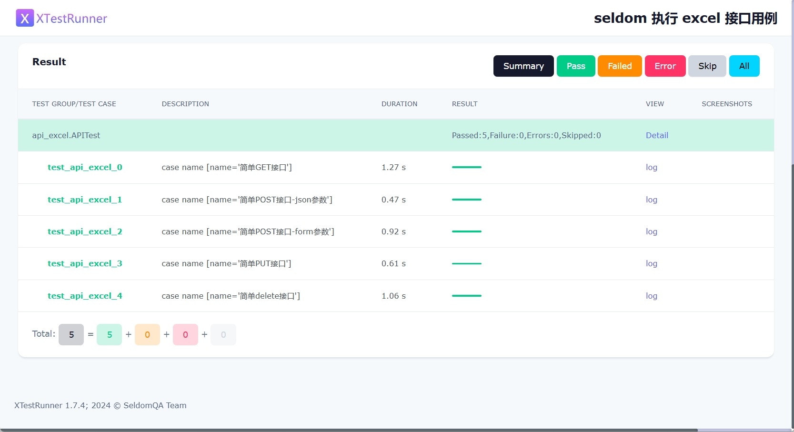

## Seldom支持Excel管理接口用例

前些天留意到 pytest-xlsx 这个插件，支持 Excel 编写测试用例，包括 HTTP接口和 web UI 用例。本质上是利用 pytest的hook功能读取解析Excel文件并执行。用 Excel管理 Web UI 用例相当鸡肋，但是，用数据文件管理HTTP接口用例的的使用场景要广泛得多。否则，HttpRunner、pytest-auto-api2（七月）也不会得到广泛得关注了。

虽然，... 但是 ...

seldom本来就支持各种数据驱动文件，前公司在写产线拨测用例的时候，由于产线拨测用例比较简单，用Excel编写用例确实更加方便，然后通过`@file_data()`装饰器进行解析执行。为何不更进一步，封装成一个命令去执行Excel的接口用例。

__试用场景：__

1. 仅适用于单接口的调用。
2. 不依赖于登录接口的token。

所以，不用着急吐糟不支持xxx，不满足需求就老老实实去写代码吧！如果只是单接口的自动化，个人认为还是不错的！


### 编写Excel 接口测试用例


首先，创建一个Excel文件，格式如下。

| name                  | api   | method | headers | param_type | params | assert | exclude |
| --------------------- | ----- | ------ | ------- | ---------- | ------ | ------ | ------- |
| 简单GET接口           | /get  | GET    | {}      | data       | {}     | {}     | []      |
| 简单POST接口-json参数 | /post | POST   | {}      | json       | {}     | {}     | []      |
| ...                   |       |        |         |            |        |        |         |

__参数说明__

| 字段         | 说明                                                                          | 列子                                                    |
| ------------ | ----------------------------------------------------------------------------- | ------------------------------------------------------- |
| `name`       | 用例的名称，会在测试报告中展示。                                              |                                                         |
| `api`        | 接口的地址，可以写完整的URL地址, 也可以只定义路径，`base_url` 在 `confrun.py` | 例如：`http://www.httpbin.org/get` or `/get`            |
| `method`     | 接口的请求方法，必须大写，不允许为空                                          | 支持：`GET`、`POST`、`PUT`、`DELETE`                    |
| `headers`    | 请求头，不允许为空，默认为 `{}`，字段必须双引号`"`。                          | 例如：`{"user-agent": "my-app/0.0.1"}`                  |
| `param_type` | 接口参数类型，必须小写，不允许为空。                                          | 例如：`data`、 `json`                                   |
| `params`     | 接口参数，不允许为空，默认为 `{}`，字段必须双引号`"`。                        | 例如：`{"id": 1, "name": "jack"}`                       |
| `assert`     | 断言接口返回，允许为空 或 `{}`，                                              | 例如：`{"status": 200, "success": True, "data": [...]}` |
| `exclude`    | 断言过滤字段，一些特殊的字段会导致断言失败，需要过滤掉。                      | 例如：`["X-Amzn-Trace-Id", "timestamp"]`                |


具体编写的HTTP接口用例：



你会发现，API 只有路径，基础的URL地址呢？用例重跑次数支持吗？报告名称怎么设置？超时时间...

这些都支持，seldom命令本身就有配套的 `confrun.py` 配置文件，可以配置这些参数。

我们可以创建 `confrun.py`配置文件进行配置。

```py

def base_url():
    """
    http test
    api base url
    """
    return "http://www.httpbin.org"


def debug():
    """
    debug mod
    """
    return False


def rerun():
    """
    error/failure rerun times
    """
    return 0


def report():
    """
    setting report path
    Used:
    return "d://mypro/result.html" or "d://mypro/result.xml"
    """
    return None


def timeout():
    """
    setting timeout
    """
    return 10


def title():
    """
    setting report title
    """
    return "seldom 执行 excel 接口用例"


def tester():
    """
    setting report tester
    """
    return "bugmaster"


def description():
    """
    setting report description
    """
    return ["windows", "api"]


def language():
    """
    setting report language
    return "en" or "zh-CN"
    """
    return "en"


def failfast():
    """
    fail fast
    :return:
    """
    return False
```

### 运行测试用例

首先，安装seldom==3.8.0最新版本版本。

```shell
> pip install seldom==3.8.0
```

然后，准备 excel测试文件 和 `confrun.py` 文件。

```shell
> ls

Mode      LastWriteTime         Length Name
----      -------------         ------ ----
-a----    2024/7/11     21:45          11213 api_case.xlsx
-a----    2024/7/6     21:45           1030 confrun.py
```

参考例子：https://github.com/SeldomQA/seldom/tree/master/api_case


然后，执行`seldom --api-excel`命令运行Excel测试用例：

```shell
> seldom --api-excel api_case.xlsx
run api_case.xlsx file.

              __    __
   ________  / /___/ /___  ____ ____
  / ___/ _ \/ / __  / __ \/ __ ` ___/
 (__  )  __/ / /_/ / /_/ / / / / / /
/____/\___/_/\__,_/\____/_/ /_/ /_/  v3.8.0
-----------------------------------------
                             @itest.info

2024-07-11 21:44:23 | INFO     | runner.py | TestLoader: C:\Python311\Lib\site-packages\seldom\file_runner\api_excel.py
2024-07-11 21:44:23 | INFO     | parameterization.py | find data file: api_case.xlsx

XTestRunner Running tests...

----------------------------------------------------------------------
2024-07-11 21:44:23 | INFO     | api_excel.py | execute api case: [简单GET接口]
2024-07-11 21:44:23 | INFO     | request.py | -------------- Request -----------------[🚀]
2024-07-11 21:44:23 | INFO     | request.py | [method]: GET      [url]: http://www.httpbin.org/get
2024-07-11 21:44:23 | DEBUG    | request.py | [headers]:
{
  "user-agent": "my-app/0.0.1"
}
2024-07-11 21:44:23 | DEBUG    | request.py | [params]:
{
  "key": "value"
}
2024-07-11 21:44:24 | INFO     | request.py | -------------- Response ----------------[🛬️]
2024-07-11 21:44:24 | INFO     | request.py | successful with status 200
2024-07-11 21:44:24 | DEBUG    | request.py | [type]: json      [time]: 1.020061
2024-07-11 21:44:24 | DEBUG    | request.py | [response]:
 {
  "args": {
    "key": "value"
  },

  ...

```

最后，查看HTML测试报告。



### end

从我发布了这个功能，《seldom技术交流群》 对这个功能嗤之以鼻，大家轮番吐槽了一番，个个都深受其害的样子，seldom违背了自己的宗旨，哈哈~！

我倒是觉得，seldom只是多提供了一种选择。而且，实现这个功能也没花费多少时间。
