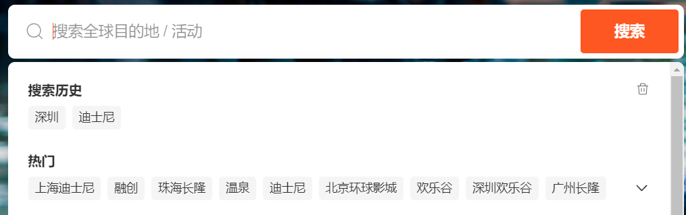

# seldom 实战技巧

seldom 是我一直在维护的自动化测试框架。目前GitHub已经 500+ star。

最近在项目中使用Seldom + poium 编写自动化测试用例。接下来，我就分享一些使用技巧。

### 如何参数化测试用例


网站的首页，如上面的导航。于是，开始利用poium编写元素定位。
```py
from poium import Page, Element

class Homepage(Page):
    destination_hk = Element(cass='#id_2&ext', describe="探索目的地-香港")
    destination_macau = Element(css='#id_3&ext', describe="探索目的地-澳门")
    destination_singapore = Element(css='#6&ext', describe="探索目的地-新加坡")
    ...
```

写着写着，我发现这样的用例不可维护，因为这里的导航是由后台配置出来的一个导航，热门目的地不是固定的，随国家、语言变化。

修改用例如下：

```py
# page
from poium import Page, Elements

class Homepage(Page):
    destination_all = Elements(xpath='//div/div/', describe="所有热门城市")

# case
import seldom

class TestHomeNav(seldom.TestCase):
    """导航"""

    def start(self):
        self.open("https://www.shop.com/")
        self.hp = HomePageCN(self.driver)

    def test_nva_search(self):
        # 遍历城市列表，点击每一个城市
        destinations = self.hp.destination_all
        for elem in destinations:
            elem.click()
```

那新的问题来了，这么写就一条用例，而且，假设其中一个城市配置链接错误或失效，整个用例失败，我们很难排查是哪个城市的问题，而且也不利于用例统计。

最后，改进之后的方案。

```py
# page
from poium import Page, Elements

class Homepage(Page):
    destination_all = Elements(xpath='//div/div/', describe="所有热门城市")


# common
def get_destinations_data(url):
    """
    获得热门目的地的 数量
    :return: [(),()]
    """
    hp = HomePage(Seldom.driver)
    hp.open(url)
    destinations = hp.destination_all
    destinations_data = []
    for i, elem in enumerate(destinations):
        destinations_data.append(
            (elem.text, i)
        )
    return destinations_data


# case
import seldom
from seldom import data

base_url = "https://www.shop.com/"


class TestHomeNav(seldom.TestCase):
    """导航"""

    def start(self):
        self.open(base_url)
        self.hp = HomePage(self.driver)

    @data(get_destinations_data(base_url))
    def test_nva_search(self, name, i):
        # 探索目的地
        print("city name-->", name)
        destinations = self.hp.destination_all
        city_name = destinations[i].text
        destinations[i].click()
        self.assertText(city_name)
```

这种方案有两个好处。

1. 城市列表变动，不会影响用例的执行。
2. 每个城市统计一条用例。


> seldom基于unittest的参数化非常简单和强大，这也是我没有转投pytest的最主要原因之一。 pytest的参数化`@pytest.mark.parametrize()`确实不好用，这一点不接受反驳。

## 用例依赖



这一条用例是我要自动化点击`搜索历史`。`搜索历史`搜索过​才会产生的数据。

```py
# case
import seldom
from seldom import data
from seldom import depend

class TestHomeSearch(seldom.TestCase):
    """搜索"""

    def start(self):
        self.open(base_url)
        self.hp = HomePage(self.driver)

    @data([
        ("case1", "迪士尼"),
        ("case2", "双月湾"),
        ("case3", "上海"),
    ])
    def test_search_a_keyword(self, name, keyword):
        """
        搜索：活动、城市
        """
        print("case name-->", name)
        self.hp.search_input.send_keys(keyword)
        self.hp.search_button.click()
        self.assertText(f"以下是与“{keyword}”相关的体验")

    @depend("test_search_a_keyword")
    def test_search_history(self):
        """
        搜索：点击搜索历史
        """
        history = self.hp.search_history
        keyword = history[0].text
        history[0].click()
        self.assertText(f"以下是与“{keyword}”相关的体验")
```

1. 搜索再次用到了参数化。
2. 通过`@depend()` 装饰器设置依赖上面的用例`test_search_a_keyword`，当被依赖的用例失败时，该用例直接跳过。

## UI + 接口自动化混搭验证

Seldom既支持Web UI自动化，又支持接口。


例如，上面的活动卡片，如何验证图片是否显示。

* 截图对比
  1. 提前准备一张对比的图片，太麻烦，存在对比偏差，活动有被替换的风险。
  2. 自动截图，人工检查截图，这不叫完全自动化。
  3. 跑自动化的时候，测试人员盯着看... 这就很离谱了。 

```html

```

先来看看一张图片的定义。如果一张图片无法显示。

1. html 代码写错，例如 `src` 写成 `scr`。
2. 图片链接失效。

第一种情况概率很低，而且很容易发现，而且是必现。第二种情况就比较麻烦了，可能图片链接一开始是好的，可能因为图片服务器问题导致图片丢失。

好了，分析完图片不可见的情况。那么就可以通过验证图片请求来保证图片是可见的。

```py
import seldom


class TestHomeActivity(seldom.TestCase):

    def start(self):
        self.open(base_url)
        self.hp = HomePageCN(self.driver)

    def test_hot_sale_activity(self):
        """
        检查活动活动 图片
        """
        img = self.hp.activity_img.get_attribute("src")
        self.get(url=img)  # 调用图片链接
        self.assertStatusCode(200)  # 断言活动图片是否可以访问
```

通过`get_attribute()` 获取元素的`src` 图片链接，然后，直接`self.get()`调用图片地址，如果返回`200` 说明图片可访问。

是不是web UI和 接口自动化无缝连接。


## 最后：

https://github.com/SeldomQA/seldom

提供一下GitHub地址，如果有GitHub帐号，欢迎`+ star`，最近在使用过程中也在更加积极的完善功能和修复bug。如果你正在开展自动化测试，不妨试试Seldom，他降低了你自己搭建自动化测试项目的成本，提高你编写和维护用例的速度。


