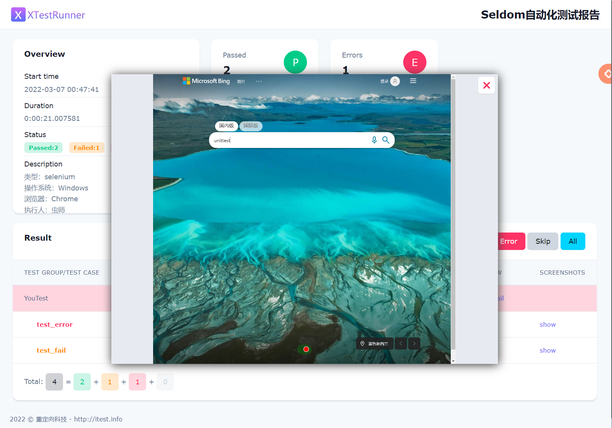
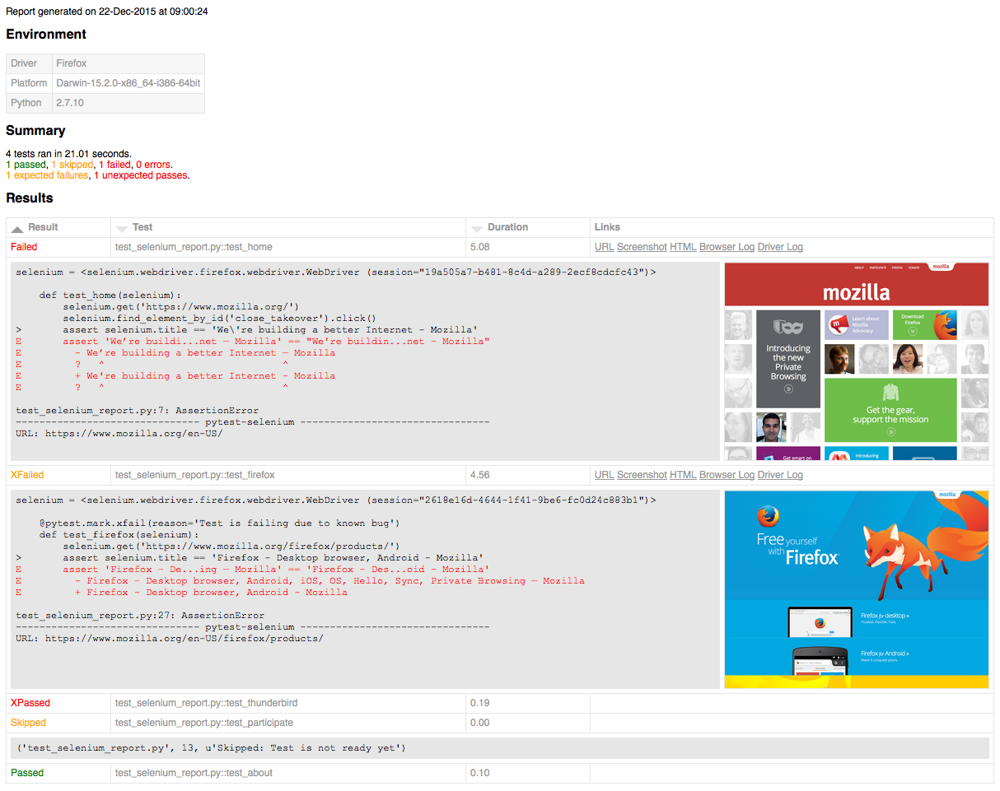
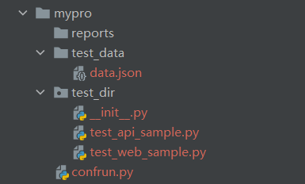

# 深度对比 seldom vs pytest

## 背景

事情是这样的，群里有个小伙伴想要在公司使用seldom，与一位擅长pytest的同事意见相左，于是来到群问去seldom 能不能与pytest结合使用，虽然 pytest 可以执行 unittest，而 seldom 是基于 unittest开发的，但是 seldom 提供了自己的执行方法，我想了半天，确实没有可结合的点。小伙伴尝试整理一下 seldom 与 pytest 的优缺点，我心想，这事儿，我熟啊！

> 我曾经拿 seldom 与 pytest 比较，比作 `电脑` vs `CPU` ， 因为做自动化测试 seldom 是开箱即用的，pytest 必须 + selenium + appium + request + ... 才能做自动化测试。但其实并非完全不能比较，`CPU` 本身不是还有各种指标嘛！另外围绕CPU设计主板、内存可以一起参加对比嘛！

于是，开始整理了对比列表。

| 功能             | seldom                                           | pytest                                        |
| ---------------- | ------------------------------------------------ | --------------------------------------------- |
| web UI测试       | 支持 ✅                                           | 支持（pytest-selenium） ⚠️                     |
| web UI断言       | 支持（assertText、assertTitle、assertElement） ✅ | 不支持 ❌                                      |
| playwright       | 支持（需安装playwright） ⚠️                       | 支持（playwright提供playwright-pytest插件） ✅ |
| 失败截图         | 支持（自动实现） ✅                               | 支持（需要设置） ✅                            |
| http接口测试     | 支持 ✅                                           | 支持（需安装 requests） ⚠️                     |
| http接口断言     | 支持（assertJSON、assertPath、assertSchema） ✅   | 不支持 ❌                                      |
| app UI测试       | 支持 ✅                                           | 支持（需安装 appium） ⚠️                       |
| Page Object模式  | 支持（推荐poium） ✅                              | 支持（推荐poium） ✅                           |
| 脚手架           | 支持（快速创建项目） ✅                           | 不支持 ❌                                      |
| 生成随机测试数据 | 支持`testdata` ✅                                 | 不支持 ❌                                      |
| 发送消息         | 支持（email、钉钉、飞书、微信）✅                 | 不支持 ❌                                      |
| log日志          | 支持 ✅                                           | 不支持 ❌                                      |
| 数据库操作       | 支持（sqlite3、MySQL、SQL Server） ✅             | 不支持 ❌                                      |
| 用例依赖         | 支持`@depend()` ✅                                | `@pytest.mark.dependency()`支持 ✅             |
| 失败重跑         | 支持`rerun` ✅                                    | pytest-rerunfailures 支持 ✅                   |
| 用例分类标签     | 支持`@label()` ✅                                 | `@pytest.mark.xxx`支持 ✅                      |
| HTML测试报告     | 支持 ✅                                           | pytest-html、allure ✅                         |
| XML测试报告      | 支持 ✅                                           | 自带 `--junit-xml` ✅                          |
| 数据驱动方法     | `@data()` ✅                                      | `@pytest.mark.parametrize()`  ✅               |
| 数据驱动文件     | `@file_data()`(JSON\YAML\CSV\Excel) ✅            | 不支持 ❌                                      |
| 钩子函数         | `confrun.py`用例运行钩子 ⚠️                       | `conftest.py` 功能更强大 ✅                    |
| 命令行工具CLI    | 支持`seldom` ✅                                   | 支持`pytest` ✅                                |
| 并发执行         | 不支持 ❌                                         | pytest-xdist、pytest-parallel ✅               |
| 平台化           | 支持（seldom-platform）✅                         | 不支持 ❌                                      |
| 第三方插件       | seldom（unittest）的生态比较糟糕 ⚠️               | pytest有丰富插件生态 ✅                        |

__说明__

* ✅  : 表示支持。

* ⚠️: 支持，但支持的不好，或没有对方好。

* ❌  : 不支持，表示自身没有该功能，第三方插件也没有。当然了，编程语言的世界里没有什么时候是不可能的，我们不能自己基于框架实现了，然后说框架支持（除非你以插件的方式开源出来，欢迎~！）。

> 声明： 表格肯定不全，比如 fixture、基础断言、两个框架都有的就必要对比了， pytest通过插件支持的功能，我也不是所有插件都用过，所以，能力有限。欢迎 留言补充 pytest 非常有用，但我没有列的功能。


## web测试

seldom 集成了selenium，seldom 版本之前就是一个 web 测试框架，所以，对selenium 有比较好的封装，比如更简洁的API，元素等待、操作元素高亮、针对 web测试设计的断言、用例失败/错误自动截图 等。

```py
# seldom
import seldom
from seldom import Steps


class BaiduTest(seldom.TestCase):

    def test_case_one(self):
        """a simple test case """
        self.open("https://www.baidu.com")
        self.type(id_="kw", text="seldom")
        self.click(css="#su")
```

pytest 有对应的 pytest-selenium 插件，但是这个插件只是集成了selenium，但并未对selenium的API做太多的封装。

```py
# pytest-selenium
from selenium.webdriver.common.by import By

def test_example(selenium):
    selenium.get('https://www.baidu.com')
    selenium.find_element(By.ID, "kw").send_keys("pytest")
    selenium.find_element(By.ID, "su").click()
```

针对 Web 测试的断言，seldom 提供了断言。

```py
# 断言标题是否等于"title"
self.assertTitle("title")

# 断言标题是否包含"title"
self.assertInTitle("title")

# 断言URL是否等于
self.assertUrl("url")

# 断言URL是否包含
self.assertInUrl("url")

# 断言页面包含“text”
self.assertText("text")

# 断言页面不包含“text”
self.assertNotText("text")

# 断言警告是否存在"text" 提示信息
self.assertAlertText("text")

# 断言元素是否存在
self.assertElement(css="#kw")

# 断言元素是否不存在
self.assertNotElement(css="#kwasdfasdfa")
```

## playwright 支持

没错，以前需要对selenium做二次开发才能实现的功能，playwright自己直接做了，比如 智能等待，元素断言。所以，在使用 playwright的时候几乎不用再做二次封装了。

playwright针对pytest提供插件支持，直接安装 `pytest-playwright` 插件，可以非常丝滑的使用 playwright。

```py
import re
from playwright.sync_api import Page, expect


def test_homepage_has_Playwright_in_title_and_get_started_link_linking_to_the_intro_page(page: Page):
    page.goto("https://playwright.dev/")

    # Expect a title "to contain" a substring.
    expect(page).to_have_title(re.compile("Playwright"))

    # create a locator
    get_started = page.get_by_role("link", name="Get started")

    # Expect an attribute "to be strictly equal" to the value.
    expect(get_started).to_have_attribute("href", "/docs/intro")

    # Click the get started link.
    get_started.click()

    # Expects the URL to contain intro.
    expect(page).to_have_url(re.compile(".*intro"))
```

seldom 虽然选了selenium 做亲儿子，但也不是完全不支持 playwright，纯粹把seldom 当个单元测试框架用即可。仍然可以享受到seldom 提供的其他功能，例如自动生成报告。

```py
import seldom
from playwright.sync_api import sync_playwright
from playwright.sync_api import expect


class Playwright(seldom.TestCase):

    def start(self):
        p = sync_playwright().start()
        self.browser = p.chromium.launch()
        self.page = self.browser.new_page()

    def end(self):
        self.browser.close()

    def test_start(self):
        page = self.page
        page.goto("http://playwright.dev")
        print(page.title())
        expect(page).to_have_title("Fast and reliable end-to-end testing for modern web apps | Playwright")

        get_started = page.locator('text=Get Started')
        expect(get_started).to_have_attribute('href', '/docs/intro')
        get_started.click()

        expect(page).to_have_url('http://playwright.dev/docs/intro')
```

## http接口测试

seldom 基于requests做了封装，并提供了强大的断言。

```py
import seldom

class TestAPI(seldom.TestCase):

    def test_get_method(self):
        payload = {'key1': 'value1', 'key2': 'value2'}
        self.get("http://httpbin.org/get", params=payload)
        self.assertStatusCode(200)
```

pytest 没有找到受欢迎的插件，当然，接口测试不复杂，直接安装requests写也问题不大。

```py
import requests

def test_get_method()：
    payload = {'key1': 'value1', 'key2': 'value2'}
    r = requests.get("http://httpbin.org/get", params=payload)
    assert r.status_code == 200
```

除此之外，seldom 提供了针对接口设计的断言。

```py
# 断言JSON内容
self.assertJSON()

# 断言字段类型
self.assertPath()

# 提取数据字段断言
self.assertPath()
```


## App UI测试

seldom 从3.0 开始支持App UI 测试，主要针对 appium API做了二次开发，这方面还有很大的提升空间。 

```py
import seldom


class TestBBS(seldom.TestCase):

    def test_bbs_search(self):
        self.click(id_="com.meizu.flyme.flymebbs:id/nw")
        self.type(id_="com.meizu.flyme.flymebbs:id/nw", text="flyme")
        self.click(id_="com.meizu.flyme.flymebbs:id/o1")
        self.sleep(2)
        elems = self.get_elements(id_="com.meizu.flyme.flymebbs:id/a29")
        for title in elems:
            print(title.text)
            self.assertIn("lyme", title.text)


if __name__ == '__main__':
    desired_caps = {
        'deviceName': 'JEF_AN20',
        'automationName': 'UiAutomator2',
        'platformName': 'Android',
        'platformVersion': '10.0',
        'appPackage': 'com.meizu.flyme.flymebbs',
        'appActivity': '.ui.LoadingActivity',
        'noReset': True,
    }
    seldom.main(app_info=desired_caps, app_server="http://127.0.0.1:4723")
```

pytest 这边也没有找到好用的扩展插件，只搜索到了一个5年前的项目 pytest-appium。

```py
from pytest_appium.android.UIAutomator2 import UiSelector, UiScrollable
from pytest_appium.driver.proxy._enums import Direction

@pytest.mark.platform('ios')
def test_example(appium_extended, platform):
    el = appium_extended.find_element_on_page(
        UiSelector().resourceIdMatches('.*awesome_item'),
        direction=Direction.LEFT,
    )
    assert el.text == 'Example'
```

当然了，如果改用openatx 的 `uiautomator2`/`facebook-wda`，那么 seldom 与 pytest 都是支持的，同一起跑线，无优劣之分。


## Page Object模式

Page object 设计模式，这只是一种设计模式，与编程语言和框架都无关，比如，你上班走直路，而你同事喜欢蛇形走位，只是你同事的爱好而已，并不代表他张的比你帅，或比你多两只脚。

poium 是针对page objects 设计的库，seldom 和 pytest 都是可以使用的。

* seldom

```py
import seldom
from seldom import Seldom
from poium import Page, Element


class BaiduPage(Page):
    """baidu page"""
    input = Element(id_="kw", describe="搜索输入框")
    button = Element(id_="su", describe="搜索按钮")


class BaiduTest(seldom.TestCase):
    """Baidu search test case"""

    def test_case(self):
        """
        A simple test
        """
        page = BaiduPage(Seldom.driver, print_log=True)
        page.open("https://www.baidu.com")
        page.input.send_keys("seldom")
        page.button.click()
        self.assertTitle("seldom_百度搜索")
```

* pytest

```py
from poium import Page, Element


class BaiduPage(Page):
    """baidu page"""
    input = Element(id_="kw", describe="搜索输入框")
    button = Element(id_="su", describe="搜索按钮")


# browser, base_url 在 conftest.py 中配置
def test_baidu_search_case(self, browser, base_url): 
    """
    百度搜索"pytest"
    """
    page = BaiduPage(browser)
    page.get(base_url)
    page.search_input = "pytest"
    page.search_button.click()
    sleep(2)
    assert browser.title == "pytest_百度搜索"
```

## 失败截图

在进行 web和 app 测试时，需要失败截图，这个功能还挺重要，截图可以帮你快速的定位到问题页面。

seldom 在在执行web/app测试失败&错误自动截图，不用任何设置。



pytest 实现自动截图相对就需要做一点配置，pytest-html、allure 都需要通过 `conftest.py` 文件添加钩子函数实现。

```py
# conftest.py

import pytest

# pytest-html 实现截图钩子函数
@pytest.hookimpl(hookwrapper=True)
def pytest_runtest_makereport(item, call):
    pytest_html = item.config.pluginmanager.getplugin("html")
    outcome = yield
    report = outcome.get_result()
    extra = getattr(report, "extra", [])
    if report.when == "call":
        # always add url to report
        extra.append(pytest_html.extras.url("http://www.example.com/"))
        xfail = hasattr(report, "wasxfail")
        if (report.skipped and xfail) or (report.failed and not xfail):
            # only add additional html on failure
            extra.append(pytest_html.extras.html("<div>Additional HTML</div>"))
        report.extra = extra
```




## 脚手架

脚手架不算什么高级的功能，但对于新手熟悉测试框架的使用有很大帮助，通过脚手架可以快速创建项目，并通过项目快速了解框架的用法。

seldom 实现了脚手架，通过`seldom -P xxx` 实现。

```shell
> seldom -P mypro
2023-02-02 23:52:04 cli.py | INFO | Start to create new test project: mypro
2023-02-02 23:52:04 cli.py | INFO | CWD: D:\github\seldom

2023-02-02 23:52:04 cli.py | INFO | created folder: mypro
2023-02-02 23:52:04 cli.py | INFO | created folder: mypro\test_dir
2023-02-02 23:52:04 cli.py | INFO | created folder: mypro\reports
2023-02-02 23:52:04 cli.py | INFO | created folder: mypro\test_data
2023-02-02 23:52:04 cli.py | INFO | created file: mypro\test_data\data.json
2023-02-02 23:52:04 cli.py | INFO | created file: mypro\test_dir\__init__.py
2023-02-02 23:52:04 cli.py | INFO | created file: mypro\test_dir\test_web_sample.py
2023-02-02 23:52:04 cli.py | INFO | created file: mypro\test_dir\test_api_sample.py
2023-02-02 23:52:04 cli.py | INFO | created file: mypro\confrun.py
```



pytest 定位是纯单元测试框架，需要你手动自己设计自动化测试目录。

## 生成随机测试数据

这个也不是什么复杂的功能，但经常被用到，比如 生成随机 注册用户名、数字、日期等。

seldom已经包含了各种常用的随机数。

```py
from seldom.testdata import *


# 随机一个名字
print("名字：", first_name())
print("名字(男)：", first_name(gender="male"))
print("名字(女)：", first_name(gender="female"))
print("名字(中文男)：", first_name(gender="male", language="zh"))
print("名字(中文女)：", first_name(gender="female", language="zh"))

# 随机一个姓
print("姓:", last_name())
print("姓(中文):", last_name(language="zh"))

# 随机一个姓名
print("姓名:", username())
print("姓名(中文):", username(language="zh"))

# 随机一个生日
print("生日:", get_birthday())
print("生日字符串:", get_birthday(as_str=True))
print("生日年龄范围:", get_birthday(start_age=20, stop_age=30))

# 日期
print("日期(当前):", get_date())
print("日期(昨天):", get_date(-1))
print("日期(明天):", get_date(1))

print("当月：", get_month())
print("上个月：", get_month(-1))
print("下个月：", get_month(1))

print("今年：", get_year())
print("去年：", get_year(-1))
print("明年：", get_year(1))
...

```

pytest 不支持生成随机数，但是，你可以使用 `faker`库，这个库可以生成各种类型的随机数，非常非常强大。


## 发送消息

自动化执行的结果需要及时的消息通知，以前各个公司主要邮箱，现在就是主流的几款企业沟通工具，钉钉、企业微信、飞书，他们都提供的有开放的API。

seldom 针对这些工具都已经实现了封装。以钉钉为例。

```py
import seldom
from seldom import DingTalk

# ...

if __name__ == '__main__':
    seldom.main()
    ding = DingTalk(
        access_token="690900b5ce6d5d10bb1218b8e64a4e2b55f96a6d116aaf50",
        key="xxxx",
        app_secret="xxxxx",
        at_mobiles=[13700000000, 13800000000],
        is_at_all=False,
    )
    ding.sender()
```

pytest 不是专门针对自动化测试人员设计的，所以，自然无法做到如此贴心的服务，当然，你可自己去封装。

--------------
对比的内容太多，写不完了，下一篇继续吧~！
