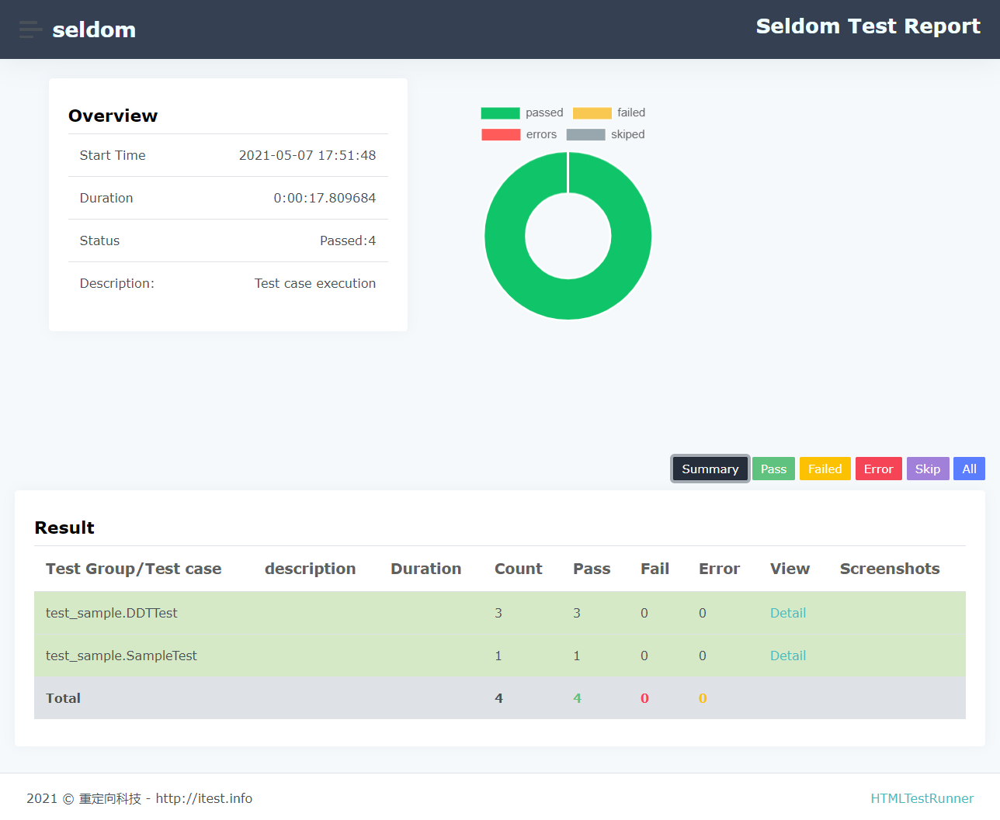
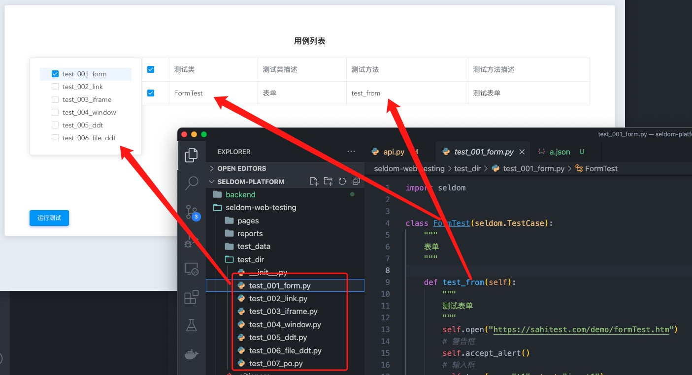

## 一文理解 seldom 自动化测试框架

seldom 是一个开源自动化测试框架。经过最近两年的频繁迭代，大大小小已经发布了几十个版本。我已经在多篇文章中​介绍它的特性和使用技巧。

但是，每次在介绍时评论区总会有网友提问，和xx相比有什么优势。受限于评论区的回复字数，我并不能很好的回答这个问题。那么，我觉得很有必要单独写一篇文章，介绍seldom自动化测试框架功能、定位和优势。

一句话描述seldom：

> 基于unittest 的 Web UI/HTTP自动化测试框架。

关键词：

* 基于unittest 单元测试框架。
* 支持 web UI 自动化测试。
* 支持 HTTP 接口测试。

### 基于 unittest 单元测试框架开发

为什么选择 `unittest` 单元测试框架？越来越多的人在使用 `pytest`, 他确实非常强大，并且有很丰富的生态（基于pytest的各种插件）。

我大概在2015年开始学习`pytest`，并分享相关文章，也有在自动化项目中使用`pytest`，`pytest`确实非常强大，讲这个的原因是想说明，我很熟悉 `pytest` 的功能。

为什么还选择基于`unittest`?

__1. unittest是python自带的，这就意味着不需要额外安装。__

当你要做一个开源项目的时候，依赖的库越多，考虑的兼容问题越多。除了直接依赖，还有间接依赖所带来的兼容问题。所以，在引入一个库所带来的功能小于带来的“负担” 时，宁愿不集成。

当然，这只是不太重要的原因之一。

__2. 基于`unittest` 更容易实现封装，正因为他需要定义测试类，所以很容易在父类中实现API。__

你可能觉得`pytest`不强制写测试类更简单，但我在使用`pytest`的也会写类，类在我看来是一个很好的描述功能点的维度。一个文件表示一个`页面/业务`， 一个类表示一个`功能点`，一个方法表示一条`测试用例`，这其实是非常好的层次划分，所以，定义类对我来说不算负担。

下面是我用`pytest`写的代码：

```py
class TestLogin:

    @classmethod
    @pytest.fixture(scope="function", autouse=True)
    def setup(cls, driver):
        cls.page_menu = NavMenu(driver)
        cls.page_account = Account(driver)

    def test_normal_registered(self):
        """
        用例名称：输入未注册的邮箱，可注册成功
        """
        self.page_menu.switch_to_account()
        self.page_account.change_language_and_currency(language=Language.Simplified_Chinese)
        self.page_account.log_out()
        # ...

    def test_check_short_password(self):
        """
        用例名称：输入密码123456，提示密码必须在8-20位包含字母和数字
        """
        self.page_menu.switch_to_account()
        self.page_account.log_out()
        mail_mix = self.page_account.create_mix_string()
        user = "{email}@apptest.com".format(email=mail_mix)
        self.page_account.signup_password_check(email=user, password="123456")
        assert self.page_account.snack_text.wait(self.page_account.wait).exists()
```

正如标题所说，有类的好处是可以更轻松的在父类中封装API。当然`pytest`可以通过 `conftest.py` 或装饰器来实现封装。


__3. 我不喜欢 `pytest`的参数化。__

这看上去是个很主观的理由，别急！我会解释为什么。

```py
@pytest.mark.parametrize(
    "test_input, expected",  # 必须要定义每个参数名
    [
        ("1+2", 2),
        ("3+5", 8),
    ],
)
def test_add(test_input, expected):
    assert eval(test_input) == expected
```

我承认`pytest` 的参数化非常强大，甚至可以使用多个`@pytest.mark.parametrize()` 来实现笛卡尔积。但是，谁告诉我怎么才能不写 `"test_input, expected"`, 他让参数化变的不好用。如果我不定义`ids`，他甚至会把整个参数作为用例的名称后缀，

```
test_sample.py::test_add[1+2-3] PASSED
test_sample.py::test_add[3+5-8] PASSED
```
`[1+2-3]`、`[3+5-8]` 作为用例名称的后缀太丑了，想想你用例参数有中文，还很长会是什么样子。


那么，我们看看 `unittest`+ `parameterized` 中的是如何实现参数化。 

```py
@parameterized.expand([
    (2, 3, 5),
    (3, 5, 8),
])
def test_add(self, a, b, expected):
    self.assertEqual(a+b, expected)
```

1. 他并不需要定义个`"a, b, expected"` 在列表的上面。
2. 他会自动的为参数化的用例加 `_0`、 `_1` ... 的后缀。

```
test_add_0 (__main__.MyTest) ... ok
test_add_1 (__main__.MyTest) ... ok
```


你可能觉得多写一行代码而已，这没什么？如果要参数化的是文件呢。

* data.json

```json
{
  "login":  [
    {
      "username": "Tom",
      "password": "tom123"
    },
    {
      "username": "Jerry",
      "password": "jerry123"
    }
  ]
}
```

* seldom

```py
@file_data("data.json", key="login")
def test_login(self, username, password):
    """a simple test case """
    print(username)
    print(password)
```

seldom 在`unittest`的基础上对 `parameterized` 做了二次开发（实现了`@data()`、`@file_data()`），可以像上面那样使用。如果像pytest那样再定义个`"username, password"` 我是不能接受的。

好吧！我花了太多力气来说明`pytest`这个我认为的“缺点”了，但是，参数化真的是自动化测试非常重要的特性，尤其是接口自动化测试。


__4. `seldom`扩充了`unittest` 大部分缺失的必要功能。__

4.1 集成了定制的 HTML测试报告。（你可能会安利我 `allure`多么强大，尤其是提供一些`allure`装饰器，可以在报告中显示更多内容！）



seldom HTML是在HTMLTestRunner定制的一个报告，对于Web UI测试实现了用例失败/错误自动截图、用例失败重跑等功能，自认为个人审美在线，报告不丑，功能基本够用。


4.2 seldom实现了用例依赖。

```py
import seldom
from seldom import depend


class TestDepend(seldom.TestCase):

    def test_001(self):
        print("test_001")

    @depend("test_001")
    def test_002(self):
        print("test_002")

    @depend("test_002")
    def test_003(self):
        print("test_003")
```

通过`@depend()` 装饰器实现用例依赖，当被依赖的用例执行失败时，用例自动失败。

4.3 实现了分类标签

```py
import seldom
from seldom import label


class MyTest(seldom.TestCase):

    @label("base")
    def test_label_base(self):
        self.assertEqual(1+1, 2)

    @label("slow")
    def test_label_slow(self):
        self.assertEqual(1, 2)

    def test_no_label(self):
        self.assertEqual(2+3, 5)


if __name__ == '__main__':
    # seldom.main(debug=True, whitelist=["base"])  # 白名单
    seldom.main(debug=True, blacklist=["slow"])    # 黑名单
```

可以通过黑白名单选择要执行的用例，或要跳过的用例。

综上所述，我想我已经回答了seldom 为什么基于`unittest` 开发，因为基于`unittest` 更容易做二次开发，并且补足了他的一些短板，`pytest` 参数化不好用。


### seldom 相比 pytest 有什么优势？

你认真看了上面的内容可能不会再问这个愚蠢的问题了，但如果没看也没关系，我再来解释一遍。

* pytest可以做`web UI`自动化测试吗？

> 答案是否定的，必须要配合`selenium`, `playwright` 这样的web UI测试库才行。

* pytest可以做`HTTP接口`自动化测试吗？

> 答案是否定的，必须要配合`requests`, `httpx` 这样的HTTP库才行。

* seldom 可以做web UI 和 HTTP自动化测试吗？

> 答案是肯定的，因为他已经集成了`selenium`，`requests`库。

所以，拿`seldom` 和 `pytest` 来比较本身是非常不适合的，就好像在小米发布会上，雷军在介绍小米12的功能，有人在台下提问：“小米12手机和高通骁龙888哪个更强？”。用雷军的话：“这绝对是来捣乱的”。

注：高通骁龙888 是手机CPU，它集成了通信模组，但是如果你说可以直接拿着这个芯片打电话那就厉害了。

### 品牌机 VS DIY

你接下来会问：

既然`seldom`是基于`unittest`单元测试框架，集成了`selenium/requests`。我为什么不直接使用`unittest` + `selenium/requests` 来做自动化？

1. 前面第4个问题有做部分解答，__`seldom`扩充了`unittest` 大部分缺失的必要功能。__ 

2. seldom 相比 unittest + selenium/requests 更加简单。

以HTTP接口测试为例：

* unittest + requests

```py
import unittest
import requests


class TestAPI(unittest.TestCase):

    def test_get_method(self):
        payload = {'key1': 'value1', 'key2': 'value2'}
        r = requests.get("http://httpbin.org/get", params=payload)
        self.assertEqual(r.status_code, 200)

if __name__ == '__main__':
    unittest.main()
```

* seldom

```py
import seldom


class TestAPI(seldom.TestCase):

    def test_get_method(self):
        payload = {'key1': 'value1', 'key2': 'value2'}
        self.get("http://httpbin.org/get", params=payload)
        self.assertStatusCode(200)


if __name__ == '__main__':
    seldom.main()
```

你可能觉得`seldom` 也没简化多少代码，那我告诉你seldom 可以自动生成HTML报告，有更友好的日志，集成了更强大的断言（`jmespath`/`jsonschema`）。

当然了，这些东西你完全可以自己封装。正如标题，你是直接用“品牌机”还是自己“DIY”电脑。seldom 正如一台品牌机，把一些核心部件已经组装成了一台可以直接使用的电脑。你不再需要自己买 主板、CPU、内存、电源、机箱自己组装。况且，你自己组装的电脑就一定便宜，性能好？

seldom作为一个“品牌机”的优势：

1. 对于新手开箱即用，降低学习成本。
2. 对于高手，省去了自己组装的麻烦，自动化的一套东西已经相对成熟，每个都自己封装一遍并不厉害，也没啥成就感。


### seldom 相比 HttpRunner 有什么优势？


首先，`seldom` 最开始只集成 `selenium`，也就是说只支持 web UI自动化测试，直到 `seldom` 2.0 才支持 HTTP接口测试。 `HttpRunner` 一开始的定位就是做HTTP接口自动化，并且支持性能测试。

在HTTP接口测试方面有重叠。

非要对比优势，四个字概括：`理念不同`。

seldom 的核心思想是：`用代码去解决问题`。 __我本人也一直鼓励测试人员去写代码，代码更灵活，更自由，也更有助于自身能力的提升。__ 如果你接触过 Flask、requests、yagmail...等，这些框架/库都有一个共同的特点，用简单的方式去解决复杂的问题，在编程语言这个层面，并不会给你太多限制，你可以完全用他，也可以只用一部分，也可以平滑的实现它不支持的功能。

上面这段话，我上篇介绍seldom的文章也有说，可能没看，或者看了也不理解。那么，seldom肯定不适合你，不是功能不满足你，道不同。


HttpRunner 2.0 版本之前是基于`yaml/json` 配置文件。

```json
{
     
    "config": {
        "name": "basic test config",
        "base_url": "http://127.0.0.1:8000/api",
        "validate": [
            {"eq": ["status_code", 200]}
        ]
    },

    "teststeps": [
        { 
            "name": " test_add_event_all_null",
            "request": {
                "url": "/add_event/",
                "method": "POST",
                "data":{"eid":"","limit":"","address":"","start_time":""}
            },
            "validate": [
                {"eq": ["body.status", 10021]},
                {"eq": ["body.message", "parameter error"]}
            ]
            
        }
    ]   
}
```

HttpRunner 3.0 支持链式脚本，并且拥抱了`pytest`生态。

```py
from httprunner import HttpRunner, Config, Step, RunRequest, RunTestCase


class TestCaseTestCase(HttpRunner):

    config = Config("basic test config").base_url("http://127.0.0.1:8000/api")

    teststeps = [
        Step(
            RunRequest(" test_add_event_all_null")
            .post("/add_event/")
            .with_data({"eid": "", "limit": "", "address": "", "start_time": ""})
            .validate()
            .assert_equal("body.status", 10021)
            .assert_equal("body.message", "parameter error")
        )
    ]


if __name__ == "__main__":
    TestCaseTestCase().test_start()
```

seldom 重写HttpRunner 3.0 用例。

```py
import seldom


class TestCaseTestCase(seldom.TestCase):
    
    def test_add_event_all_null(self):
        data = {"eid": "", "limit": "", "address": "", "start_time": ""}
        self.post("/add_event/", params=data)
        self.assertPath("body.status", 10021)
        self.assertPath("body.message", "parameter error")


if __name__ == "__main__":
    seldom.main(base_url="http://127.0.0.1:8000/api")
```

同样是python语言，从编写字母数量上seldom（400个字母）优于 httpRunner 3.0( 600个字母)。总之，seldom代码量更少，不知道这算不算优势？至于代码`可读性`就见仁见智。


### 用 seldom 是自由的

seldom思想中提到，你可以用seldom的全部功能，或者部分功能，或者增加他的能力，你可能体会不到。我来举两个例子。

* 例子1， seldom生成随机数据。

我就单纯觉得 seldom 生成的随机数据挺好的，可不可以在我的`pytest` 框架中使用，答案是肯定的。

```py
import pytest
from seldom import testdata


@pytest.mark.parametrize(
    "test_input, expected",
    [
        ("3+5", testdata.get_int()), # seldom 生成随机数据
    ],
)
def test_add(test_input, expected):
    assert eval(test_input) == expected

```

* 例子2，用seldom 做app自动化。

seldom不支持app测试，只是因为他没有集成appium 的 API，并不代表不能将两者放一起使用。

```py
import seldom
from appium import webdriver


class TestApp(seldom.TestCase):

    def start(self):
        # APP定义运行环境
        desired_caps = {
            'deviceName': 'Android Emulator',
            'automationName': 'appium',
            'platformName': 'Android',
            'platformVersion': '7.0',
            'appPackage': 'com.android.calculator2',
            'appActivity': '.Calculator',
        }
        self.driver = webdriver.Remote('http://localhost:4723/wd/hub', desired_caps)

    def test_calculator(self):
        """测试计算器"""
        self.driver.find_element_by_id("com.android.calculator2:id/digit_1").click()
        self.driver.find_element_by_id("com.android.calculator2:id/op_add").click()
        self.driver.find_element_by_id("com.android.calculator2:id/digit_2").click()
        self.driver.find_element_by_id("com.android.calculator2:id/eq").click()


if __name__ == '__main__':
    seldom.main()
```

运行上面的用例，照样可以生成HTML测试报告。

这就是我所说的，seldom是自由的，他并不会限制你只能做什么，不能做什么。即 `代码自由`，这是那些鼓吹所谓 `不用写代码` 的自动化测试工具所无法做到的。

### seldom 缺点

目前seldom 比较明显的缺点是不支持 多线程，主要是selenium 在启动浏览器是需要一个单独的线程，为了减少开启/关闭浏览器，使用的全局启动/关闭浏览器。这一点 pytest 也没有很好的办法，虽然，pytest 支持多线程。

对于接口自动化来说，本身执行速度就很快，用不用多线程我认为关系不大。除非你的接口用例达到了一个比较大的规模。

### seldom 优点

全文并未介绍seldom有什么独特的优点，不过，我们也在努力的做一些探索。比如，平台化的支持。



seldom 2.5版本提供了接口，可以直接读取用例目录、文件、类、方法信息通过平台上展示。

有什么好处？ 

非测试人员看用例信息和测试报告通过平台，甚至可以通过平台勾选用例执行，也可以更好的统计用例的执行次数，时间等信息。

测试人员通过seldom框架编写用例，想怎么就怎么写，`代码自由`。并不限制你的技术提升。

平台 VS 框架 之争是不是可以结束了？

> 备注：这个功能还在实验阶段，我藏不住事儿，就提前拿出来得瑟一下！ 不过，seldom已经实现了API，会平台开发的同学也可以自己玩儿。


