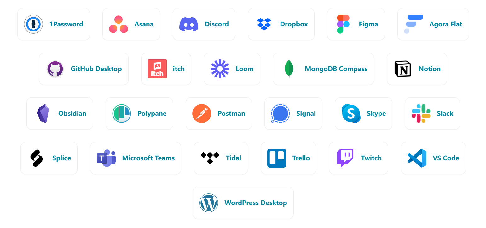
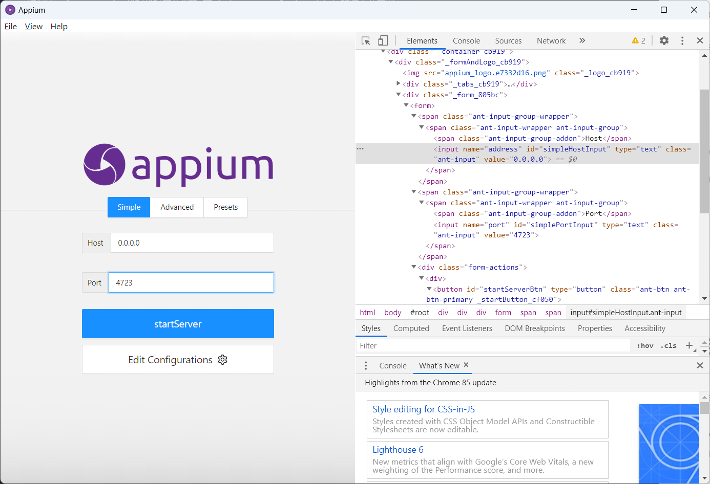

# Selenium 测试 Electron 应用

## Electron 介绍

Electron是一个使用 JavaScript、HTML 和 CSS 构建桌面应用程序的框架。 嵌入 Chromium 和 Node.js 到 二进制的 Electron 允许您保持一个 JavaScript代码代码库并创建 在Windows、macOS和Linux上运行的跨平台应用。

* 有哪些应用



有许多我们常见的桌面应用，比如 postman/apifox、slack、VSCode/Atom、Trello、appium-desktop、github-desktop、等，都是基于 electron 构建的。


## selenium 测试 Electron 应用

使用过appium-desktop的同学，应该发现，在应用上右键是可以打开 chrome devtools 工具的。如下图：



我们以此应用为例，使用 selenium 测试 electron 应用。

```py
from selenium import webdriver
from time import sleep

options = webdriver.ChromeOptions()
options.binary_location = f"C:\Program Files\Appium Server GUI\Appium Server GUI.exe"
driver = webdriver.Chrome(options=options)
sleep(5)
```

通过`ChromeOptions` 的 `binary_location`选项指定 appium-desktp 的安装位置，这样就可以启动 appium-desktop 了。

大概率会遇到下面的报错：

```shell
Current browser version is 85.0.4183.121 with binary path C:\Program Files\Appium Server GUI\Appium Server GUI.exe
```

electron应用内嵌 Chromium 版本比较旧，需要指定 ChromeDriver 驱动。手动下载 一个版本号是 `85.0.4183.xx`的驱动文件，放到环境变量 `PATH` 中指定目录下即可。新的selenium会优先使用配置的驱动文件，如果找不到会自行下载。

接下来，你操作web页面一样，操作electron应用。

```py
from selenium import webdriver
from selenium.webdriver.common.keys import Keys
from time import sleep

options = webdriver.ChromeOptions()
# options.add_argument('--disable-gpu')
options.binary_location = f"C:\Program Files\Appium Server GUI\Appium Server GUI.exe"
driver = webdriver.Chrome(options=options)
sleep(5)

# 切换句柄
all_handles = driver.window_handles
driver.switch_to.window(all_handles[0])
# 清理输入框&重新输入
host_input = driver.find_element("id", "simpleHostInput")
host_input.send_keys(Keys.CONTROL, "a")
host_input.send_keys(Keys.DELETE)
host_input.send_keys("127.0.0.1")

post_input = driver.find_element("id", "simplePortInput")
post_input.send_keys(Keys.CONTROL, "a")
post_input.send_keys(Keys.DELETE)
post_input.send_keys("4724")

driver.find_element("id", "startServerBtn").click()

sleep(5)
driver.quit()
```

__说明:__

1. electron 应用启动后可能存在多窗口的情况，所以需要切换句柄，默认切换到第一个句柄即可。
2. 输入框无法通过`clear()` 清空，可以使用键盘操作，`Keys.CONTROL` + `Keys.A` 选中所有，`Keys.DELETE` 删除。


## 最后

了解到 electron 技术是看到一些技术报道，QQ 使用electron进行了重写，Linux for QQ 再也不是上古界面了，electron的优势就是夸平台，缺点也很明显，启动速度慢，Web的页面体验总归比原生界面要差上许多。安装包比较大，一个Hello world应用大概需要 100M 左右，想想他内嵌了一个浏览器内核，怎么可能不大。当然，如果使用 electron-builder 打包，可以减小安装包大小。

并不是所有的 `electron` 应用都可以右键打开 chrome devtools，我一开始尝试apifox就不行，当然，可以通过`driver.page_source` 获取页面源码，然后分析元素，可以得到了一大坨编译压缩后的字符，有熟悉 electron 开发测试的小伙伴可以评论区提供思路。
