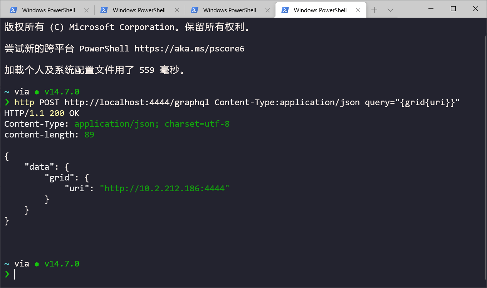

# Selenium Grid4 工作原理

Selenium 4.0 beta版已经发布，那么距离正式版已经不远了，在Selenium 4.0中变化比较大的就是Grid了，本文翻译了官方文档，重点介绍Grid 4的工作原理


## Selenium Grid3工作原理


__Hub__

1. 中介和管理
2. 接受运行测试的请求
3. 从客户端获取指令并在节点上远程执行它们
4. 管理线程

Hub是发送所有测试的中心点。每个selenium Grid恰好由一个Hub组成。Hub需要能够从各自的客户端(即CI服务器、开发人员机器等)访问。Hub将连接一个或多个`Node`测试的节点。

__Node__

1. Node和执行的浏览器在同一台主机。
2. 将自己注册到Hub上，并保持通信。
3. 接收来自Hub的请求并执行他们。

Node是在单个计算机系统上执行测试的不同的Selenium实例。Grid中可以有许多节点。作为Node的机器不需要与Hub或其他Node的平台相同，也不需要具有相同的浏览器选择。Windows上的节点可以提供Internet Explorer作为浏览器选项，而这在Linux或Mac上是不可能的。


## selenium Grid4


__Router 路由器__

路由器负责将请求转发到正确的组件。
 
他是Grid的入口点，接收所有外部的请求。路由器行为的不同依赖于接受的请求。
 
如果是一个新的会话请求，路由器会把它发送给`New Session Queuer`，将其添加到`New Session Queue`, `New Session queuer`通过`Event Bus`触发一个事件。`Distributor`（处理新的会话创建的位置）将会接收事件并轮询新`Session Queue`来获得新会话请求。
 
如果请求属于已存在的会话, 路由器发送session id 到 `Session Map`, 然后`Session Map`返回会话运行的`Node`。此后，路由器发送请求给`Node`。
 
__Distributor 分配器__
 
`Distributor`知道所有的`Node`以及他们的能力。它的主要角色是接收新的 session 请求，找到适合的`Node`来创建会话。`Distributor`在`Session Map` 中存储session id和正在执行会话的`Node`之间的关系。
 
 
__Node 节点__
 
一个`Node`可以在Grid中多次创建。每个`Node`负责管理运行所在机器的可用浏览器。
 
`Node`通过 `Event Bus`向`Distributor`注册。它的配置作为注册消息的一部分发送。
 
默认情况下，`Node` 自动注册所在主机上所以可以运行的浏览器驱动程序。它还为基于Chromium 的浏览器和 Firefox 的每个可用 CPU 创建一个 slot（插槽？不会翻译）。针对Safari 和 IE 只创建一个slot。通过在特定的配置，它可以在Docker容器中创建会话。你可以看到更多配置描述在后面的使用介绍中。
 
`Node`只执行接收到的命令。它不会评估、判断和控制任何事情。`Node`运行的主机不需要拥有与其他组件相同的操作系统。例如，Windows主机的`Node`提供IE浏览器选项，而这在Linux或Mac主机上是不可能的。
 
__Session Map 会话映射__
 
`Session Map`是一个数据存储，保存session id 和运行会话的`Node`信息。它在向`Node`转发请求的过程中为`Router`提供支持。`Router`将向`Session Map`请求与 session id相关联的`Node`。当以完全模式启动Grid，`Session Map`是第一个被启动的组件。
 
__New Session Queuer 新会话队列者
New Session Queue 新会话队列__
 
`New Session Queuer`是唯一可以与`New Session Queue`通信的组件。它处理所有的队列操作，例如，像“add”去操作队列。它提供配置参数设置请求超时和请求重试的间隔。
 
`New Session Queuer`通过`Router`接收新会话请求并将其添加到队列中。Queuer等待直到它收到请求的响应。如果请求超时，请求立刻被拒绝并且不会添加到队列中。
 
如果请求的功能在任何已注册的`Node`都不存在，那么请求立刻被拒绝，客户端收到响应。
 
如果请求的功能与任何`Node`的slots 匹配，`Distributor` 将尝试获取可用的slots，如果所有slots都很忙，`Distributor` 将要求Queuer将请求添加到队列前面。在请求重试间隔后，`Distributor`再次接受请求。不停的尝试重试，直到请求成功或超时。如果请求在重试可添加到队列前超时，则其被拒绝。
 
在获得可用的slots和创建会话之后，`Distributor`通过`Event Bus`将新会话响应传递给`New Session Queuer`。`New Session Queuer`在接收到事件时响应客户端。
 
__Event Bus 事件总线__
 
`Event Bus` 总线充当`Node`、`Distributor`、 `New Session Queuer`和 `Session Map`之间的通信路径。Grid通过消息进行大部分的内部通信，避免了昂贵的HTTP调用。
 
__Role In Grid__
 
在Grid3中，组件分`Hub`和`Node`， 通过独立模式下运行Grid，可以将他们放在一起运行。同样的概念在Grid4中也是可以的。可以通过将上面描述的一些组件分组来运行`Hub`，也可以在独立模式下同时运行所有组件。
 
__Hub__

Hub 是以下组件的总合：
 
· Router
· Distributor
· Session Map
· New Session Queuer
· Event Bus

它支持经典的`Hub & Node` 的设置。
 
__Standalone__
 
如前所述， Standalone是所有组件的总和。在用户看来，它们是作为一个组件执行的。这包括作为`Hub`的所有组件，以及一个`Node`。在Standalone启动后，可以使用一个功能齐全的Grid。


## 不同的模运行Grid

* Standalone
* Hub and Node
* Distributed
* Docker


__Standalone Mode__

一个新的Selenium Server jar 包含了运行Grid的所有内容。它是运行Selenium Grid的最简单模式。默认情况下，服务监听`http://localhost:4444`，你可以在程序中调用`RemoteWebDriver`类访问这个URL进行测试，服务器从系统路径中检测到可用的驱动程序。

* 启动Selenium server:

```shell
> java -jar .\selenium-server-4.0.0-beta-1.jar standalone

18:02:39.622 INFO [LogManager$RootLogger.log] - Using the system default encoding
18:02:39.625 INFO [OpenTelemetryTracer.createTracer] - Using OpenTelemetry for tracing
18:02:43.351 INFO [NodeOptions.report] - Adding Chrome for {"browserName": "chrome"} 16 times
18:02:43.352 INFO [NodeOptions.report] - Adding Firefox for {"browserName": "firefox"} 16 times
18:02:43.812 INFO [Node.<init>] - Binding additional locator mechanisms: id, name
18:02:43.826 INFO [LocalDistributor.add] - Added `node` 40291796-b2da-40a8-8b3a-b20a5c80b65d at http://10.2.212.186:4444.
18:02:43.830 INFO [GridModel.setAvailability] - Switching `node` 40291796-b2da-40a8-8b3a-b20a5c80b65d (uri: http://10.2.212.186:4444) from DOWN to UP
18:02:45.583 INFO [Standalone.execute] - Started Selenium Standalone 4.0.0-beta-1 (revision Unknown): http://10.2.212.186:4444
```

* 运行脚本（python）
```python
from selenium import webdriver
from selenium.webdriver.common.by import By
from selenium.webdriver import DesiredCapabilities

dr = webdriver.Remote(command_executor='http://127.0.0.1:4444',
                      desired_capabilities=DesiredCapabilities.CHROME.copy()
                      )
dr.get("https://www.baidu.com")
dr.find_element(By.ID, "kw").send_keys("selenium grid4")
dr.find_element(By.ID, "su").click()
dr.close()
```


__Hub and Node Mode__

* 启动hub

```shell
> java -jar .\selenium-server-4.0.0-beta-1.jar hub
```

* 注册Node

```shell
> java -jar .\selenium-server-4.0.0-beta-1.jar node
```

在 Selenium 4.0 中，我们还添加了GraphQL，这是一种可以轻松查询必要数据并获得完全相同数据的新方法。

* 通过HTTPie查询接口



官网：https://httpie.io/


以下两种模式比较复杂一些，也是Grid4真正区别于Grid3的功能，后续再介绍！

* Distributed Mode 分布式模式
* Start Standalone Grid Via Docker Images 通过Docker镜像启动Grid

