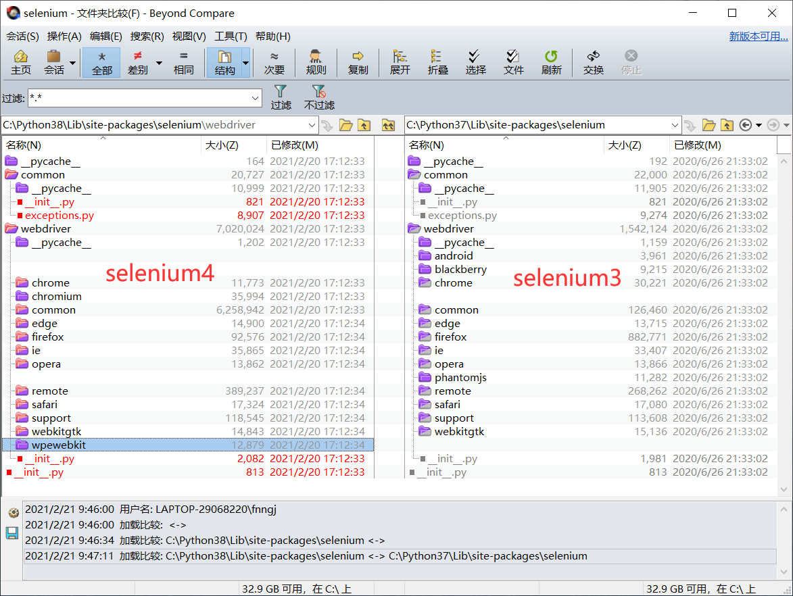

# Selenium 4 源码分析

这一篇文章我们来分析Selenium 4 python版源码。

除非你对Selenium 3的源码烂熟于心，否则通过对比工具分析更容易看出Selenium 4更新了哪些API。

文件对比工具推荐 Beyond Compare




## 驱动支持

Selenium 4 去掉了`android`、`blackberry`和`phantomjs` 等驱动支持。

* Selenium 对 android的支持本来就比较鸡肋，我想几乎没有人用Selenium来做android自动化测试，所以，去掉android专注于 Web 才是Selenium的定位。
* Blackberry 是针对黑莓手机的驱动，嗯！没落的黑莓手机。
* phantomjs 自从有了 chrome headless 模式，phantomjs 几乎没有维护的必要的。

Selenium 增加了 `chromium` 和 `wpewebkit` 驱动。

* chromium 是一个开源浏览器项目，chrome、chromiumEdge 都是基Chromium开发的。
* wpewebkit 关于wpewebkit的资料很少，只找到了一名介绍`为低端设备优化的WebKit端口`。

chromium 不需要直接使用，它主要是给chrome、chromiumEdge 继承的父类，如果要直接使用，必须要指定 `browser_name` 和 `vendor_prefix` 两个参数。

```python
from selenium.webdriver.chromium.webdriver import ChromiumDriver

dr = ChromiumDriver(browser_name='??', vendor_prefix='??')
'''
- browser_name - Browser name used when matching capabilities.
- vendor_prefix - Company prefix to apply to vendor-specific WebDriver extension commands.
'''
```

wpewebkit 是可以直接使用，但是驱动应该只支持 Linux系统，我没做验证。

```python
from selenium import webdriver

dr = webdriver.WPEWebKit()
```


## 弃用定位方法

以前常用的定位方法将被弃用。

` warnings.warn("find_element_by_* commands are deprecated. 
 Please use find_element() instead")`

```python
from selenium import webdriver

dr = webdriver.Chrome()

dr.get("https://www.baidu.com")

dr.find_element_by_id("kw").send_keys("selenium4")
dr.find_element_by_id("su").click()

```

`find_element_by_xx` 将被弃用，推荐使用`find_element()`

```python
from selenium import webdriver
from selenium.webdriver.common.by import By
dr = webdriver.Chrome()
dr.get("https://www.baidu.com")

dr.find_element(By.ID, "kw").send_keys("selenium grid4")
dr.find_element(By.ID, "su").click()
dr.close()
```

上面的定位写法在 selenium3 一直是被支持的，只是我们一般很少使用。

## 相对定位

这是 Selenium4 的一个亮点，官方称他为`相对定位`， 官方博客对相对定位的说明。

想想我们如何描述元素在页面上的位置。想想你在电话里会怎么做。你永远不会谈论原始DOM，`啊，找到嵌套在span标签中的第五个div标签，其id为foo`。你永远不会这么说！相反，当谈到内容在页面上的位置时，你会说`只需在图片上方和链接右侧找到该内容`。

很久以前，一个名为[Sahi](https://sahipro.com/docs/sahi-apis/accessor-api-basics.html)的项目开始定位这样的元素。在Selenium4中，我们称它们为`相对定位器`。你有时可能会看到我们将它们称为`友好定位器`，因为最初的实现称它们为友好定位器，但`相对`更好地描述了它们的工作方式。我们有几个：`near`, `above`, `below`, `to_left_of`, `to_right_of`。它们允许你用人类语言谈论元素在页面上的位置。

```python
from selenium import webdriver
from selenium.webdriver.common.by import By
from selenium.webdriver.support.relative_locator import with_tag_name

dr = webdriver.Chrome()
dr.get("https://www.xx.com")

lowest = dr.find_element(By.ID, "below")
elems = dr.find_elements(with_tag_name("p").above(lowest))

ids = [el.get_attribute('id') for el in elems]
print(ids)

```


## 新增API

在`remote.webdriver`文件的`WebDriver` 类（所有浏览器类都继承该类）新增的几个API无关痛痒，而且还没注解，所以暂时不清楚具体用法。

* log： 无注释
* pin_script：无注释 
* unpin： 无注释
* get_pinned_scripts: 无注释


```py

dr.pin_script(script="??")
dr.unpin(script_key="??")
print(dr.get_pinned_scripts())

```

不过，我也发现了几个有用的API

* 打开并切换到新窗口/标签。

```python
dr.switch_to.new_window("window")
dr.switch_to.new_window("tab")
```

* 获取不同设置的超时间。

```python
from selenium import webdriver

dr = webdriver.Chrome()
dr.implicitly_wait(10)
dr.set_page_load_timeout(3)
dr.set_script_timeout(7)

print(dr.timeouts.implicit_wait)
print(dr.timeouts.page_load)
print(dr.timeouts.script)
```

* 获取当前页面PDF文件。

```python
from selenium import webdriver
from selenium.webdriver.chrome.options import Options

chrome_options = Options()
chrome_options.headless = True
dr = webdriver.Chrome(options=chrome_options)
dr.get("https://docs.pytest.org/en/stable/#documentation")

# 获取当前页面PDF文件
print(dr.print_page())
```


## Trio CDP

`common`目录下面多出`bidi` 和`devtools` 两个子目录。查看源码 提供了Trio CDP的项目连接。

https://github.com/HyperionGray/trio-chrome-devtools-protocol

CDP全称：Chrome DevTools Protocol

关于CDP的介绍，官方有一段介绍：

> CDP是一种基于Chrome的浏览器中启用调试器而开发的协议。它是一个非正式协议，不是一个面向用户的API，允许您反省浏览器。 Puppeteer和Cypress者建立在该协议上，在测试和浏览器之间引入一个`network hop`，随着网络延迟的增加，这种方式会导致测试速度变慢。更复杂的是，由于CDP被设计为一个调试协议，所以在不同版本之间它可以在没有任何通知的情况下进行更改。这就是为什么Puppeter和Cypress与特定版本的浏览器绑定在一起，这给作为测试作者的您带来了一个难题：如何在浏览器的多个版本上进行测试？
> 
> 尽管如此，使用CDP还是有很多可能性，这就是为什么我们在Selenium4中增加了对它的支持。事实上，我们的一些新功能是建立在它之上的（尽管我们隐藏了细节！）

代码注解的示例：
```py
from selenium import webdriver
from selenium.webdriver.common.bidi.console import Console

dr = webdriver.Chrome()

dr.get("https://www.baidu.com")


with dr.log.add_listener(Console.log) as messages:
    dr.execute_script("console.log('I like cheese')")
assert messages["message"] == "I love cheese"
```


## 最后


官方博客里还提到了：
* `对网站的身份验证`：来解决网站的登录问题。
* `拦截网络流量`：来解决网络的稳定性。

官方文档和源码中都没找到例子或API，后续再做研究。

