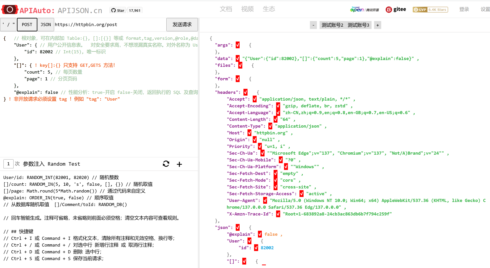

# APIAuto：一个功能强大，文档稀烂的API工具

## 一、引言

在现代软件开发中，接口文档、接口调试和自动化测试已经成为前后端协作的核心环节。虽然市面上已有 Postman、Swagger、YApi 等工具，但它们要么功能分散，要么缺乏自动化支持。

今天要介绍的开源项目 —— **，是一款基于 **JavaScript 的纯前端 HTTP 接口测试与文档管理工具**，它集成了接口文档生成、可视化调试、自动化测试、Mock Server、参数断言等强大功能，堪称“一站式”接口管理平台。

GitHub地址: https://github.com/TommyLemon/APIAuto

---

## 二、项目简介

### ✅ 主要特性：

| 功能 | 描述 |
|------|------|
| 自动生成接口文档 | 支持光标悬浮注释，自动提取参数说明 |
| 可视化接口调试 | 支持 GET/POST/PUT/PATCH/DELETE 等多种方法 |
| 自动化测试 | 支持 JSON 脚本编写用例，一键运行 |
| Mock Server 支持 | 支持模拟接口返回值，加速前端开发 |
| 多环境配置 | 支持 DEV/TEST/PROD 环境切换 |
| 参数校验与格式化 | 支持 JSON Schema 断言、高亮显示 |
| 支持 CI/CD 集成 | 提供 RESTful 接口控制测试执行 |
| 数据库断言 | 可对接 MySQL、PostgreSQL 等数据库进行验证 |

---

## 三、 安装与运行

APIAuto是一个纯JS实现的项目, 从 Releases 下载最新版本。

https://github.com/TommyLemon/APIAuto/releases

解压之后，双击 `index.html` 文件，通过浏览器打开。




---

## 四、核心功能详解

### 1. 自动生成接口文档

APIAuto 可以对接后端 APIJSON 接口规范，自动生成结构清晰的接口文档，无需手动维护。

此外，还支持光标悬停查看字段含义，提升阅读效率。

### 2. 接口调试界面友好

提供类 Postman 的图形化调试界面，支持：

- 多种请求方法（GET / POST / PUT / PATCH / DELETE）
- Header、Query、Body 参数输入
- 文件上传、Cookie 管理
- 环境变量替换

### 3. 自动化测试脚本编写

APIAuto 提供了强大的自动化测试功能，支持通过 JSON 编写测试用例，包括：

- 参数提取（JSON Path）
- 响应断言（JSON Schema / 自定义表达式）
- 数据库断言（MySQL、PostgreSQL）

#### 示例测试脚本：

```json
{
  "name": "登录接口测试",
  "url": "/api/user/login",
  "method": "POST",
  "headers": {
    "Content-Type": "application/json"
  },
  "body": {
    "username": "testuser",
    "password": "123456"
  },
  "assertions": [
    {
      "type": "status",
      "value": "200"
    },
    {
      "type": "json",
      "expression": "$.code",
      "value": "200"
    }
  ]
}
```

### 4. Mock Server 模拟接口响应

在前后端联调阶段，如果后端未完成接口开发，可以使用 APIAuto 快速搭建 Mock Server，模拟接口返回数据。

只需定义接口路径和返回模板即可实现接口模拟。

---

## 五、结语

工具是好工具，这哥们介绍的稀烂，比如，项目的 README.md，正常的应该介绍安装和使用示例。 结果大篇幅的吹嘘自己参加了某大会。嘚瑟心理已经溢出屏幕了。 其实，这也没啥，关键是，我翻阅半天文档，和他的B站视频，愣是没弄明白怎么安装和使用。 一个项目下面吹还不够，搞了一堆子项目（APIJson、 UnitAuto、 SQLAuto...）一起吹。 我都想顺着网线找到他，问问他写的啥玩意儿。那B站视频一直晃脑袋，以为自己是特朗普啊，还防爆头？

好在，最后有了一丢丢眉目。

在线地址（快速体验）：http://apijson.cn/api/

