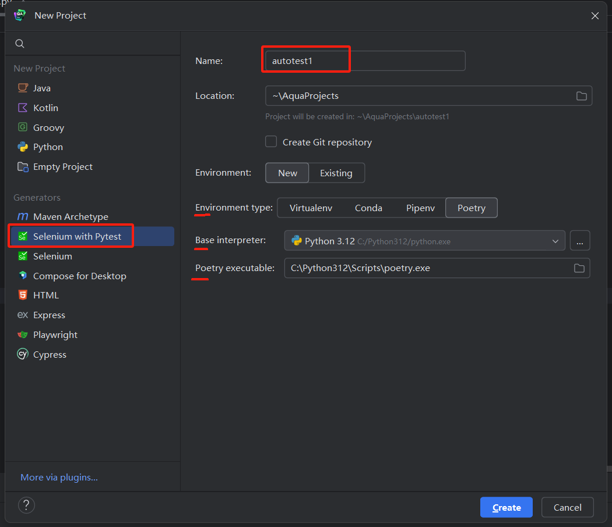
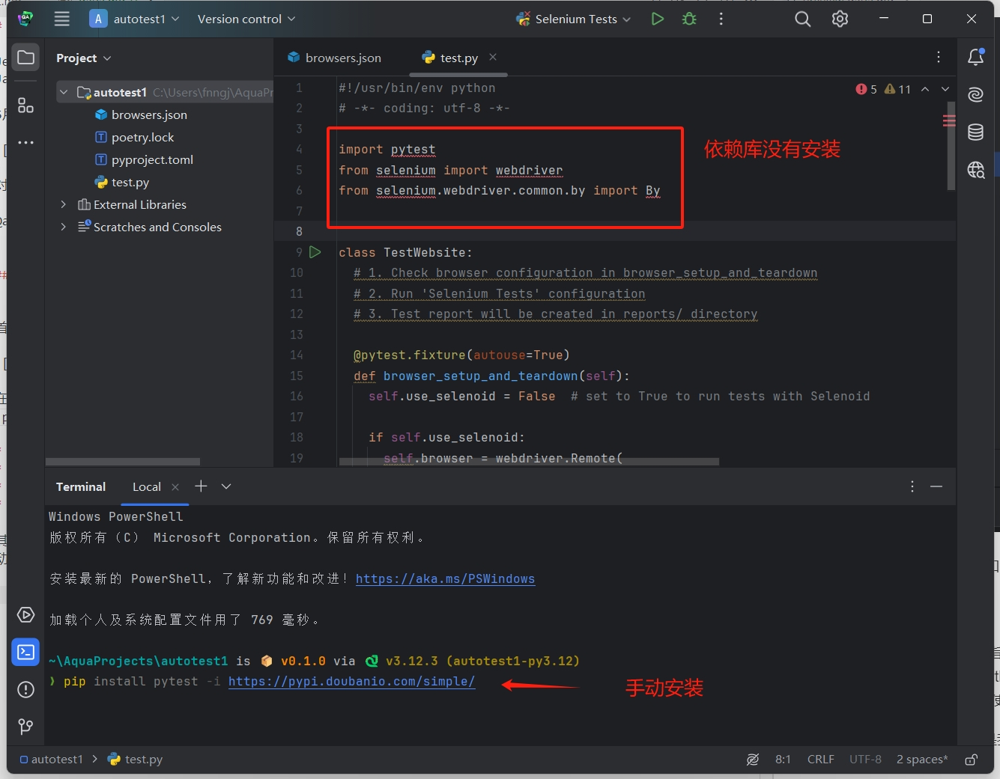
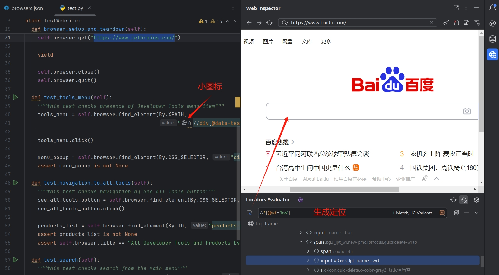
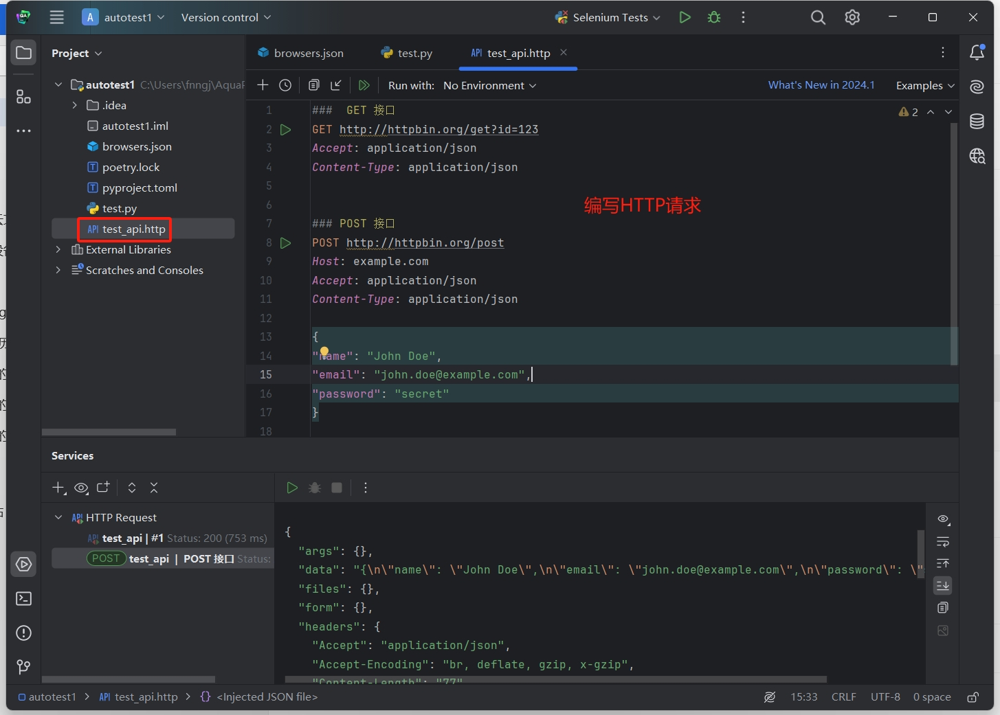

# Aqua 专为自动化测试打造的IDE

JetBrains是一家全球知名的软件开发公司，他们公司推出的IDE几乎是编程语言的首选，IntelliJ IDEA 之于Java，PyCharm之于Python，以及GoLand之于go等。

5月24号JetBrains官方宣布Aqua正式公开发布，这是一款专门针对自动化测试打造的IDE。


对于一名自动化测试的工程师，对于这些语言和工具再并不陌生。

Aqua下载地址：https://www.jetbrains.com/zh-cn/aqua/


## 创建项目


首先，启动Aqua后，可以通过菜单栏：`File` -> `New` -> `project...` 新建项目。



在创建项目时 `语言`、`框架` 和 `库` 其实是一个排列组合的关系。我这里选择最为熟悉的 `Python`、`pytest`和 `selenium`。

* Name: 项目名称。
* Environment type: 用于指定环境管理工具。
* Base interpreter: 指定Python版本。
* Poetry executable: 推荐使用`Poetry`，Python需要先安装Poetry，这里才能选择。

其次，手动安装依赖，可能是我在创建项目的时候报了一个错误，导致依赖库没有安装，不过，没关系，我们可以手动安装。



打开 Terminal 使用 pip 命令安装个`pytest` 和 `selenium` 即可。

## 功能体验

### 样例代码

项目创建完成，Aqua默认创建了 `test.py` 文件，并生成了示例代码。

```python
import pytest
from selenium import webdriver
from selenium.webdriver.common.by import By


class TestWebsite:
  # 1. Check browser configuration in browser_setup_and_teardown
  # 2. Run 'Selenium Tests' configuration
  # 3. Test report will be created in reports/ directory

  @pytest.fixture(autouse=True)
  def browser_setup_and_teardown(self):
    self.use_selenoid = False  # set to True to run tests with Selenoid

    if self.use_selenoid:
      self.browser = webdriver.Remote(
        command_executor='http://localhost:4444/wd/hub',
        desired_capabilities={
          "browserName": "chrome",
          "browserSize": "1920x1080"
        }
      )
    else:
      self.browser = webdriver.Chrome()

    self.browser.maximize_window()
    self.browser.implicitly_wait(10)
    self.browser.get("https://www.jetbrains.com/")

    yield

    self.browser.close()
    self.browser.quit()

  def test_tools_menu(self):
    """this test checks presence of Developer Tools menu item"""
    tools_menu = self.browser.find_element(By.XPATH,
                                           "//div[@data-test='main-menu-item' and @data-test-marker = 'Developer Tools']")

    tools_menu.click()

    menu_popup = self.browser.find_element(By.CSS_SELECTOR, "div[data-test='main-submenu']")
    assert menu_popup is not None
  
  ...

```

代码比较简单，通过 `@pytest.fixture` 创建浏览器的启动和关闭。`test_xxx`实现测试用例。熟悉Selenium的工程师来说，这个可忽略不计。


### 定位元素

在代码中，每个定位前面多了一个小icon，点击可以打开内置的浏览器，可以快速地帮助我们生成元素定位。



这个功能就实用很多了，在编写Web UI 自动化测试的时候，查找元素的定位往往是比较耗时的工作，这个功能可以有效地节省查找元素的定位的时间。


### 内置HTTP client

我们可以创建一个 `test_api.http`的文件，直接编写 HTTP 请求。



这个功能仅仅用于接口的调试，JetBrains 其他专业版的IDE都内置的有这个功能。这个都算不上Aqua的特色功能。


### 其他

* Docker

借助 Aqua，可以访问 Docker 容器，这样一来，您可以运行并调试容器、下载和构建镜像、运行多容器应用程序。

* 数据库

你可以无缝地处理多个数据库、开发 SQL 脚本，以及在 IDE 中执行低级数据断言。 Aqua 可以连接到实时数据库、运行查询、导出数据，并让您在可视界面中管理架构。 这意味着您可以直接从 IDE 访问 Oracle、SQL Server、PostgreSQL、MySQL 等数据库。

* 测试管理系统

我们添加了注解来支持 Allure Framework 等测试报告工具或 Serenity BDD 等内置测试框架机制。 IDE 允许你点击问题 ID 在 Web 浏览器中打开问题或测试管理系统用例。


*  AI Assistant

借助 AI Assistant，您可以直接从 Web 检查器中打开的网页创建 UI 测试并生成页面模型。AI Assistant 会为所选框架和编程语言生成合适的代码，包括关键网页元素。然后，您可以复制代码并将其插入现有文件或添加到新文件中。

### 总结

还有其他组合每体验，比如 typescript + playwirht 的编写自动化体验。

整体感觉，JetBrains 拿着自家已有的东西，随便整合一下 命名个新产品出来营销。如果你已经在使用 PyCharm 或者 IntelliJ IDEA 在写自动化测试，其实没太大必要专门来用 Aqua，如果使用的是其他编辑器或这个IDE，不妨尝试一下Aqua。

我自己打算使用一段时间，继续挖掘一下Aqua的功能。

