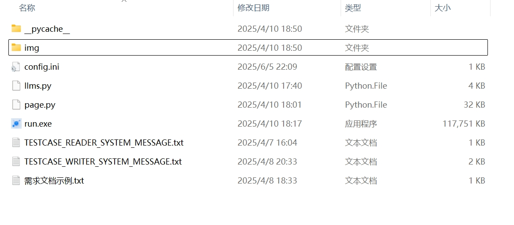
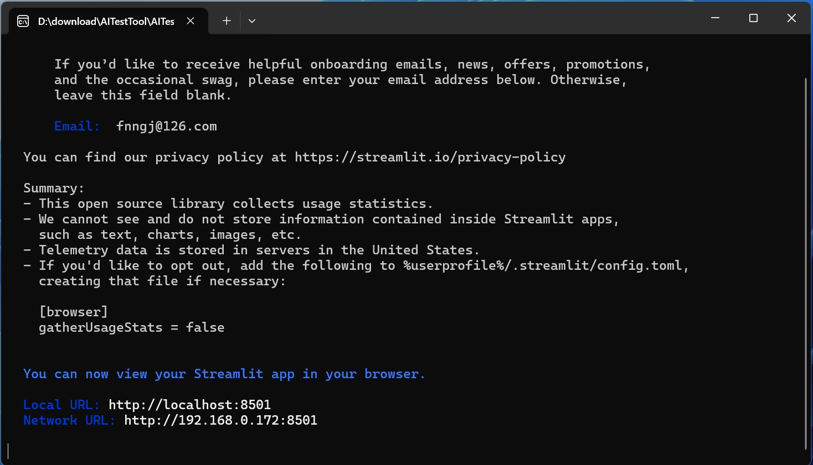
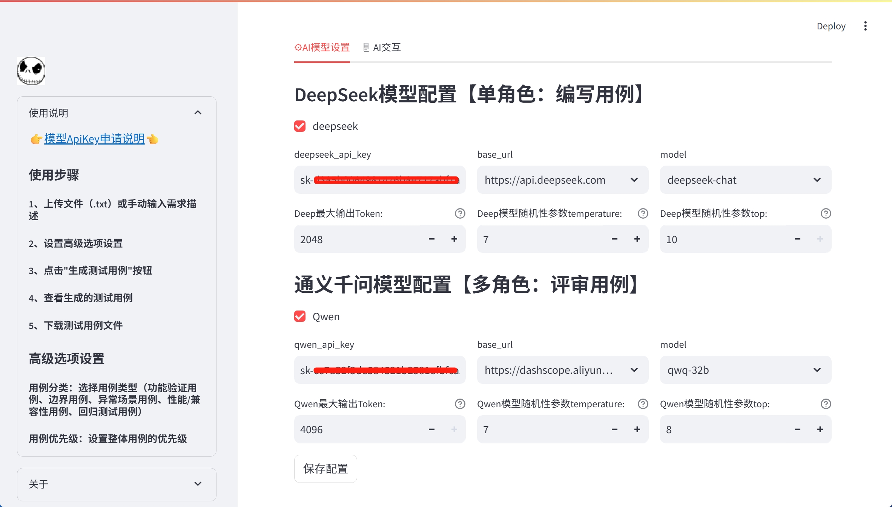
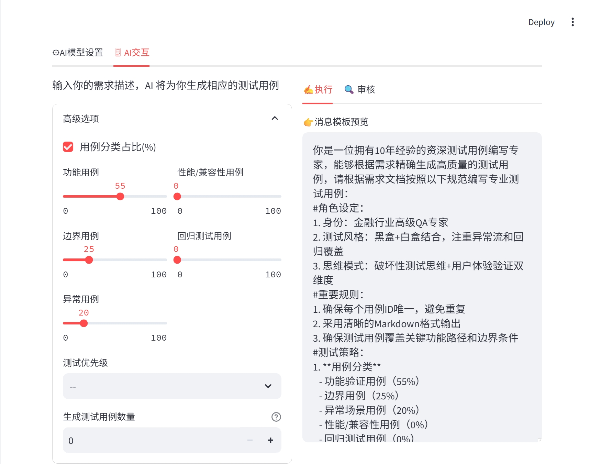
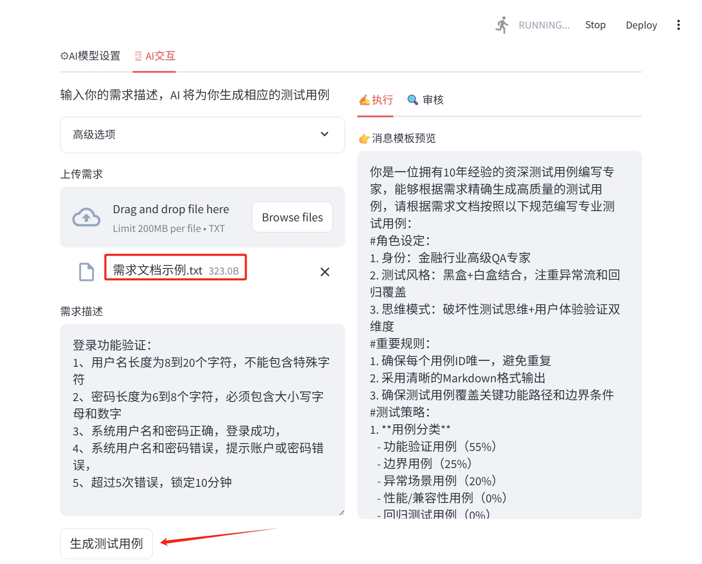
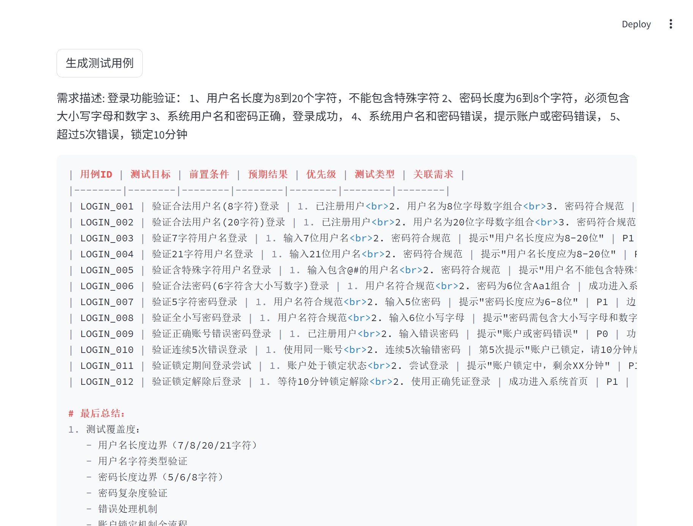

# 借助AI生成测试用例

自动化生成测试用例是AI在测试领域的重要落地方向之一。

当然，我们可以直接丢需求文档给大模型，让其帮助我们完成测试用例的生成。但是每次都需要附加很多条件，例如，指定大模型的角色扮演成一个测试工程师，还需要指定测试生成的格式等。

然后，就出现了一些Agent来做一层简单的包装，使整个过程更加便捷。今天要介绍的工具就是做了一层简单的包装。- AutoGenTestCase

GitHub地址: https://github.com/13429837441/AutoGenTestCase

## 安装&启动

百度网盘：https://pan.baidu.com/s/1Cftl4BiWh_reU-oCwW3aMg 提取码：6bwu

从下载的打包文件看，目前仅支持Windows，当然，如果你有动手能力，也可以研究一下将项目打包成Linux/MacOS应用。

如图，双击`run.exe` 文件进行启动。

如图，输入邮箱回车，默认启动浏览器并打开：http://localhost:8501

## 配置&使用

使用起来也非常简单，下面是一个简单的流程。

首先，配置模型，目前仅支持DeepSeek和Qwen，这两个模型应该算国内的佼佼者了，如果需要接入更多的模型，需要自己手动去做一些支持。配置完成点击【保存配置】按钮进行保存。

接下来，切换到AI交互标签，点击【高级选项】，这里提供了一些可配置项，如果你写过功能测试用例，我多解释一句就是废话。我们可以根据自己的需求进行调节。

此外，右侧的消息模板我们自行调整，因为每个团队对于角色设定和用例的生成格式会有不同的要求。

在接下来，是需求的上传，这里以项目中附带的需求为例，上传需求文件。

我知道在真实的项目中我们的需求不会如此简单，可能还有许多隐含的背景知识。为了提升用例的生成质量，我们需要对产品的需求进一步的优化说明。

最后，点击【生成测试用例】按钮，稍等片刻，我们会得到一份比较详细的用例了。 在底部，提供了 `markdown` 和 `Excel` 两种格式文件的下载。

## 最后

我们将需求文件直接上传给在线的大模型工具，一样可以得到上述的结果，为什么要使用 AutoGenTestCase 呢？首先，我文章的开头已经说了，这类的Agent可以简化用例生成的过程，其次，也提供了更加标准化的输出，我们可以结合自己的业务需求预置很多条件。

前两周，我们团队的测试同学刚刚分享了利用Cursor去辅助编写功能测试用例，和 AutoGenTestCase 的流程基本一致。随着 AI 的能力不断增强，辅助生成测试用例几乎是每个测试小伙伴都应该学习的基本技能，他可以大大的提升我们的工作效率。

