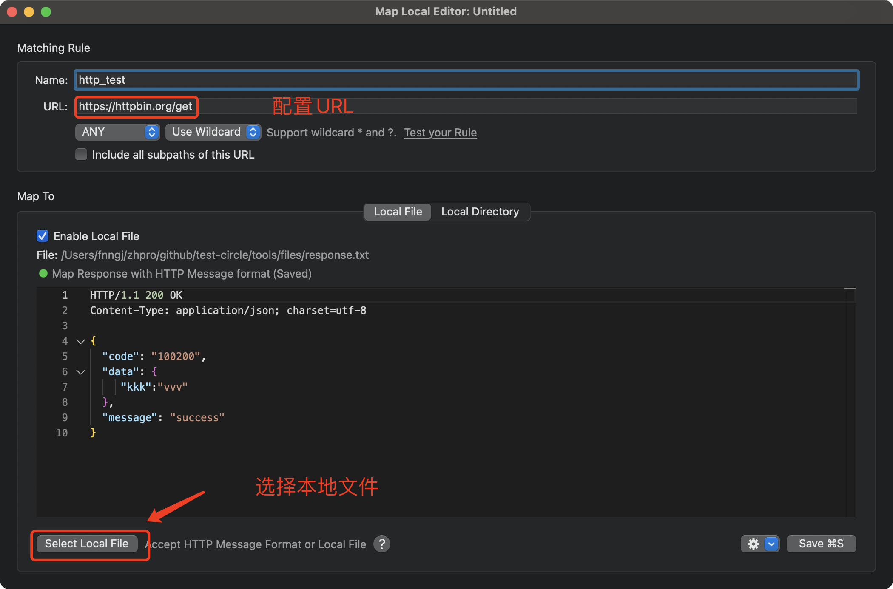

# proxyman更好用的免费抓包工具

### 简介

> slogan：只是简单的点几下，就可以捕捉HTTP(s) 请求。

一流的原生macOS应用程序捕获，解密和模拟HTTP请求/响应与强大的调试工具。

官方网站：https://proxyman.io/

官方文档：https://docs.proxyman.io/


### 特点

💻 原生 macOS 应用。使用 Swift 和 Objective-C 编写。由 Apple SwiftNIO 提供高性能网络应用支持。 

🍎 完全支持 Apple 芯片（例如 M1、M2、M3）。

💫 为 macOS Ventura 和 Sonoma 设计。 

✅ 无忧拦截来自 Web 浏览器、iOS 和 Android 设备的 HTTP/HTTPS 请求/响应和 WebSocket。 

✅ 现代且直观的用户界面 

🔍 多重过滤器 

✅ 提供全面的指南来设置 iOS 模拟器和 iOS 及 Android 设备。 基本调试工具：编写、重复、通配符/正则表达式过滤器、多重过滤器、自定义列、工具栏... 

✅ 高级工具：断点、本地映射、远程映射、黑名单、外部代理、无缓存、Protobuf、清除缓存、自定义证书、脚本、网络条件、反向代理、差异、访问控制、DNS 欺骗等。 

✅ 后端开发的自动设置：自动捕获来自 NodeJS、Ruby 和 Python 的 HTTP(s) 流量。


### 安装

**方式1**

macOS 可以直接使用 `brew` 命令安装。


```bash
brew install --cask proxyman
```

**方式2**

直接点击官网首页下载按钮 `Download macOS App` 进行下载安装。


安装好`Proxyman`后，默认情况下，第一次打开`Proxyman`时会提示:Install Proxy Helper tool ，点击安装即可，也可直接跳过后续在高级设置里安装。


安装完成，启动界面如下：


### 基础使用

**证书配置**

为了支持加密的 HTTPs 协议，必须在当前计算机上安装 Proxyman CA 证书。

Proxyman 菜单栏：`Certificate` --> `Install Certificate on this Mac...`


**方便的筛选功能**

在开启抓包功能的时候，往往会抓取电脑所有的网络请求，我们需要去筛选某个应用的某个类型的请求。Proxyman 提供了非常方便的筛选功能。

* 左侧可以选中某个应用的网络请求。
* 顶部可以筛选请求的类型：http、https、websocket、JSON、Form、XML、JS、CSS ... 这一点跟浏览器开发者工具类似。


**按需查看接口响应**

当我们查看某个接口的Response提示：`Enable only this domain` 或 `Enable all domains from "Microsoft Edge Helper"`

> 建议需要哪个域名就开启哪个域名，这样有利于减少Proxyman的计算开销，通过`option+command+p`即可查看启用SSL的域名和不启用的域名。


**自定义标签**

在 `Request` 和 `Response` 可以选择自定义展示哪些标签。方便我们根据需求使用标签。


### 高级使用

**重复发起请求**

有的时候我们修改接口后，需要自己重新调用一下接口看数据响应的数据是否正确，这就需要用到重复发起请求了。

选中某一条请求，然后按住`command+回车键`即可触发重复。也可以右击鼠标从菜单中选择"Repeat"选项。


**编辑&重复发起请求**

有的时候在测试接口的时候，为了验证接口接收不同参数时候的处理逻辑，那么就需要用到编辑功能了，对现有的请求进行编辑并发送请求。

选中某一条请求，按住`command+option+回车键`即可触发编辑并重复。也可以右击鼠标从菜单中选择"Edit and Repeat"选项。


**设置断点**

给请求打断言也是非常常用的功能。比如抓取 手机端的请求，为了满足测试需求，需要修改接口参数发送给后端，这个时候就需要对接口设置断点了。

选中某条接口，右击鼠标选择`Tools`-->`Breakpoint...` 即可进入打开断点规则创建弹窗界面。


配置断点


重新发起请求，弹出断点窗口，修改参数，发送请求。


**文件映射和修改影响**

文件映射功能允许将服务器返回的数据映射到本地的文件上。当代理服务器接收到来自服务器的响应时，它会将响应中的某些数据替换为本地文件中的内容。这样，我们就可以轻松地编辑本地文件，并观察对应的响应如何改变，而无需直接修改服务器端的数据或请求。

首先，我们本地创建一个映射文件`response.txt`

```
HTTP/1.1 200 OK
Content-Type: application/json; charset=utf-8

{
  "code": "100200",
  "data": {
     "kkk":"vvv"
  },
  "message": "success"
}
```

在Proxyman中创建映射关系, 菜单栏：`Tools` --> `Map local...`


配置映射URL和响应。



重新调用接口查看结果。


这样就实现了一个简单的mock服务。

**编写脚本**

Proxyman提供了类似于中间件的概念——`脚本`，这个脚本允许在请求和响应结束前插入一个脚本改写请求和响应。

Proxyman官方文档介绍说，使用脚本的方式改写网络比在Proxyman可视化操作要快100倍，所以在此也建议大家使用脚本。

具体看查看文档：
https://docs.proxyman.io/scripting/snippet-code


### 最后

Fiddler、Chearle虽然功能强大，但是操作更复杂一些，而且是付费软件，proxyman 可以满足我们的绝大部分需求，个人体验下来使用也比较简单。