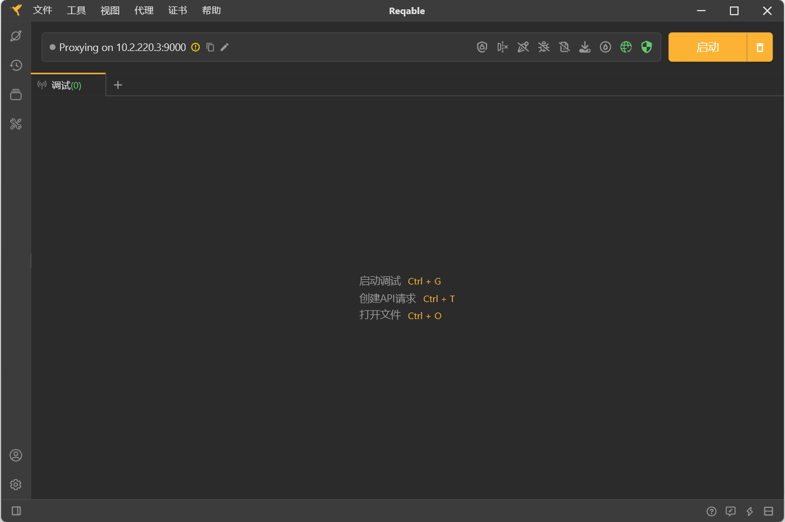
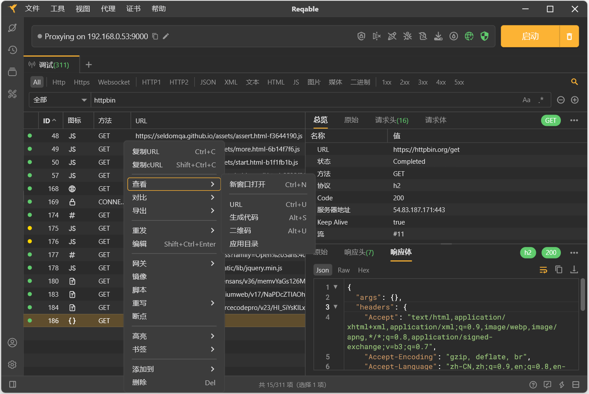
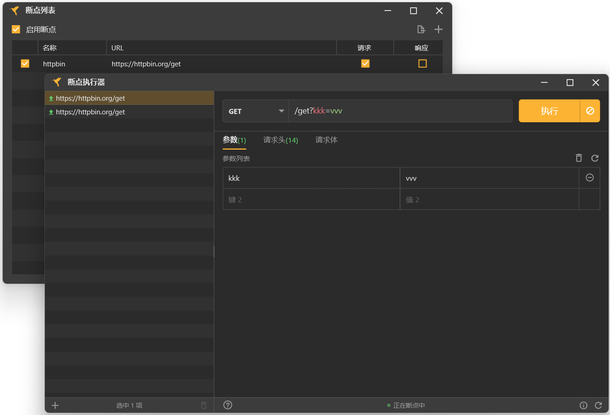
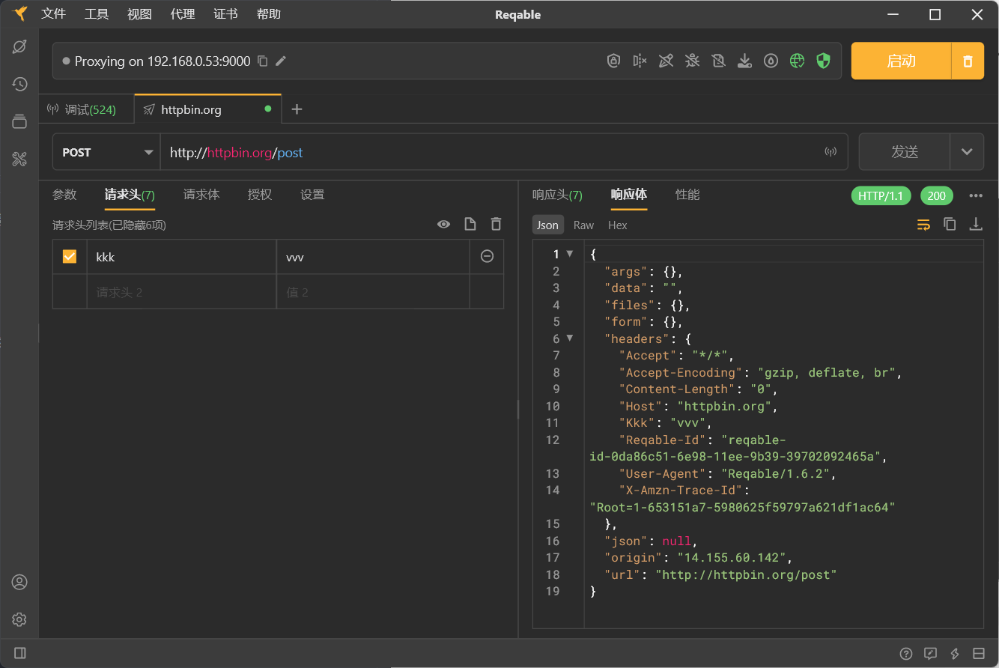

## HTTP开发和调试工具 - Reqable

你在使用什么工具进行抓包。fiddler/charles/wireshark？ 或者 Python 的 mitmproxy 库？ 这些工具都很强大，但多少配置起来都有复杂，尤其是在抓取 HTTPS 请求的时候。本文推荐另一款更简单的HTTP抓包调试工具 - Reqable。

Reqable是一款跨平台的专业HTTP开发和调试工具，在全平台支持HTTP1、HTTP2和HTTP3(QUIC)协议，简单易用、功能强大、性能高效，助力程序开发和测试人员提高生产力。

官网：https://reqable.com/

__特点：__

Reqable提供了两大基本功能：API调试和API测试，并打通了API调试和测试之间的壁垒，例如可以从抓包数据中创建API进行测试，也可以在API测试时进行流量抓包分析。同时，Reqable还提供了一些常用的技术辅助工具，尽可能一站式完成接口生产相关工作。

## 使用

官方提供了Windows/macOS/Linux，下载后直接运行即可。

#### api 调试

* 启动抓包

点击 `启动` 按钮，开启抓包，默认占用本地`9000` 端口。

通过浏览器访问任意网页，reqable会自动抓取请求数据。并且支持关键字筛选请求信息。

* 设置断点

通过 `设置列表` 可以设置断点，断点设置后，请求数据会暂停在断点处。根据需求来修改`请求`和`相应`。

## api 测试

* 创建API测试

点击 加号 `+`， 添加API测试。 这部分功能相比其他接口测试工具（postman/apifox/apipost）要简陋不少。这里不再做过多介绍。

## 总结

Reqable相对个人免费，而且上手非常简单，而且中文界面，对于国内开发测试来说，使用起来说值得推荐。

就我个人来说，一款接口测试工具和一款抓包工具必不可少。我以前的组合是：postman + Charles。现在的组合是 Apifox + Reqable。
