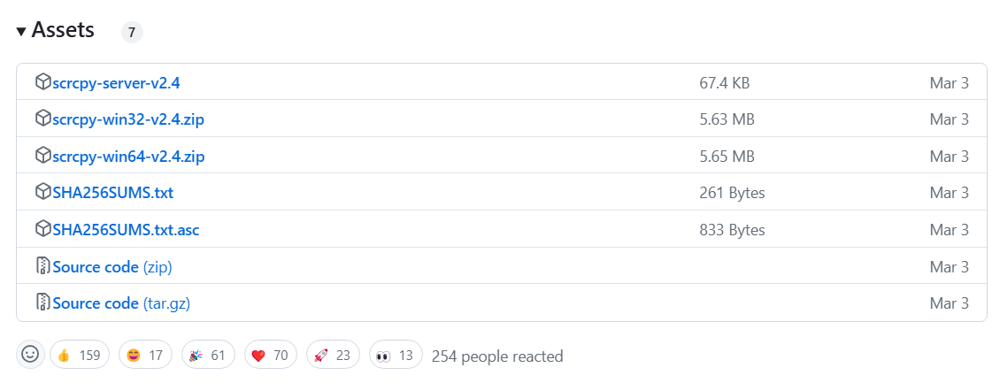
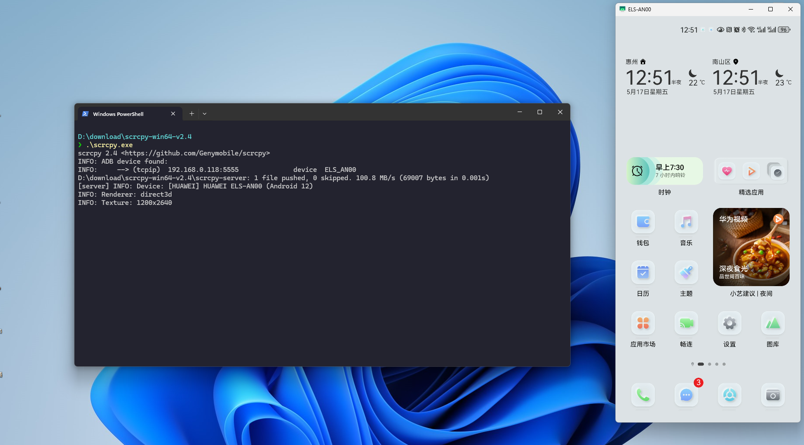

# 这个开源投屏工具太爽了 - scrcpy

> 手机投屏到电脑不少人都会用到的功能。除非 手机和电脑同一品牌才会有比较好的体验（例如：华为、荣耀、苹果等）。我用的手机和笔记本非一个品牌，相信不少人跟我一样。这个时候就要找第三方投屏工具，有些要收费，而且感觉很重。直到我发现了 scrcpy，已经在使用 scrcpy 的同学可以默默退出了。


## scrcpy介绍

GitHub地址：https://github.com/Genymobile/scrcpy

scrcpy是合成词，由`screen copy` 提取出来的字母拼成。

scrcpy支持通过USB或TCP/IP连接镜像Android设备（视频和音频），并允许使用计算机的键盘和鼠标控制设备。它不需要任何root权限。支持 Linux、Windows和macOS 等操作系统。

__特点__

* 轻便性：本地化，仅显示设备屏幕。
* 性能：30~120帧每秒，取决于设备。
* 画质：1920×1080或更高。
* 低延迟：3570毫秒。
* 启动快：~1秒内显示第一幅图像。
* 非侵入性：不在安卓设备上留下任何安装内容。
* 用户福利：无需账号，无广告，无需联网。
* 自由：自由开源软件。

## scrcpy使用

在开源的 `releases` 列表中根据自己的操作系统下载。windows系统版本`5.6MB`的大小太轻量级了。



__有线投屏__

* 首先，准备一根USB数据线条，将手机与PC进行连接。通过`adb`检查设备是否连接成功。`scrcpy`下载解压包含的有`adb.exe` 工具。

```bash
> adb devices -l
List of devices attached
MDX00000000000   device product:ELS-AN00 model:ELS_AN00 device:HWELS transport_id:1
```

* 然后，使用`scrcpy` 命令启动投屏。

```bash
> scrcpy
scrcpy 2.4 <https://github.com/Genymobile/scrcpy>
INFO: ADB device found:
...
```

投屏效果如下：



`scrcpy` 支持更多参数启动：

使用H.265在1920x1080分辨率下录制设备摄像头（和麦克风）到一个MP4文件。

```bash
scrcpy --video-source=camera --video-codec=h265 --camera-size=1920x1080 --record=file.mp4
```

通过模拟物理键盘和鼠标来控制设备，无需镜像显示（无需USB调试）：

```bash
scrcpy --otg
```

__无线投屏__

有线投屏总是不太方便，利用`adb` 还可以实现无线投屏。

1. 保持USB数据线连接不要拔掉。

2. 查看手机IP地址，这里使用 `adb shell` 命令。

```bash
> adb shell
HWELS:/ $  ifconfig  wlan0         <- 查看IP地址
wlan0     Link encap:UNSPEC
          inet addr:192.168.0.118  <- 手机IP地址
```

3. 输入 `adb tcpip <端口号>` 命令，将设备从USB连接模式切换到Wi-Fi连接模式。

```bash
> adb tcpip 5555
restarting in TCP mode port: 5555
```

如果看到`restarting in TCP mode port: 5555`这样的提示，则表示启动成功。 手机的adbd程序会以WIFI模式重新启动。

4. 拔掉USB数据线连接。

5. 通过`adb connect <IP地址><端口>` 命令连接 手机。

```bash
> adb connect 192.168.0.118:5555
connected to 192.168.0.118:5555
```

6. 重新使用 `scrcpy` 命令启动投屏。

```bash
> scrcpy
scrcpy 2.4 <https://github.com/Genymobile/scrcpy>
INFO: ADB device found:
INFO:     --> (tcpip)  192.168.0.118:5555     <-- 通过WiFi投屏         
```
