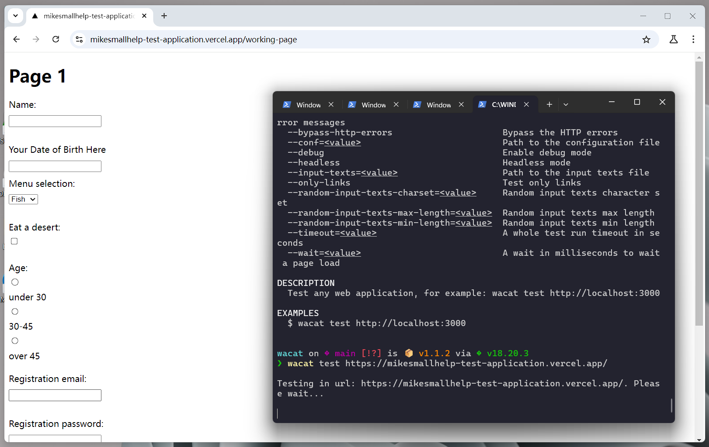
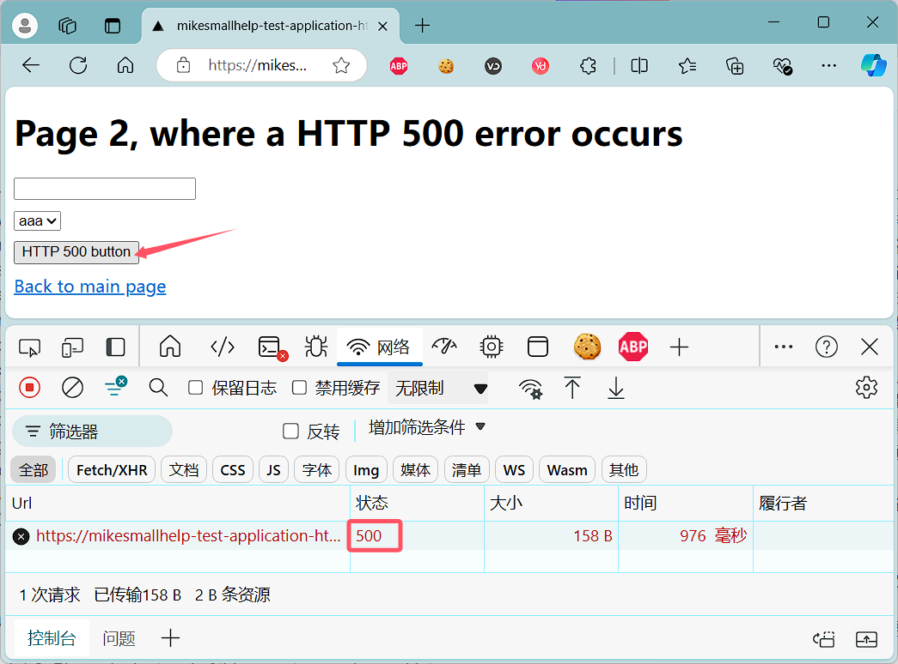
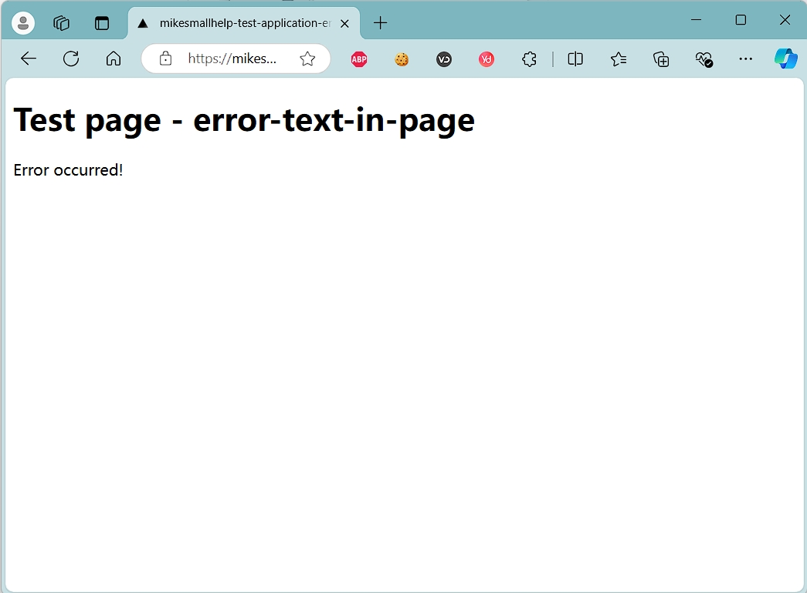
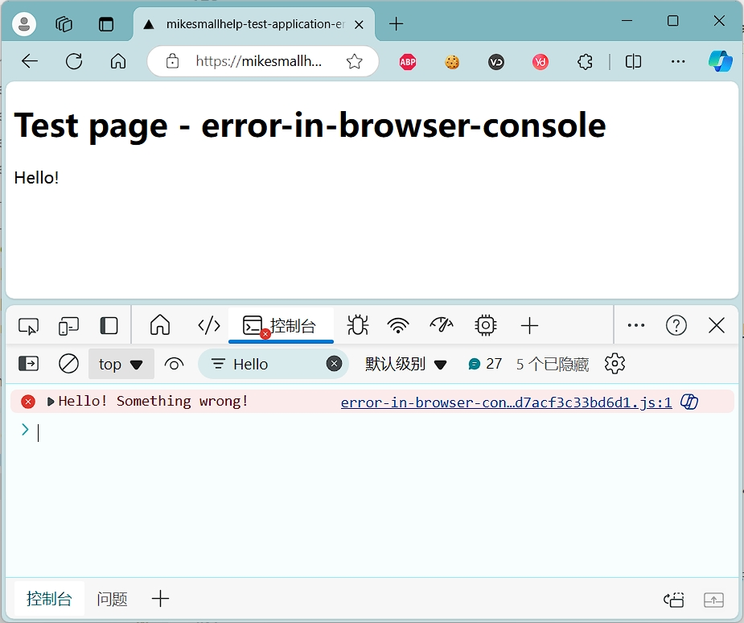
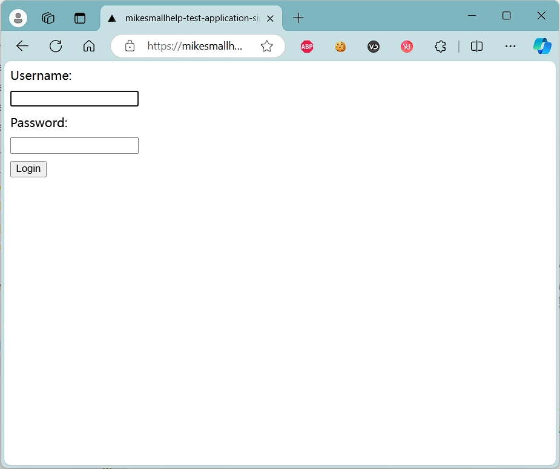

# Wacat - 用猫制造的混乱来测试你Web应用

想象一下，你离开电脑一会儿，去拿一杯咖啡。与此同时，你的猫从你的键盘上走过，造成了一些混乱。

> Wacat 为 walking cat 即为：行走的猫

__Wacat可以完成工作细节：__

* 检测浏览器和服务器之间的HTTP错误（例如HTTP 500错误）
* 检测浏览器控制台日志中的错误
* 检测网页中的错误字符串
* 在参数文件中给出错误字符串
* 支持用户进行随机形式的文本输入配置
* 可以从外部文件读取表单输入（例如：https://github.com/0xspade/Combined-Wordlists?tab=readme-ov）
* 只能测试链接，例如，这可用于应用程序的冒烟测试。
* 支持某些身份验证场景
* 在JSON文件中提供身份验证配置
* 支持配置不被访问的页面
* 支持无头模式
* 支持配置页面下载等待时间和整个测试超时值
* 支持在CI管道中运行


## 安装

1. 安装Node.js

https://nodejs.org/

2. 克隆项目到本地：

```shell
> git clone https://github.com/mikesmallhelp/wacat
```

3. 安装相关依赖

```shell
> cd wacat/    # 进入项目目录
> npm install  # 安装依赖
> npx playwright install --with-deps  # 安装playwright
> npm run build  # 编译项目
> npm i -g  # 安装全局
```

4. 查看`wecat test`命令帮助

```shell
 wacat test --help
Test any web application, for example: wacat test http://localhost:3000

USAGE
  $ wacat test URL [--bypass-browser-console-errors] [--bypass-http-errors]
    [--conf <value>] [--debug] [--headless] [--input-texts <value>] [--only-links]
    [--random-input-texts-charset <value>] [--random-input-texts-max-length <value>]
    [--random-input-texts-min-length <value>] [--timeout <value>] [--wait <value>]

ARGUMENTS
  URL  Application url to test, for example: http://localhost:3000

FLAGS
  --bypass-browser-console-errors          Bypass the browser console's error messages
  --bypass-http-errors                     Bypass the HTTP errors
  --conf=<value>                           Path to the configuration file
  --debug                                  Enable debug mode
  --headless                               Headless mode
  --input-texts=<value>                    Path to the input texts file
  --only-links                             Test only links
  --random-input-texts-charset=<value>     Random input texts character set
  --random-input-texts-max-length=<value>  Random input texts max length
  --random-input-texts-min-length=<value>  Random input texts min length
  --timeout=<value>                        A whole test run timeout in seconds
  --wait=<value>                           A wait in milliseconds to wait a page load

DESCRIPTION
  Test any web application, for example: wacat test http://localhost:3000

EXAMPLES
  $ wacat test http://localhost:3000
```

## 基本使用

__Wacat应用程序执行过程：__

1. 转到你的web应用程序根url
2. 访问你的应用程序中的每个链接
3. 将随机文本输入添加到表单中
4. 从下拉菜单、复选框等中选择随机值。
5. 按随机顺序点击每个按钮。


在`wacat/`文件夹下执行命令:

```shell
> wacat test https://mikesmallhelp-test-application.vercel.app/
```

测试url `https://mikesmallhelp-test-application.vercel.app/` 中的一个简单应用程序。你可以将url替换为你的应用程序url。




首先，wacat应用程序打开Chromium浏览器，并进入命令的根URL。

然后，根页面不包含任何输入字段，下拉菜单等wacat简单收集链接的两个子页面，并进入二级页面。在每个子页面中，首先按下按钮。它填充表单输入，从下拉菜单中选择等。最后它又按下了按钮。

下面是测试运行过程日志：

```shell
wacat test https://mikesmallhelp-test-application.vercel.app/

Testing in url: https://mikesmallhelp-test-application.vercel.app/. Please wait...


Running 1 test using 1 worker
[chromium] › test.spec.ts:41:1 › test an application
In the page: https://mikesmallhelp-test-application.vercel.app/
In the page: https://mikesmallhelp-test-application.vercel.app/working-page
Push the button #1
Filling the #1 text input field a value: q1TS=:i~=t'P5zN]$5?N9p;jv1jA5g<_L'aN]u8Yi
The label is 'Your Date of Birth Here', so generating an appropriate random content for the input field
Filling the #2 text input field a value: 31/08/1995
Filling the #1 email input field a value: octrmiovg.leeqisghbk@lxibzdmsxnb.org
Filling the #1 password input field a value: Aa12#1aaA!#!
Filling the #1 search input field a value: YPDuVMkvLsEF
Filling the #1 url input field a value: https://kozb032.net
The #1 drop-down list. Selecting the option #2
Selecting the #1 checkbox
The #1 radio button group. Selecting the radio button #3
Push the button #1
In the page: https://mikesmallhelp-test-application.vercel.app/working-page2
Push the button #1
Filling the #1 text input field a value: q1TS=:i~=t'P5zN]$5?N9p;jv1jA5g<_L'aN]u8Yi
The label is 'Your Date of Birth Here', so generating an appropriate random content for the input field
Filling the #2 text input field a value: 31/08/1995
Filling the #1 email input field a value: azglalycjq.izxptdkaj@dvyesdvz.org
Filling the #1 password input field a value: 1#B1b2a112bb
Filling the #1 search input field a value: EQdFSsPGs
Filling the #1 url input field a value: https://rg0yar2.biz
The #1 drop-down list. Selecting the option #2
Selecting the #1 checkbox
The #1 radio button group. Selecting the radio button #1
Push the button #1
  Slow test file: [chromium] › test.spec.ts (55.3s)
  Consider splitting slow test files to speed up parallel execution
  1 passed (58.2s)
```

通过日志可以看到Wacat每一步操作都干了什么。


## 测试细节

下面将列举一些Wacat的使用细节。


### 检测HTTP错误

wacat可以检测浏览器和服务器之间的HTTP错误。例如，如果按下下面示例应用程序中的按钮，则会发生HTTP 500错误。

* 运行命令

```shell
wacat test https://mikesmallhelp-test-application-http-500-error.vercel.app/
```

* 访问页面




### 从目标应用程序的页面检测错误字符串

下面是一个示例应用程序，在一个子页面中包含一个错误文本`Error occurred!`

* 配置文件

我们希望检测到错误文本`abc` 和 `Error occurred!`。在Wacat项目`example-files\configuration-error-texts.js`文件中这样配置:

```json
{
    "errorTextsInPages": ["abc", "Error occurred!"]
}
```

* 运行命令(指定配置文件)

```shell
> wacat test --conf example-files\configuration-error-texts.json https://mikesmallhelp-test-application-error-in-page.vercel.app
```

* 访问页面



因为一个页面包含了`Error occurred!`，Wacat最终会检查失败。

### 在浏览器的控制台中检测错误

下面是一个示例应用程序，它在浏览器的控制台中包含一个错误日志记录。

* 运行命令

```shell
> wacat test https://mikesmallhelp-test-application-error-in-browser-console.vercel.app
```

* 访问页面



* 绕过检查

如果您想绕过此检查并停止执行，请使用`--bypass-browser-console-errors`标志。如果命令

```shell
>  wacat test --bypass-browser-console-errors https://mikesmallhelp-test-application-error-in-browser-console.vercel.app
```
在运行时，执行不会像前面的例子那样停止。Wacat记录错误消息，但继续执行。


### 配置随机表单输入

通常，Wacat创建随机表单输入。默认情况下，长度在1到60个字符之间，并使用默认字符集。

`--random-input-text-min-length` 参数设置最小长度，
`--random-input-text-max-length` 参数设置最大长度。
`--random-input-text-charset` 参数设置标志的字符集。

* 运行命令

```shell
> wacat test --random-input-texts-min-length 1 --random-input-texts-max-length 3 --random-input-texts-charset ®©¥¬¿ https://mikesmallhelp-test-application.vercel.app/
```

### 从文件中读取输入字段文本

还可以从文件中读取输入字段，例如从文件`example-files/input.txt`中读取。文本，其内容为:

* 配置文件

```text
xaxa
ybyb
```

* 运行命令

Wacat将文件中的每个输入文本用于目标应用程序中的每个输入字段，除非发生了一些错误或页面更改。

```shell
> wacat test --input-texts example-files\input-texts.txt https://mikesmallhelp-test-application.vercel.app/ 
```

### 仅测试链接

要只测试应用程序中的链接，使用`--only-links`标志。然后Wacat加载页面并检测HTTP错误，但输入字段没有填充等。

* 运行命令

```shell
> wacat test --only-links https://mikesmallhelp-test-application.vercel.app/
```

### 身份认证

下面是一个具有简单身份验证的应用程序。

* 配置文件

创建`example-files/configuration-authentication.json`文件配置。

```json
{
    "authentication": {
        "usernameLabel": "Username",
        "usernameValue": "Mike",
        "passwordLabel": "Password",
        "passwordValue": "Smallhelp",
        "loginButtonLabel": "Login"
    }
}
```

> 请注意，应用程序包含“Username”标签，并将其放入JSON中的“usernameLabel”属性的值中。用户名值是“Mike”，它被放入JSON中的“usernameValue”属性的值中。同样的逻辑也适用于密码输入字段。应用程序有一个名为“Login”的按钮，它被放入JSON中的“loginButtonLabel”属性的值中。

* 运行命令

```shell
wacat test --conf example-files\configuration-authentication.json https://mikesmallhelp-test-application-simple-authentication.vercel.app/
```


* 访问页面



Wacat 还支持更复杂的身份认证，请自行看到文档，不再演示。


### 配置不访问页面

Wacat的设计使其不会超出您正在测试的主机。还可以配置更多不被访问的页面url。


* 配置文件

创建`example-files/configuration-complicated-authentication-with-not-visit-link-urls-remote.json`文件配置。

```json
{
    "authentication": {
        "beforeAuthenticationLinkTexts": [
            "Please go to an application",
            "Please login"
        ],
        "usernameLabel": "Username",
        "usernameValue": "Mike",
        "usernameButtonLabel": "Next",
        "passwordLabel": "Password",
        "passwordValue": "Smallhelp",
        "loginButtonLabel": "Login"
    },
    "notVisitLinkUrls": [
        "https://mikesmallhelp-test-application-more-complicated-authentication.vercel.app/logout"
    ]
}
```

* 运行命令

```shell
> wacat test --conf example-files/configuration-complicated-authentication-with-not-visit-link-urls-remote.json https://mikesmallhelp-test-application-more-complicated-authentication.vercel.app/
```

## 总结

1. 不难发现，项目的核心是利用`playwright`来完成自动化部分，遍历页面元素，完成一些随机输入和点击操作。
2. 还有一些功能我省略了介绍，总体来看利用配置文件和命令行参数实现很多功能，灵活性还是比较强的。
3. 基于`node.js`/`TypeScript`实现的，有同学可能要问，是否支持`Python`，嗯，这个嘛，虽然`Python`是测试人员的首选语言，但也不是说`Python`在测试领域无所不能，当然，足够精通`Python`的话，参考Wacat的原理，实现一个`Python`版本的Wacat，应该问题不大。