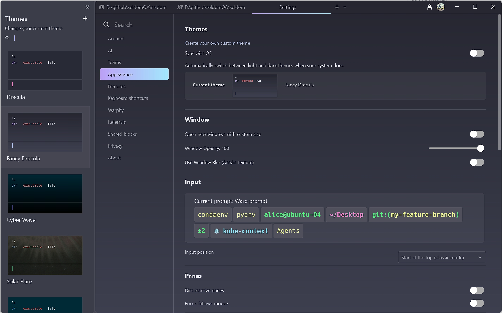
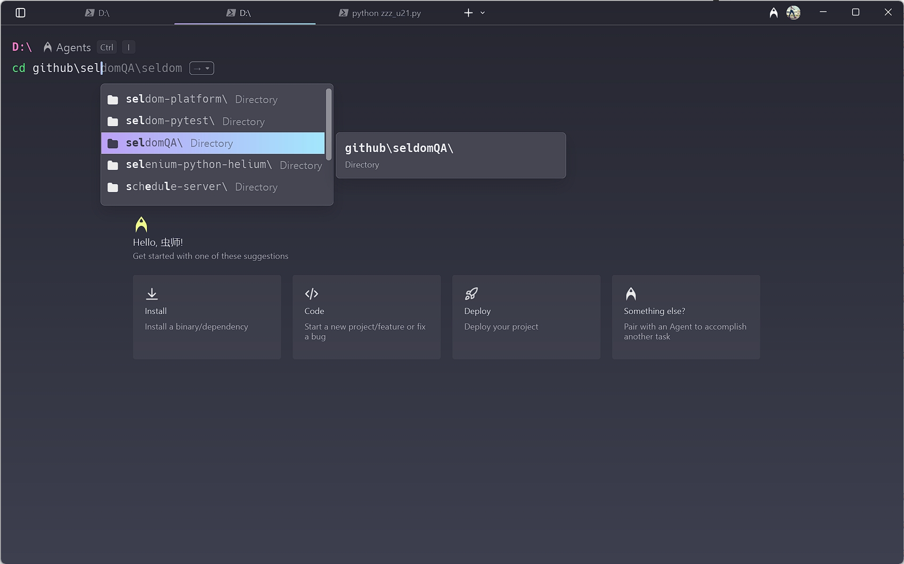
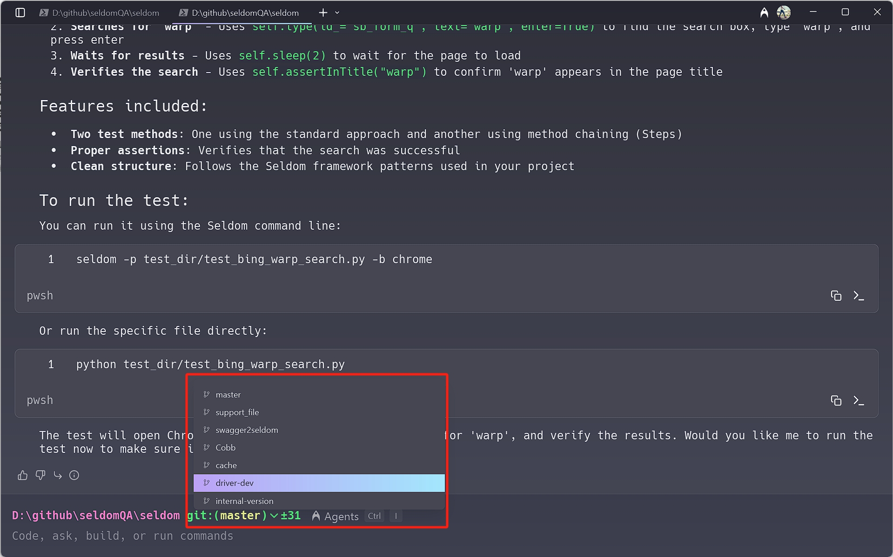
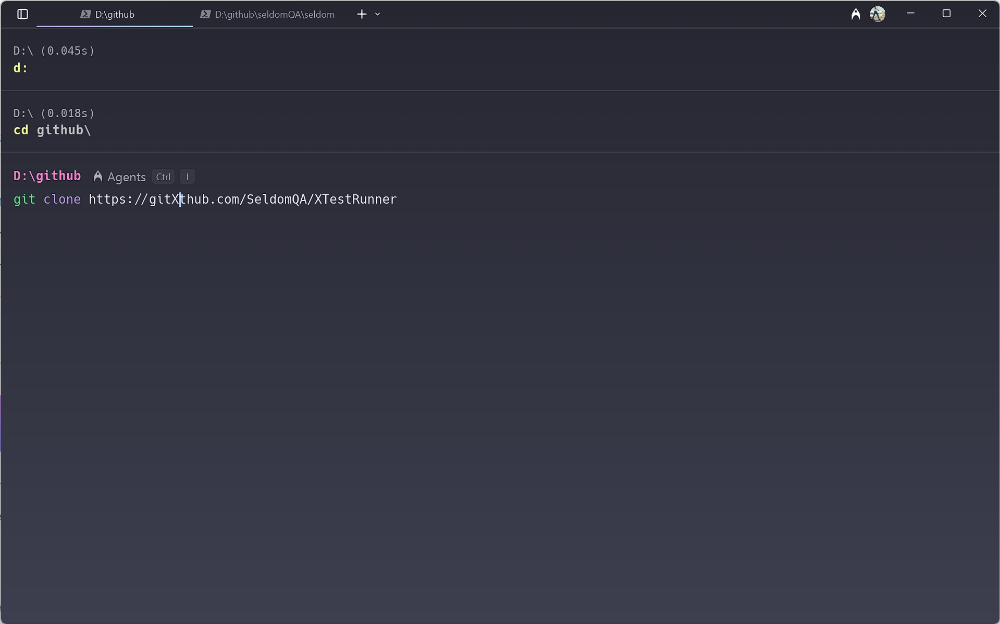
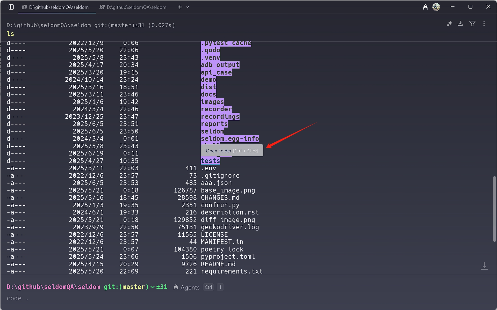
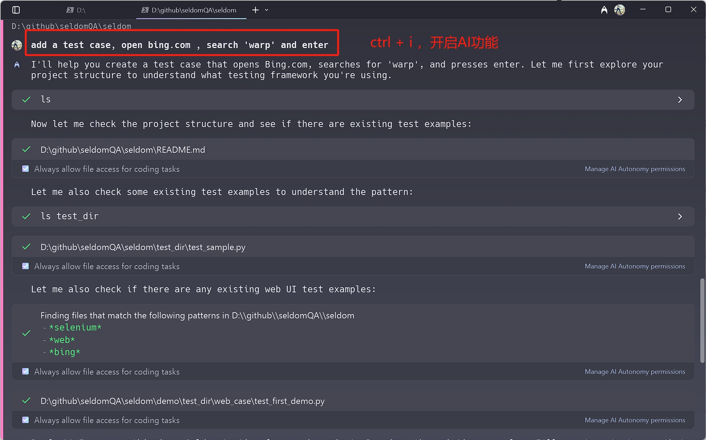

# warp的出现，让我做了渣男

如果看过我B站的视频就会发现，我运行代码都是在终端下进行的，极少用IDE自身去运行程序，除非迫不得已需要debug代码。所以，我是一个终端爱好者。

在Windows下我使用Powershell，MacOS下使用iTerm2，而且都会给他们套上starship的命令行提示符工具，没错~！这一直是我多年的真爱。

但是，今天我今天必须做个渣男，因为warp的出现，让我果断抛弃掉了以上这些。

## warp简介

Warp是一款基于rust的现代终端，内置AI和开发团队知识。

__特点__

* 基于`Rust`开发
* `GPU`加速
* 兼容`zsh`， `bash`, `fish`， `PowerShell`和`Git bash`
* 支持 `MacOS`、`Windows`和 `Linux`

## 使用

Warp的功能非常的多，简单讲讲我发现的一些好用的功能。

__✨ 选择主题__

当我拿到一个台新的MacOS，为了配置成自己喜欢的中断，安装 `iTerm2` + `oh-my-zsh` + `starship` 往往需要耗费我半天时间，但是 warp的所有功能几乎不需要自己配置。但是，你可以花费一丢丢时间选选择自己喜欢的主题。

__✨ 自动匹配__

自动匹配功能，大部分中断可以按tab键自动补全，如果想进一步的自动提示，需要安装像`zsh-autosuggestions`类似的插件，然而，Warp可以自动匹配并提示。

__✨ Git切换分支__

当配置starship时，经常因为分支的icon无法显示要安装字体（或切换字体），每次都要搞半天。然而，Warp不仅没有这种苦恼，甚至切换分支都不需要输入git命令。

__✨ 便捷的鼠标操作__

当我们粘贴了一个很长的字符串，其中有一个字符需要修改，先用ctrl + 方向键跳多个字符，然后，再按方向键慢慢移动。然而，在warp中，你可以直接鼠标点击修改位置，光标直接移动过去。

甚至，我们看到的目录，文件 都是可以点击打开的。

我有点恍惚，我不是在使用中端，而是IDE。

__✨ AI能力__

当前，最不值得一提的就是AI能力，当前AI无处不在，我们使用的所有软件似乎都可以通过AI赋能。Warp作为一个终端软件也加入了AI能力，我们可以在某个目录下输入`prompt`，他会结合当前项目帮我们完成一些工作，例如，生成一个测试用例脚本。

## 最后

官方地址：https://www.warp.dev/

使用文档：https://docs.warp.dev/

